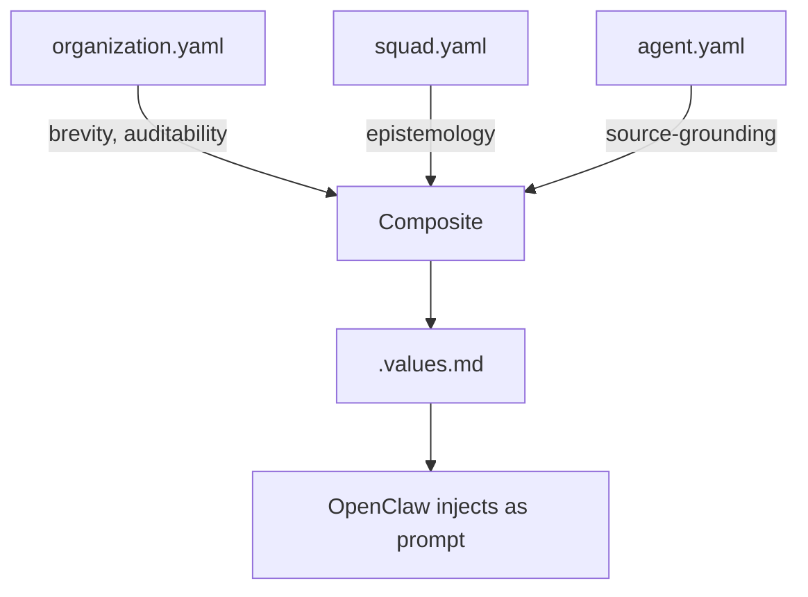
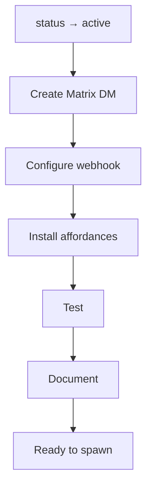

# Agent Framework

## Architecture

```
~/backstage/
├── organization.yaml
├── squads/
│   ├── template/ (squad.yaml, ENFORCEMENT.md)
│   ├── unassisted/
│   └── assisted/
└── agents/
    ├── template/ (agent.yaml, soul.md, ENFORCEMENT.md)
    ├── unassisted/uxr/ (agent.yaml, soul.md, .values.md)
    └── assisted/secretaria/
```

## Values Composite Flow



## Matrix Routing

```mermaid
graph TD
    A[Message] --> B{DM or Squad?}
    B -->|DM| C[/matrix/AGENT webhook]
    B -->|Squad| D{@mention?}
    D -->|Yes| E[Forced response]
    D -->|No| F[Passive memory - all read, none respond]
```

## Agent Activation



## Templates

**squad.yaml:**
```yaml
name: template
values: []
affordances:
  tools: []
  skills: []
  mcps: []
```

**agent.yaml:**
```yaml
name: template
squad: template
values: []
affordances:
  tools: []
  skills: []
  mcps: []
  librarian_topics: []
```

## Watcher

**Files watched:**
- organization.yaml
- squads/*/squad.yaml
- agents/*/*/agent.yaml

**On change:**
1. Composite values (org → squad → agent) → `.values.md`
2. Composite library (org → squad → agent) → `.library.md`
3. Reload agent

## OpenClaw Config

```yaml
organization: ~/backstage/organization.yaml
agents: ~/backstage/agents
squads: ~/backstage/squads
```

**Discovery:**
```bash
openclaw agent list
openclaw agent spawn uxr --task "..."
```

## Matrix

**Webhooks (isolated per agent):**
- /matrix/uxr → UXR DM
- /matrix/squad/unassisted → Squad room

**Behavior:**
- DM → direct response
- Squad + @agent → forced response
- Squad without @ → passive memory (no response)

**Rule:** Only status: active agents get DMs.

## Enforcement

**Manual (now):**
1. Create Matrix DM
2. Configure webhook
3. Test affordances
4. Verify values composite
5. Document in ENFORCEMENT.md

**Future:** Checkpoint validates on status → active.

## Testing

```bash
# Librarian topics
librarian-mcp search "AI auditing" --topics AI/policy

# Agent spawn
openclaw agent spawn uxr --task "Find AI policy on auditing"
```

**Squad @mention:**
```
@uxr summarize → UXR responds
Hey team → No response (passive memory)
```
