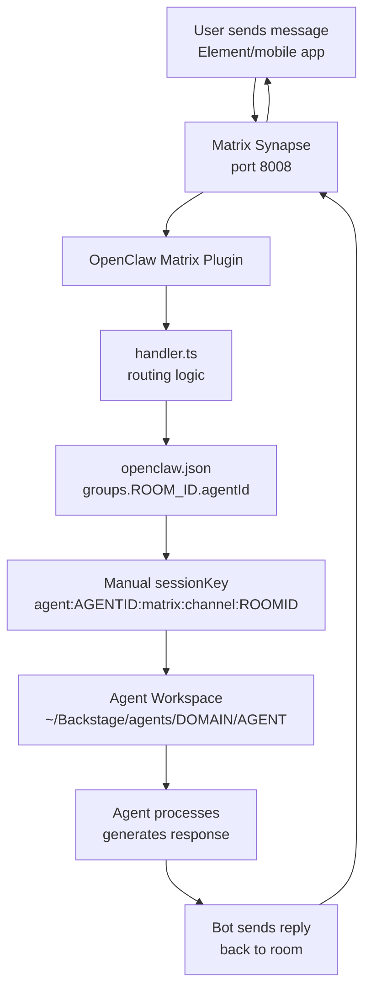

# Matrix Message Flow

**Last updated:** 2026-03-13  
**Epic:** v3.6.0 - Agent Framework

---

## Overview

This document explains how messages flow from Matrix clients through Synapse and OpenClaw to specific agents, including the critical routing fix required for per-agent DM rooms.

---

## High-Level Flow



---

## Detailed Flow

### 1. User Sends Message

**Source:** Element web, mobile app, or API call

**Example:**
```
User types in "Business Analyst" room:
"Qual é o seu workspace?"
```

**Matrix event:**
```json
{
  "type": "m.room.message",
  "room_id": "!EQyjalpjgFwRZGsril:studio.adal-rigel.ts.net",
  "sender": "@nonlinear:studio.adal-rigel.ts.net",
  "content": {
    "msgtype": "m.text",
    "body": "Qual é o seu workspace?"
  }
}
```

---

### 2. Synapse Receives Message

**Component:** Matrix Synapse container (Docker)  
**Port:** 8008 (HTTP client-server API)  
**Log:**
```
synapse.access.http.8008 - INFO - POST-123 - @nonlinear:studio... 
  Processed request: m.room.message
```

**Critical:** Synapse MUST be accessible on **port 8008** (not 8448).

---

### 3. OpenClaw Bot Syncs

**Component:** OpenClaw Matrix plugin  
**Process:** Long-polling sync (`/sync?timeout=30000`)

**Log:**
```
matrix-auto-reply: logged in as @openclaw_bot:studio.adal-rigel.ts.net
```

**Bot receives event batch:**
```json
{
  "next_batch": "s145_1000...",
  "rooms": {
    "join": {
      "!EQyjalpjgFwRZGsril:studio.adal-rigel.ts.net": {
        "timeline": {
          "events": [
            {
              "type": "m.room.message",
              "sender": "@nonlinear:...",
              "content": {"body": "Qual é o seu workspace?"}
            }
          ]
        }
      }
    }
  }
}
```

---

### 4. handler.ts Routing Logic

**File:** `/opt/homebrew/lib/node_modules/openclaw/extensions/matrix/src/matrix/monitor/handler.ts`

**Step 4a: Extract room info**
```typescript
const roomId = "!EQyjalpjgFwRZGsril:studio.adal-rigel.ts.net";
const isRoom = true; // (not DM)
const senderId = "@nonlinear:studio.adal-rigel.ts.net";
```

**Step 4b: Resolve base route**
```typescript
const baseRouteRaw = core.channel.routing.resolveAgentRoute({
  cfg,
  channel: "matrix",
  accountId,
  peer: { kind: "channel", id: roomId },
});
// baseRouteRaw.agentId = "main" (default)
```

**Step 4c: Read room config**
```typescript
const roomConfig = cfg.channels.matrix.groups[roomId];
// roomConfig = { agentId: "business-analyst" }
```

**Step 4d: Calculate effectiveAgentId**
```typescript
const effectiveAgentId = (isRoom && roomConfig?.agentId?.trim()) 
  || baseRouteRaw.agentId;
// effectiveAgentId = "business-analyst"
```

**Step 4e: Inject into baseRoute**
```typescript
const baseRoute = {
  ...baseRouteRaw,
  agentId: effectiveAgentId, // ← Override default "main"
};
```

**Step 4f: Build sessionKey MANUALLY** *(critical fix)*
```typescript
// ❌ WRONG (old code):
// const sessionKey = baseRouteSession.sessionKey; 
// → Always "agent:main:matrix:channel:..."

// ✅ CORRECT (fixed):
const normalizedRoomId = roomId.toLowerCase().replace(/[^a-z0-9]/g, '');
const baseSessionKey = `agent:${effectiveAgentId}:matrix:channel:${normalizedRoomId}`;
const sessionKey = baseSessionKey;
// → "agent:business-analyst:matrix:channel:eqyjalpjgfwrzgsrilstudioadalrigeltsnet"
```

**Why manual construction?**

`resolveMatrixBaseRouteSession` calls `buildAgentSessionKey(baseRoute)`, but **ignores `baseRoute.agentId`** and uses a default value instead. This is a bug in OpenClaw's routing logic.

**Workaround:** Construct sessionKey ourselves using `effectiveAgentId`.

**Step 4g: Create route object**
```typescript
const route = {
  ...baseRoute, // agentId: "business-analyst"
  sessionKey,   // "agent:business-analyst:matrix:channel:..."
  lastRoutePolicy: baseRouteSession.lastRoutePolicy,
};
```

**Debug logs:**
```
[MATRIX-DEBUG-1] roomId=!EQyj... effectiveAgentId=business-analyst
[MATRIX-DEBUG-2] route.agentId=business-analyst route.sessionKey=agent:business-analyst:...
```

---

### 5. Dispatch to Agent

**Component:** OpenClaw session dispatcher

**Action:** Creates or resumes session for `agent:business-analyst:matrix:channel:...`

**Workspace loaded:** `~/Backstage/agents/meta/business-analyst/`

**Context files read:**
- `SOUL.md` (agent personality)
- `USER.md` (about Nicholas)
- `AGENTS.md` (agent-specific protocols)
- `agent.yaml` (config)

---

### 6. Agent Processes Message

**LLM call:** Claude Sonnet 4.5 (configured model)

**System prompt includes:**
- SOUL.md content
- USER.md content
- AGENTS.md instructions
- Available tools/skills

**User message:**
```
Qual é o seu workspace? (caminho completo)
```

**Agent reasoning:**
1. Check current working directory
2. Report workspace path as configured

---

### 7. Agent Generates Response

**Example response:**
```
~/Backstage/agents/meta/business-analyst
```

**Response object:**
```json
{
  "role": "assistant",
  "content": "~/Backstage/agents/meta/business-analyst"
}
```

---

### 8. Bot Sends Reply

**Component:** OpenClaw Matrix client

**API call:**
```bash
POST http://localhost:8008/_matrix/client/r0/rooms/!EQyj.../send/m.room.message
Authorization: Bearer BOT_TOKEN
Content-Type: application/json

{
  "msgtype": "m.text",
  "body": "~/Backstage/agents/meta/business-analyst"
}
```

**Synapse log:**
```
synapse.access.http.8008 - INFO - POST-124 - @openclaw_bot:... 
  200 "POST /_matrix/client/r0/rooms/.../send/m.room.message"
```

---

### 9. User Receives Reply

**Matrix sync delivers message to user's client:**
```json
{
  "type": "m.room.message",
  "sender": "@openclaw_bot:studio.adal-rigel.ts.net",
  "content": {
    "msgtype": "m.text",
    "body": "~/Backstage/agents/meta/business-analyst"
  }
}
```

**User sees in Element:**
```
openclaw_bot: ~/Backstage/agents/meta/business-analyst
```

---

## Session Key Format

**Correct format:**
```
agent:AGENTID:matrix:channel:NORMALIZEDROOMID
```

**Examples:**

**Business Analyst:**
```
agent:business-analyst:matrix:channel:eqyjalpjgfwrzgsrilstudioadalrigeltsnet
```

**Design Engineer:**
```
agent:design-engineer:matrix:channel:iqgfkjjjqonmfqfvbstudioadalrigeltsnet
```

**Main (default, wrong for agent rooms):**
```
agent:main:matrix:channel:eqyjalpjgfwrzgsrilstudioadalrigeltsnet
```

**Normalization:** Lowercase + strip non-alphanumeric characters from room ID.

---

## Verification Points

### Check 1: Config Loaded

```bash
openclaw logs --limit 50 | grep "MATRIX-DEBUG-1"
```

**Look for:**
```
effectiveAgentId=business-analyst
```

**If shows `main`:** Config not loaded or `agentId` field missing from `openclaw.json`.

### Check 2: SessionKey Correct

```bash
openclaw logs --limit 50 | grep "MATRIX-DEBUG-2"
```

**Look for:**
```
route.sessionKey=agent:business-analyst:matrix:channel:...
```

**If shows `agent:main:...`:** Manual sessionKey construction not applied in handler.ts.

### Check 3: Session Created

```bash
openclaw status | grep business-analyst
```

**Expected:**
```
agent:business-analyst:matrix:c…  | group | just now | ...
```

**If not found:** Message didn't reach agent (check previous steps).

### Check 4: Agent Responded

**Ask workspace path:**
```
Qual é o seu workspace? (caminho completo)
```

**Expected:**
```
~/Backstage/agents/meta/business-analyst
```

**If shows `~/.openclaw/workspace`:** Routing failed, using main agent instead.

---

## Common Issues

### Issue: All rooms route to `main` agent

**Symptom:**
```
route.sessionKey=agent:main:matrix:channel:...
```

**Cause:** `resolveMatrixBaseRouteSession` ignoring `baseRoute.agentId`.

**Fix:** Apply manual sessionKey construction in handler.ts (see Step 4f).

**Verify fix applied:**
```bash
grep "const baseSessionKey" /opt/homebrew/lib/node_modules/openclaw/extensions/matrix/src/matrix/monitor/handler.ts
```

**Should find:**
```typescript
const baseSessionKey = `agent:${effectiveAgentId}:matrix:channel:${normalizedRoomId}`;
```

---

### Issue: Bot doesn't receive messages

**Symptom:** No MATRIX-DEBUG logs when sending message.

**Causes:**

**1. Bot not joined room:**
```bash
# Check via API
curl "http://localhost:8008/_matrix/client/r0/rooms/${ROOM_ID}/joined_members" \
  -H "Authorization: Bearer $BOT_TOKEN" | jq '.joined'
```

**Fix:** Invite bot again.

**2. Synapse not accessible:**
```bash
curl http://localhost:8008/_matrix/client/versions
```

**Fix:** Check Synapse container running, port 8008 exposed.

**3. Bot sync failing:**
```bash
openclaw logs | grep "matrix: logged in"
```

**Fix:** Check credentials, homeserver URL in `openclaw.json`.

---

### Issue: Agent responds from wrong workspace

**Symptom:** Agent says workspace is `~/.openclaw/workspace` instead of `~/Backstage/agents/...`

**Cause:** Routing to `main` agent instead of specific agent.

**Debug:**
```bash
# Check effectiveAgentId
openclaw logs --limit 50 | grep effectiveAgentId

# Check sessionKey
openclaw logs --limit 50 | grep route.sessionKey

# Check active session
openclaw status | grep matrix
```

**Fix:** Ensure `agentId` in config + manual sessionKey applied.

---

### Issue: EADDRINUSE on port 8008

**Symptom:**
```
Error: listen EADDRINUSE: address already in use :::8008
```

**Cause:** Tailscale `serve` proxy holding port.

**Fix:**
```bash
tailscale serve --https=8008 off
docker restart matrix-synapse
tailscale serve --bg --https=8008 http://localhost:8008
```

**See:** `~/Documents/personal/connections/launchagent-tailscale.md`

---

## Architecture Notes

### Why Manual SessionKey Construction?

**Problem:** OpenClaw's `buildAgentSessionKey` function receives `baseRoute` but doesn't respect the `agentId` field when constructing the session key.

**Evidence:**
```typescript
// We pass baseRoute with agentId override:
const baseRoute = { ...baseRouteRaw, agentId: effectiveAgentId };

// But buildAgentSessionKey returns:
"agent:main:matrix:channel:..." // ← Ignores our override!
```

**Root cause:** Internal implementation uses a different field or defaults to `main`.

**Workaround:** Bypass `buildAgentSessionKey` and construct sessionKey ourselves:
```typescript
const sessionKey = `agent:${effectiveAgentId}:matrix:channel:${normalizedRoomId}`;
```

**Future:** Ideally OpenClaw core would fix `buildAgentSessionKey` to respect `baseRoute.agentId`, making manual construction unnecessary.

---

### Why Port 8008, Not 8448?

**8008** = Client-server API
- For clients (Element, bots)
- HTTP (can use HTTPS with reverse proxy)
- What OpenClaw needs

**8448** = Server-server API (federation)
- For other Matrix servers
- HTTPS required
- NOT for local clients

**Common mistake:** Configuring `homeserver: "https://studio.adal-rigel.ts.net:8448"` instead of `"http://localhost:8008"`.

**Result:** Connection fails because 8448 is for federation, not client API.

---

## Testing Flow

**Step-by-step verification:**

1. **Send test message** (via curl or Element)
2. **Check Synapse logs** (message received)
3. **Check OpenClaw logs** (MATRIX-DEBUG-1: effectiveAgentId)
4. **Check sessionKey** (MATRIX-DEBUG-2: agent:AGENTID:...)
5. **Check session created** (`openclaw status`)
6. **Check response** (bot replies in room)
7. **Verify workspace** (agent reports correct path)

**If any step fails:** Diagnose at that level before proceeding.

---

## Related Docs

- `adding-openclaw-agent.md` - Create agent
- `adding-agent-to-matrix.md` - Configure Matrix room
- `~/Documents/personal/connections/restart.md` - Gateway recovery
- `/opt/homebrew/lib/node_modules/openclaw/extensions/matrix/src/matrix/monitor/handler.ts` - Routing code

---

**Created:** 2026-03-13  
**Based on:** Debugging session 2026-03-13 (Business Analyst + Design Engineer)  
**Key insight:** Manual sessionKey construction required due to `buildAgentSessionKey` bug
