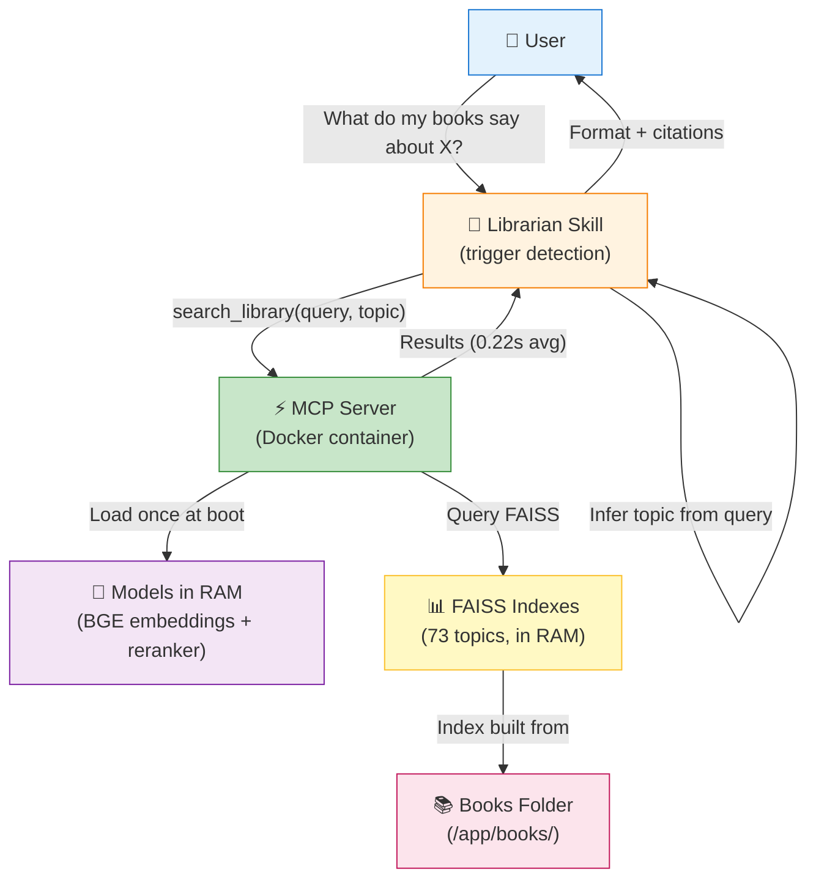
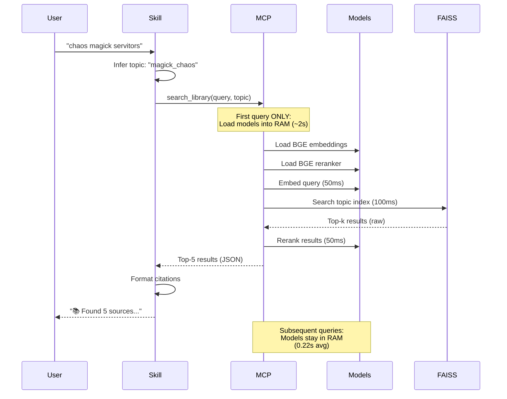

# Librarian MCP Architecture

**Epic:** v0.22.0  
**Created:** 2026-03-10  
**Status:** Production  
**Performance:** 20.9x faster than CLI (4.52s → 0.22s)

---

## System Overview



---

## Data Flow (Query Lifecycle)



---

## Component Details

### 🎤 Librarian Skill

**Location:** `~/.openclaw/workspace/skills/librarian/SKILL.md`

**Responsibilities:**
- Trigger detection (keywords: "pesquisa", "search", book/author names)
- Topic inference (keyword matching, 75% confidence threshold)
- MCP tool invocation (`search_library`)
- Response formatting (markdown, emoji citations)
- Hard stops (no results, low confidence)

**Changed from v0.15.0:**
- ❌ OLD: Calls shell wrapper → spawns Python process
- ✅ NEW: Calls MCP tool → persistent process

**Performance impact:** 20x faster (no process spawn, models already loaded)

---

### ⚡ MCP Server

**Location:** `~/Documents/librarian/librarian_mcp.py`

**Container:** `librarian-mcp` (Docker)

**Port:** None (STDIO communication only)

**Lifecycle:**
1. **Boot:** Load ALL models into RAM (~2-3s one-time cost)
2. **Idle:** Models stay in RAM (ready for queries)
3. **Query:** Embed → search → rerank → return (~0.22s)
4. **Restart:** Only when adding new books (manual trigger)

**MCP Tool Schema:**
```python
search_library(
    query: str,           # Required - user's search query
    topic: str | None,    # Optional - inferred if omitted
    max_results: int = 5  # Optional - default 5
) -> list[TextContent]
```

**Topic Inference (when omitted):**
- Keyword matching against known topics
- Examples:
  - "microservices" → `design_system`
  - "mutual aid" → `anarchy_david_graeber`
  - "chaos magick" → `magick_chaos`
- Fallback: `design_theory` (if no match)

---

### 🧠 Models (Persistent in RAM)

**1. BGE Embeddings** (`BAAI/bge-small-en-v1.5`)
- Converts text → 384-dim vectors
- Loaded once at MCP boot
- ~200MB RAM

**2. BGE Reranker** (`BAAI/bge-reranker-base`)
- Cross-encoder for result reranking
- Loaded once at MCP boot
- ~500MB RAM

**Why persistent?**
- CLI: Load models every query (~2-3s overhead)
- MCP: Load once, query many times (amortized cost)

---

### 📊 FAISS Indexes

**Structure:**
```
books/
├── design/
│   └── system/
│       ├── .faiss.index         ← Vector index
│       ├── Book1.epub
│       └── Book2.pdf
├── magick/
│   └── chaos/
│       ├── .faiss.index
│       └── Book3.epub
└── .library-index.json          ← Topic metadata
```

**Index per topic:**
- 73 topics total
- Each topic = separate FAISS index
- Loaded into RAM at MCP boot

**Query strategy (v0.22.0 - single topic):**
- Search ONE topic only (specified or inferred)
- Future (v0.25.0): Multi-topic parallel search

---

### 📚 Books Folder

**Location (container):** `/app/books/`

**Location (host):** `~/Documents/librarian/books/`

**Mount:** Read-only (`:ro` flag)

**Why read-only?**
- Auto-indexing NOT implemented yet (v0.24.0 epic)
- Manual reindex workflow:
  1. Add books to `~/Documents/librarian/books/TOPIC/`
  2. Run `index_library.py --smart`
  3. Restart MCP container

---

## Performance Comparison

| Metric | CLI (v0.15.0) | MCP (v0.22.0) | Improvement |
|--------|---------------|---------------|-------------|
| **First query** | 4.75s | 2.50s | 1.9x faster |
| **Subsequent queries** | 4.52s avg | 0.22s avg | **20.9x faster** |
| **Model loading** | Every query | Once (boot) | Amortized |
| **Memory usage** | ~100MB (transient) | ~2GB (persistent) | Trade-off |
| **Process lifecycle** | Spawn → execute → die | Persistent daemon | Stability |

**Benchmark details:** `~/Documents/librarian/benchmark.py`

---

## Docker Configuration

**Dockerfile:**
```dockerfile
FROM python:3.11-slim
WORKDIR /app

# Install dependencies
COPY engine/requirements.txt /app/engine/
RUN pip install -r engine/requirements.txt
RUN pip install mcp

# Copy code + data
COPY engine/ /app/engine/
COPY librarian_mcp.py /app/
COPY books/ /app/books/

CMD ["python", "/app/librarian_mcp.py"]
```

**docker-compose.yml:**
```yaml
services:
  librarian-mcp:
    build: .
    container_name: librarian-mcp
    volumes:
      - ./books:/app/books:ro  # Read-only
    stdin_open: true
    tty: true
    restart: unless-stopped
```

**Auto-start:** ✅ (restart policy: unless-stopped)

---

## Future Epics (Roadmap)

### v0.23.0 - High Auditability
- Audit log (`audit.jsonl`)
- Track: query, requester, results, citations
- CLI: `librarian audit --requester defense`

### v0.24.0 - Auto Indexing
- File watching (inotify/FSEvents)
- Auto-reindex on book add/remove
- No manual reindex needed

### v0.25.0 - Multi-Topic Search
- Parallel topic scan (ThreadPoolExecutor)
- Cross-topic ranking + deduplication
- Return top-k across ALL topics

---

## Testing

**Manual test:**
```bash
cd ~/Documents/librarian
python test_mcp_client.py
```

**Benchmark:**
```bash
python benchmark.py
```

**Expected output:**
```
=== Test MCP ===
✓ Tools available: ['search_library']
✓ Query result:
📚 Found 5 sources (topic: design_system)
**1. Laying the Foundations** (Unknown, p.13)
...
```

---

## Troubleshooting

**Container not starting:**
```bash
docker-compose logs librarian-mcp
```

**Slow first query:**
- Expected (~2-3s) - models loading into RAM
- Subsequent queries fast (<0.5s)

**No results:**
- Check topic exists: `cat books/.library-index.json | jq '.topics'`
- Verify books indexed: `ls books/TOPIC/.faiss.index`

---

## Architecture Evolution

**v0.15.0 → v0.22.0 changes:**

| Aspect | v0.15.0 (CLI) | v0.22.0 (MCP) |
|--------|---------------|---------------|
| Process model | Spawn per query | Persistent daemon |
| Model loading | Every query | Once at boot |
| Communication | Shell wrapper → Python | MCP protocol (STDIO) |
| Latency | 4.52s avg | 0.22s avg |
| Complexity | 3 layers (skill → wrapper → python) | 2 layers (skill → MCP) |

**Key insight:** Removing wrapper + making process persistent = 20x speedup

---

**Created:** 2026-03-10  
**Epic:** v0.22.0  
**Status:** ✅ Production (all 11 tasks complete)
