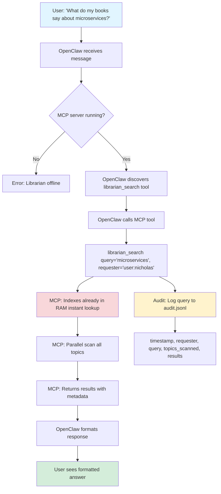

# Epic Notes

> Version, name, status → see `epic.yaml`

---

# v0.22.0 - Librarian as MCP

**Goal:** Transform Librarian into MCP server for agent epistemology validation (anti-drift via audit trail + fast queries).

---

## Context

**Why this matters:**

Nicholas will REQUIRE agents to check library before proposing solutions. Librarian becomes **epistemology validator** - agents must cite authoritative sources or explain divergence.

**Example workflow:**
```
Agent: "Propõe microservices pra X"
Nicholas: "Check systems design books first"
Agent → librarian_search("microservices vs monolith")
Agent: "Building Microservices (Newman, Ch.3) says:
       - Microservices = good if >5 teams
       - Monolith = better if <3 devs
       Our case: 1 dev → monolith recommended.
       Still propose microservices? Here's why: [divergence explanation]"
```

**Audit trail = trust.** Nicholas can verify agent checked sources (timestamp, query, results, citations).

---

## User Flow: How to Query Librarian (with MCP)



### Example Interaction

**User (Nicholas):**
> "What do my books say about microservices?"

**OpenClaw (internal):**
```json
{
  "tool": "librarian_search",
  "params": {
    "query": "microservices",
    "requester": "user:nicholas",
    "context": ""
  }
}
```

**MCP Server (librarian):**
```json
{
  "results": [
    {
      "title": "Building Microservices",
      "author": "Sam Newman",
      "topic": "systems",
      "score": 0.95,
      "snippet": "Microservices are an approach to distributed systems...",
      "source": "books/systems/building-microservices.epub",
      "chapter": "Chapter 1",
      "page": 5
    },
    {
      "title": "Domain-Driven Design",
      "author": "Eric Evans",
      "topic": "software-engineering",
      "score": 0.88,
      "snippet": "Bounded contexts are essential when...",
      "source": "books/software-engineering/domain-driven-design.pdf",
      "chapter": "Part III",
      "page": 335
    }
  ],
  "query_id": "abc123",
  "topics_scanned": ["systems", "software-engineering", "anarchy"],
  "timestamp": "2026-03-10T12:15:00Z"
}
```

**OpenClaw (formatted for user):**
> 📚 Found 2 sources on microservices:
> 
> **1. Building Microservices** (Newman, Ch.1, p.5)  
> Topic: systems | Score: 0.95  
> _"Microservices are an approach to distributed systems..."_
> 
> **2. Domain-Driven Design** (Evans, Part III, p.335)  
> Topic: software-engineering | Score: 0.88  
> _"Bounded contexts are essential when..."_

**Audit log (audit.jsonl):**
```jsonl
{"timestamp":"2026-03-10T12:15:00Z","requester":"user:nicholas","query":"microservices","topics_scanned":["systems","software-engineering","anarchy"],"results":[{"title":"Building Microservices","author":"Newman","score":0.95,"cited":false},{"title":"Domain-Driven Design","author":"Evans","score":0.88,"cited":false}],"context":""}
```

### Agent Flow (Epistemology Validation)

**Agent (Defense):**
> Proposes microservices architecture for new project

**Nicholas:**
> "Check systems design books first"

**Agent (internal):**
```json
{
  "tool": "librarian_search",
  "params": {
    "query": "microservices vs monolith trade-offs",
    "requester": "agent:defense",
    "context": "epic:v0.5.0-architecture-decision"
  }
}
```

**MCP Server returns results** (same as above)

**Agent cites sources:**
> "Building Microservices (Newman, Ch.3) says:
> - Microservices = good if >5 teams, high independence needed
> - Monolith = better if <3 devs, rapid iteration priority
> 
> Our case: 1 developer, early stage.
> Recommendation: Monolith now, migrate to microservices when team grows.
> 
> Divergence from source: None. Following Newman's guidance."

**Agent marks citations:**
```json
{
  "tool": "mark_citation",
  "params": {
    "query_id": "abc123",
    "result_ids": [0]
  }
}
```

**Audit log updated:**
```jsonl
{"timestamp":"2026-03-10T12:16:30Z","action":"cite","query_id":"abc123","result_id":0,"cited":true}
```

**Nicholas verifies:**
```bash
jq 'select(.requester == "agent:defense" and .context == "epic:v0.5.0")' audit.jsonl
# ✅ Agent consulted sources
# ✅ Agent cited Building Microservices
# ✅ Decision aligned with authoritative source
```

---

## Current Architecture

**CLI script:**
- `research.py "query" --topics chaos-magick,anarchy`
- Manual topic selection
- Reload indexes every query (~2-5s latency)
- No audit log

**Problems:**
- ❌ Slow (reload FAISS indexes every query)
- ❌ Agent doesn't know which topics (manual selection)
- ❌ No audit trail (who queried what?)
- ❌ Shell wrapper friction (not native OpenClaw)

---

## MCP Vision

**Server-first architecture:**
- Load ALL indexes in RAM at boot (~10s startup, instant queries)
- Auto-detect relevant topics (scan entire library)
- Audit log (`audit.jsonl`) tracks all queries + citations
- MCP native (OpenClaw calls tool directly)

**Performance:**
- Current: ~2-5s per query (reload indexes)
- MCP: ~50-200ms per query (indexes in RAM)
- Trade-off: Slower startup, MUCH faster queries

---

## Raciocínio: Como fazer rápido?

### Problem: Index Load Bottleneck

**Current approach (SLOW):**
```python
# Every query:
index = faiss.read_index(f"books/{topic}/index.faiss")  # 1-2s
results = index.search(query_embedding, k=10)           # 50ms
```

**MCP approach (FAST):**
```python
# At boot (once):
indexes = {}
for topic in topics:
    indexes[topic] = faiss.read_index(f"books/{topic}/index.faiss")  # 10s total

# Every query (instant):
results = indexes[topic].search(query_embedding, k=10)  # 50ms
```

**Speed improvement:** 40-100x faster queries (2-5s → 50-200ms)

---

### Problem: Multi-Topic Scan

**Naive approach (SLOW):**
```python
# Sequential scan (20 topics × 50ms = 1s)
for topic in all_topics:
    results = indexes[topic].search(query, k=10)
```

**Optimized approach (FAST):**
```python
# Parallel batch search
import concurrent.futures

with ThreadPoolExecutor() as executor:
    futures = {executor.submit(indexes[t].search, query, k=10): t for t in topics}
    results = [f.result() for f in futures]
# 20 topics in ~100ms (parallel)
```

**Speed improvement:** 10x faster multi-topic (1s → 100ms)

---

### Problem: Indexing Bottleneck

**Current:**
- Manual reindex: `python index_library.py --smart` (~5min for full library)
- No incremental indexing

**Optimization 1: Smart Indexing (already exists)**
```python
# Only reindex changed files
if file_mtime > index_mtime:
    reindex(file)
```

**Optimization 2: File Watcher (auto-reindex)**
```python
from watchdog import FileSystemEventHandler

class BookWatcher(FileSystemEventHandler):
    def on_modified(self, event):
        if event.src_path.endswith(('.epub', '.pdf')):
            topic = extract_topic(event.src_path)
            reindex_file(topic, event.src_path)
            reload_index(topic)  # Hot-reload in MCP server
```

**Speed improvement:** Instant updates (no manual reindex)

---

## Audit Trail Architecture

**What to log:**
```jsonl
{"timestamp": "2026-03-10T12:15:00Z", "requester": "agent:defense", "query": "microservices patterns", "topics_scanned": ["systems", "software-engineering"], "results": [{"title": "Building Microservices", "author": "Newman", "score": 0.92, "cited": false}], "context": "epic:v0.5.0-architecture"}
{"timestamp": "2026-03-10T12:16:30Z", "requester": "agent:defense", "action": "cite", "query_id": "abc123", "result_id": 0, "cited": true}
```

**File:** `~/Documents/librarian/audit.jsonl` (append-only)

**Why JSONL:**
- Append-only (no corruption risk)
- Grep-able (search by requester, source, date)
- Analytics-friendly (load into pandas/jq)

**Audit queries:**
```bash
# What sources did agent X use?
jq 'select(.requester == "agent:defense") | .results[].title' audit.jsonl | sort | uniq -c

# Was source Y consulted for decision Z?
jq 'select(.context == "epic:v0.5.0" and .results[].title == "Building Microservices")' audit.jsonl

# Agent saw source but didn't cite? (bias detection)
jq 'select(.requester == "agent:marketing" and .results[] | select(.title == "Debt" and .cited == false))' audit.jsonl
```

---

## Bias Detection Patterns

**What constitutes bias:**

### 1. Topic Avoidance
```bash
# Agent never queries certain topics (despite relevance)
jq -r '[.requester, .topics_scanned[]] | @tsv' audit.jsonl | \
  grep agent:marketing | cut -f2 | sort | uniq -c

# If anarchy appears 0 times but finance 50 times → topic bias
```

**Example:**
- Marketing agent: 47 queries, 0 anarchist sources consulted
- Pattern: Avoids anti-capitalist perspectives
- **Red flag:** Proposals lack critical economic analysis

---

### 2. Selective Citation (Confirmation Bias)
```bash
# Agent queries source but never cites it
jq 'select(.results[] | select(.cited == false)) | {req: .requester, title: .results[].title}' audit.jsonl | \
  jq -s 'group_by(.req) | map({agent: .[0].req, ignored: map(.title) | unique})'
```

**Example:**
- Agent queries "Debt: First 5000 Years" (5 times)
- Never cites it (cited: false on all)
- Pattern: Saw source, rejected without engagement
- **Red flag:** Ignores inconvenient sources

---

### 3. Author Preference Bias
```bash
# Agent disproportionately cites certain authors
jq 'select(.results[] | select(.cited == true)) | {req: .requester, author: .results[].author}' audit.jsonl | \
  jq -s 'group_by(.req) | map({agent: .[0].req, authors: (map(.author) | group_by(.) | map({name: .[0], count: length}) | sort_by(.count) | reverse)})'
```

**Example:**
- Legal agent: 80% citations from Graeber, 5% from others
- Pattern: Over-reliance on single perspective
- **Red flag:** Narrow epistemic base

---

### 4. Recency Bias
```bash
# Agent prefers newer sources over canonical older ones
jq 'select(.results[] | select(.cited == true)) | {title: .results[].title, year: .results[].year}' audit.jsonl | \
  jq -s 'group_by(.year) | map({year: .[0].year, count: length})'
```

**Example:**
- Agent cites books from 2020+ (90% of citations)
- Ignores foundational texts from 1960-2000
- Pattern: Novelty over authority
- **Red flag:** Missing historical context

---

### 5. Complexity Avoidance
```bash
# Agent ignores high-score matches if they're from dense/technical sources
jq 'select(.results[] | select(.score > 0.85 and .cited == false)) | {req: .requester, title: .results[].title, score: .results[].score}' audit.jsonl
```

**Example:**
- Query returns "Capital Vol. 1" (score: 0.95)
- Agent cites "Economics for Dummies" (score: 0.65)
- Pattern: Avoids difficult sources
- **Red flag:** Superficial research

---

### 6. Time-of-Day Patterns (Fatigue Bias)
```bash
# Agent cites fewer sources late in session
jq -r '[.timestamp, (.results[] | select(.cited == true) | 1)] | @tsv' audit.jsonl | \
  awk '{print substr($1, 12, 2)}' | sort | uniq -c
```

**Example:**
- Morning queries (8am-12pm): 3.2 sources cited/query
- Evening queries (6pm-10pm): 1.1 sources cited/query
- Pattern: Quality degrades over time
- **Red flag:** Agent needs rest/reload

---

### 7. Context Absence Bias
```bash
# Agent queries without context (fishing for confirmation?)
jq 'select(.context == null or .context == "") | {req: .requester, query: .query}' audit.jsonl | \
  jq -s 'group_by(.req) | map({agent: .[0].req, contextless: length})'
```

**Example:**
- Agent makes 15 queries without `context` field
- Pattern: Ad-hoc queries, not tied to epic/decision
- **Red flag:** Undirected research, fishing for quotes

---

## Reporting Bias (Automated Alerts)

**Weekly bias report:**
```
Librarian Bias Detection Report (2026-03-03 → 2026-03-10)

🚨 RED FLAGS:

1. agent:marketing - Topic avoidance (anarchy: 0%)
   - 47 queries, 0 anarchist sources consulted
   - Recommend: Explicit prompt to check anti-capitalist perspectives

2. agent:legal - Author preference (Graeber: 80%)
   - Over-reliance on single author
   - Recommend: Diversify citations

3. agent:defense - Complexity avoidance
   - High-score sources ignored (avg score ignored: 0.88)
   - Recommend: Review query methodology

✅ HEALTHY PATTERNS:

- user:nicholas - Balanced topic coverage (all topics >5%)
- agent:uxr - Diverse author citations (no author >30%)
```

---

**Automated alerts (Telegram):**
```
🚨 Bias Alert: agent:marketing

Query: "debt vs equity financing"
Result: "Debt: First 5000 Years" (score 0.92, NOT cited)

Pattern: 5th time seeing this source, 0 citations.
Possible confirmation bias - recommend review.
```

---

## Tasks (Roadmap)

### Phase 1: MCP Server + In-Memory Indexes (MVP)

**Goal:** Fast queries, agent-accessible

**Tasks:**
- [ ] Research MCP Python SDK (setup, tool exposure)
- [ ] Create MCP server scaffold (`librarian_mcp.py`)
- [ ] Load ALL FAISS indexes at startup (into RAM)
- [ ] Expose `search(query, requester, context)` tool
- [ ] Test query speed (target <200ms)
- [ ] Backward compat: Keep CLI script working

**Deliverable:** Agent can call `librarian_search("microservices")` via MCP, gets results in <200ms

**Effort:** 6-8h

---

### Phase 2: Auto-Detect Topics (Parallel Scan)

**Goal:** Agent doesn't need to know topics, scan entire library

**Tasks:**
- [ ] Implement parallel FAISS batch search (ThreadPoolExecutor)
- [ ] Benchmark: Sequential vs parallel (quantify speedup)
- [ ] Default behavior: Scan ALL topics (no manual selection)
- [ ] Optional filter: `search(query, topics=["chaos-magick"])`
- [ ] Return top-k across entire library (deduplicate by score)

**Deliverable:** Agent queries "servitors" → results from chaos-magick + occult + philosophy (auto-detected)

**Effort:** 4h

---

### Phase 3: Audit Log (Epistemology Trail)

**Goal:** Track who queried what, which sources cited

**Tasks:**
- [ ] Create `audit.jsonl` (append-only log)
- [ ] Log every query: timestamp, requester, query, topics_scanned, results
- [ ] Add `mark_citation(query_id, result_id)` tool (agent marks what it cited)
- [ ] Update audit entry when citation marked (`cited: true`)
- [ ] Test: Agent calls search → cites result → verify audit log

**Deliverable:** Nicholas can verify agent checked sources via `audit.jsonl`

**Effort:** 4h

---

### Phase 4: Citation Quality (Metadata Extraction)

**Goal:** Agent can cite properly (title, author, chapter, page)

**Tasks:**
- [ ] Extract chapter/section from EPUB metadata (if available)
- [ ] Extract page numbers from PDF (if available)
- [ ] Return snippet context (±500 chars around match)
- [ ] Format citation: `"Building Microservices (Newman, Ch.3, p.42): [snippet]"`
- [ ] Test with real books (check metadata quality)

**Deliverable:** Agent cites with full attribution (not just "book says X")

**Effort:** 4-6h

---

### Phase 5: Audit Analytics (CLI Tools)

**Goal:** Query audit trail (who used what?)

**Tasks:**
- [ ] CLI: `librarian audit --requester defense` (sources used by agent)
- [ ] CLI: `librarian audit --source "Building Microservices"` (where book was cited)
- [ ] CLI: `librarian audit --unused` (sources seen but not cited)
- [ ] CLI: `librarian audit --bias` (detect patterns: agent X ignores topic Y)
- [ ] Output format: Human-readable + JSON

**Deliverable:** Nicholas can audit agent epistemology behavior

**Effort:** 4h

---

### Phase 6: Multi-Topic Tags (Optional)

**Goal:** Books can belong to multiple topics

**Tasks:**
- [ ] Add `tags` field to metadata.json
- [ ] Keep folder structure as primary tag (backward compat)
- [ ] Allow books to appear in multiple topics
- [ ] Query filter: `search(query, tags=["anarchy", "economics"])`
- [ ] Migration: Scan existing books, suggest tags (manual approval)

**Deliverable:** "Debt: First 5000 Years" appears in anarchy + economics + history

**Effort:** 4h

---

## Performance Targets

| Metric | Current (CLI) | Target (MCP) |
|--------|--------------|--------------|
| **Single query** | 2-5s | <200ms |
| **Multi-topic (20 topics)** | 40-100s | <500ms |
| **Index load** | Every query | Once (at boot) |
| **Startup time** | Instant | ~10s |
| **Memory usage** | ~100MB | ~2GB (all indexes) |
| **Reindex** | Manual (~5min) | Auto (file watcher) |

---

## Success Criteria

**MVP (Phase 1-2):**
- ✅ Agent calls `librarian_search("microservices")`
- ✅ Returns results <200ms (indexes in RAM)
- ✅ Auto-detects relevant topics (no manual selection)

**Production (Phase 3-4):**
- ✅ Audit log tracks all queries + citations
- ✅ Agent cites: "Building Microservices (Newman, Ch.3, p.42): [snippet]"
- ✅ Nicholas can verify agent checked sources (`audit.jsonl`)

**Polished (Phase 5-6):**
- ✅ Audit analytics CLI (query who used what)
- ✅ Multi-topic tags (books in multiple categories)

---

## Open Questions

**Q1: RAM usage acceptable?**
- All indexes in RAM = ~2GB
- Is this OK for Mac Studio? (32GB total)
- **Decision:** YES (2GB/32GB = 6%, acceptable)

**Q2: MCP server always-on or on-demand?**
- **Option A:** LaunchDaemon (starts at boot, always running)
- **Option B:** On-demand (OpenClaw starts when needed)
- **Lean toward A** (instant queries > save RAM)

**Q3: Audit log rotation?**
- `audit.jsonl` grows forever (append-only)
- Rotate monthly? Archive old logs?
- **Decision:** Defer to Phase 6 (monitor growth first)

**Q4: What if agent doesn't cite sources?**
- Audit shows query but `cited: false`
- Nicholas: Red flag, ask agent why
- Future: Auto-flag uncited queries (bias detection)

---

## Analogies

**SearXNG** = meta-search for web (Google + Bing + DDG)  
**Librarian MCP** = meta-search for library (chaos-magick + systems + finance)

**Git** = audit log for code (`git blame`)  
**Librarian audit** = audit log for epistemology (`librarian audit --source`)

**Calibre** = library management (metadata search)  
**Librarian** = library epistemology (semantic search + audit trail)

---

## Next Steps (Prototype Phase 1)

1. **Install MCP Python SDK**
2. **Scaffold MCP server** (`librarian_mcp.py`)
3. **Load 1 index in RAM** (test memory usage)
4. **Expose `search()` tool** (basic query)
5. **Benchmark:** CLI vs MCP (quantify speedup)
6. **Decide:** Worth the effort? (if >10x faster, proceed)

**Estimated time:** 2-3h for prototype, then decide roadmap priority.

---

*Created: 2026-03-10*  
*Updated: 2026-03-10 (audit trail, performance optimization, task breakdown)*
