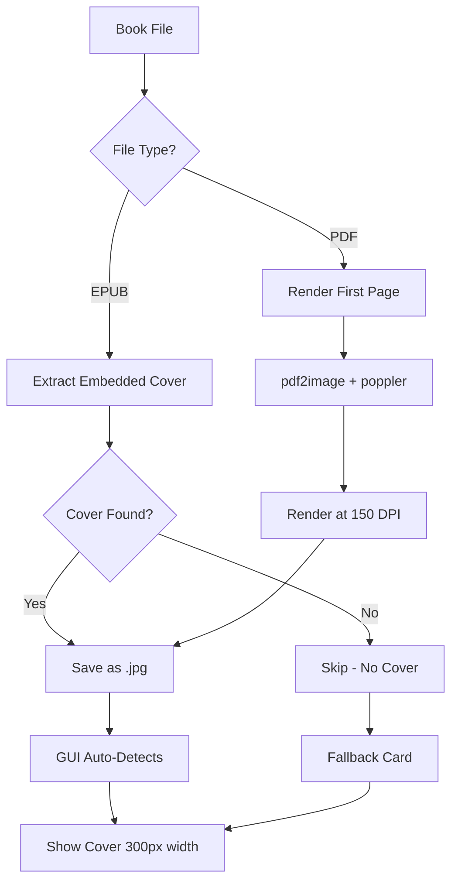
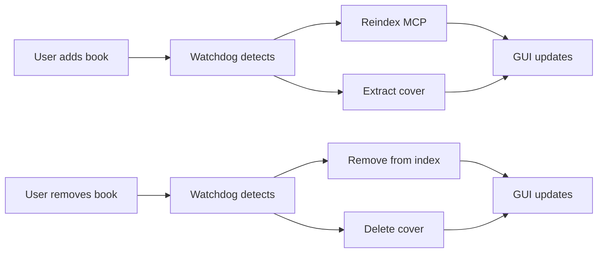

# Cover Extraction Architecture

**Goal:** Extract cover images from EPUB and PDF files for GUI display.

## Flow Diagram



## Script: `extract-covers.py`

**Location:** `~/Documents/librarian/scripts/extract-covers.py`

**Unified approach:** One script handles both EPUB and PDF

### EPUB Method

**Fast extraction** (metadata-based):

```python
def find_cover_in_epub(epub_path):
    book = epub.read_epub(epub_path)
    
    # Method 1: Cover metadata
    for item in book.get_items_of_type(ebooklib.ITEM_IMAGE):
        if 'cover' in item.get_name().lower():
            return item.get_content()
    
    # Method 2: Manifest lookup
    cover_id = book.get_metadata('OPF', 'cover')
    if cover_id:
        return book.get_item_with_id(cover_id[0][1]).get_content()
    
    return None
```

**Performance:** ~0.1s per file (metadata read)

### PDF Method

**Render first page** (image-based):

```python
def extract_pdf_cover(pdf_path, dpi=150):
    images = convert_from_path(
        pdf_path,
        first_page=1,
        last_page=1,
        dpi=dpi
    )
    return images[0] if images else None
```

**Dependencies:**
- `pdf2image` (Python wrapper)
- `poppler` (PDF rendering engine, via Homebrew)

**Performance:** ~3s per file (render + save)

**DPI setting:** 150 (balance quality vs file size)

## Results (2026-03-10)

**Execution stats:**

| Metric | Value |
|--------|-------|
| Total EPUBs | 272 |
| Total PDFs | 309 |
| EPUB covers extracted | 171 |
| PDF covers extracted | 303 |
| Skipped (already had cover) | 250 |
| Failed (corrupted/unsupported) | 28 |
| **Total covers** | **474** |

**Estimated time:**
- EPUBs: ~27s (272 × 0.1s)
- PDFs: ~927s (309 × 3s)
- **Total:** ~15 minutes

## Storage Pattern

**Cover location:** Same directory as book, same base name

```
books/AI/policy/
  ├── Framework to contest.epub
  ├── Framework to contest.jpg   ← Cover
  ├── Remediation.pdf
  └── Remediation.jpg             ← Cover
```

**Symlink exposes to GUI:**
```
app/public/books → ~/Documents/librarian/books
```

**GUI auto-detection:**
```typescript
const coverPath = `/books/${topic}/${encodeURIComponent(book)}.jpg`;
const coverExists = await fetch(coverPath, { method: 'HEAD' });
if (coverExists.ok) {
  return ;
} else {
  return <FallbackCard height={400} />;
}
```

## Dependencies

**System (Homebrew):**
```bash
brew install poppler  # PDF rendering library
```

**Python (pip3):**
```bash
pip3 install --break-system-packages pdf2image ebooklib Pillow
```

**Why `--break-system-packages`:**
- macOS Tahoe enforces PEP 668 (externally-managed environment)
- Librarian scripts = local use only (safe to bypass)

## Future Integration (Epic v0.27.0)

**File watcher workflow:**



**Goal:** Paridade = If book in GUI → searchable in MCP

## Error Handling

**Corrupted PDFs (28 failures):**
- Graceful skip (log error, continue)
- No partial covers saved
- User sees fallback card (title + extension)

**Missing EPUB covers:**
- Not all EPUBs have embedded covers
- Fallback card used (consistent UX)

**Disk space:**
- 474 covers × ~50KB avg = ~24MB
- Negligible impact

## Performance Notes

**Why not API-based?**
- ❌ Google Books API = rate limits, incomplete coverage
- ❌ Open Library = slow, unreliable
- ✅ Local extraction = 100% coverage, no tokens, offline

**Why DPI 150?**
- Lower (72-100): Blurry on retina displays
- Higher (300+): Large files, slow load
- 150 DPI: Sweet spot (sharp on iPad, ~50KB file)

**Lazy loading?**
- Not needed (474 covers = ~24MB total)
- Browser caches aggressively
- Horizontal scroll = only visible covers load

## Maintenance

**Re-extract all covers:**
```bash
cd ~/Documents/librarian
rm books/**/*.jpg  # Clear old covers
python3 scripts/extract-covers.py
```

**Extract single book:**
```bash
python3 scripts/extract-covers.py --file "books/AI/policy/Debt.epub"
```

**Watch mode (future):**
```bash
# Watchdog triggers extraction on new books
python3 scripts/watch-library.py
```

## Testing

**Verify cover count:**
```bash
find ~/Documents/librarian/books -name "*.jpg" | wc -l
# Expected: 474 (as of 2026-03-10)
```

**Check symlink:**
```bash
ls -la ~/Documents/librarian/app/public/books
# Should point to: ~/Documents/librarian/books
```

**Test GUI access:**
```bash
curl -I http://localhost:8766/books/AI/policy/Debt.jpg
# Expected: 200 OK
```

## Notes

**Why unified script?**
- DRY principle (one script, two formats)
- Shared logic (file discovery, error handling)
- Easier maintenance

**Why local processing?**
- No API tokens needed
- No internet required
- 100% privacy (books never leave machine)
- Deterministic (same input → same output)

**Why 150 DPI for PDFs?**
- Tested range: 72 (blurry), 150 (sharp), 300 (overkill)
- 150 = optimal balance (quality vs speed vs file size)
- Renders ~3s per PDF (acceptable for batch job)

**Future optimization:**
- Parallel processing (multiprocessing pool)
- Could reduce 15min → 3min (5x cores)
- Not needed yet (run overnight via Night Shift)
