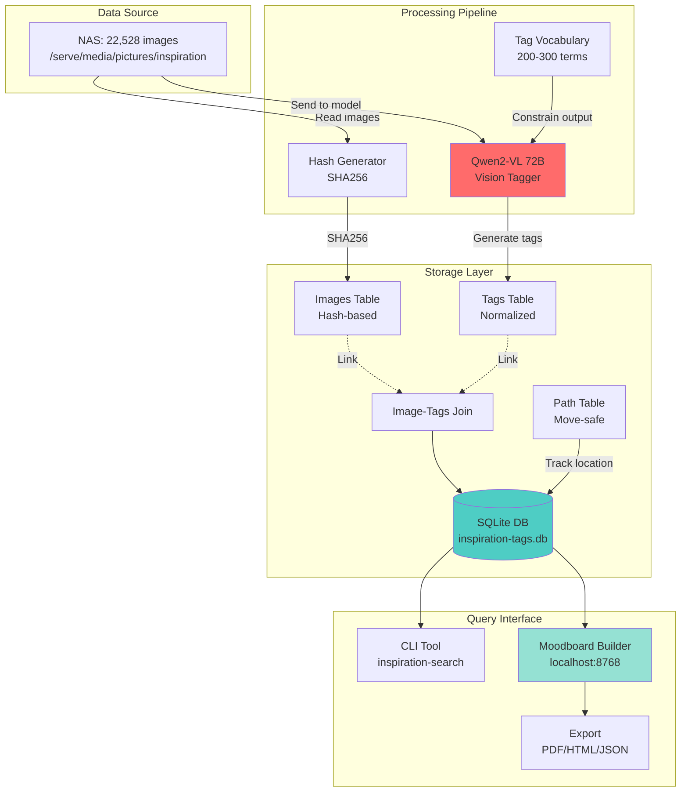
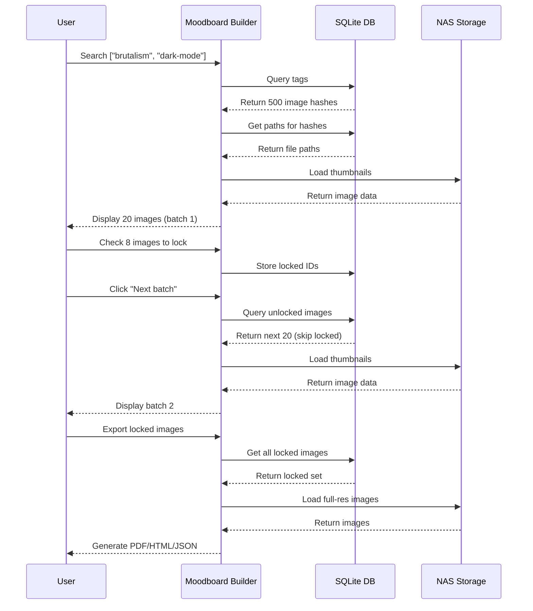
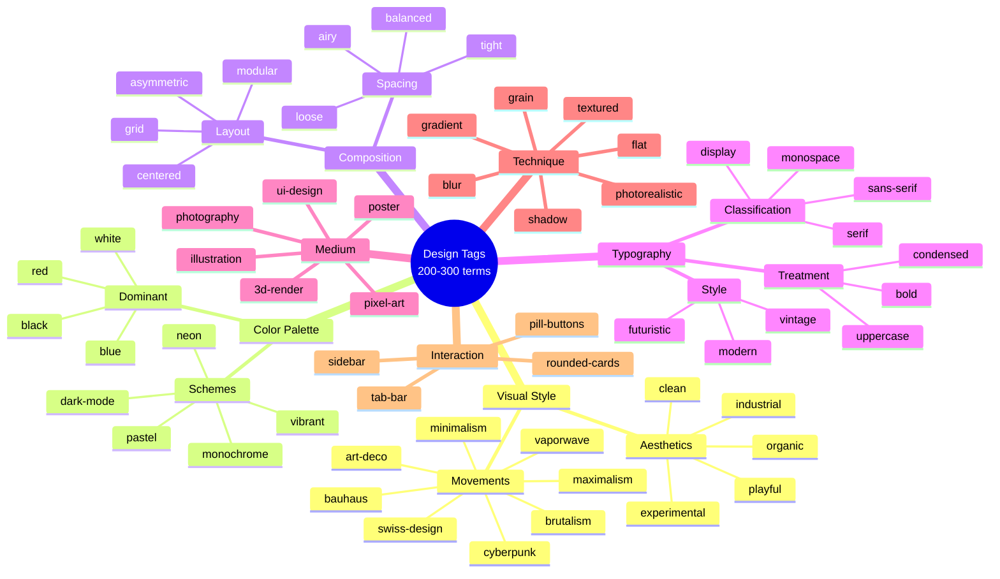
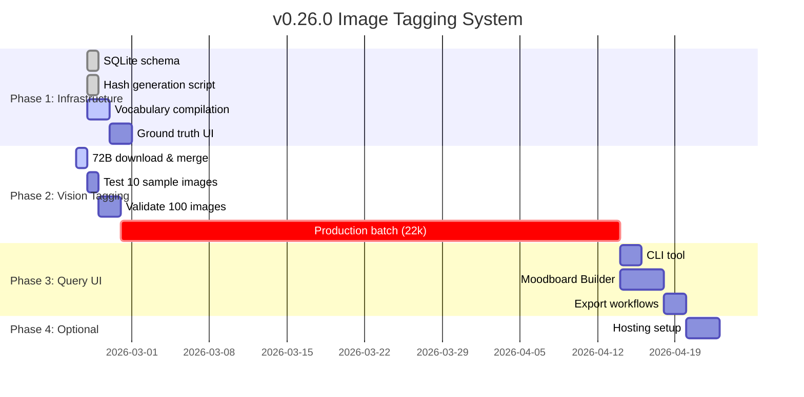

# v0.26.0 - Image Tagging System

**Status:** 💡 PLANNED (2026-02-24)  
**Priority:** MEDIUM (local LLM enables zero-cost tagging)

---

## Goal

Auto-tag 22,528 design inspiration images with visual style metadata using local Qwen2-VL 72B model.

**Why now:** Local models = zero token cost (was prohibitive with cloud APIs)

---

## Problem

**Current state:**
- 22,528 design images in `/serve/media/pictures/inspiration` (NAS)
- No tags, no search, no filtering
- Manual browsing = slow, can't find specific styles
- Want: "show me brutalist UIs" → instant results

**Constraint:**
- Files may move (renaming, reorganization)
- Tags must survive moves
- Need fast search (not 22k file scan)

---

## Solution

### System Architecture



### Architecture: Hash-based SQLite Index

**Why hash-based:**
- Tags tied to file content (SHA256), not path
- Move file? Hash stays same, tags preserved
- Path table tracks current location (rescan cheap)

**Schema:**
```sql
CREATE TABLE images (
  hash TEXT PRIMARY KEY,
  filename TEXT,
  size INTEGER,
  modified INTEGER,
  indexed_at INTEGER
);

CREATE TABLE tags (
  id INTEGER PRIMARY KEY,
  name TEXT UNIQUE,
  category TEXT  -- style, color, composition, typography, medium
);

CREATE TABLE image_tags (
  image_hash TEXT,
  tag_id INTEGER,
  confidence REAL,  -- 0.0-1.0 (model confidence)
  FOREIGN KEY(image_hash) REFERENCES images(hash),
  FOREIGN KEY(tag_id) REFERENCES tags(id)
);

CREATE TABLE paths (
  path TEXT PRIMARY KEY,
  hash TEXT,
  last_seen INTEGER,
  FOREIGN KEY(hash) REFERENCES images(hash)
);

CREATE INDEX idx_tags_category ON tags(category);
CREATE INDEX idx_image_tags_tag ON image_tags(tag_id);
CREATE INDEX idx_paths_hash ON paths(hash);
```

**Move-safe workflow:**
1. Initial index: Hash all images, generate tags
2. File moves? Path table updates (rescan finds same hash)
3. Tags preserved (tied to hash, not path)



---

## Tagging Taxonomy (Design-focused)

**NOT generic ("beach", "mountain")** — design aesthetics only.



### Categories

#### 1. Visual Style
- **Movements:** minimalism, brutalism, maximalism, bauhaus, swiss-design, art-deco, retrofuturism, cyberpunk, vaporwave, memphis-design, organic, geometric, abstract, realism
- **Aesthetics:** clean, cluttered, industrial, organic, playful, serious, whimsical, corporate, editorial, experimental

#### 2. Color Palette
- **Schemes:** monochrome, duotone, vibrant, pastel, earth-tones, neon, dark-mode, light-mode, high-contrast, low-contrast, grayscale, colorful
- **Dominant:** red, blue, green, yellow, purple, orange, pink, black, white, beige, brown

#### 3. Composition
- **Layout:** grid, asymmetric, centered, left-aligned, right-aligned, diagonal, circular, radial, modular, flowing, structured, chaotic
- **Spacing:** tight, loose, balanced, cramped, airy, dense, sparse
- **Hierarchy:** strong, weak, flat, layered, deep, shallow

#### 4. Typography
- **Classification:** sans-serif, serif, slab-serif, display, script, handwritten, monospace, geometric, humanist, grotesk
- **Treatment:** bold, thin, condensed, extended, italic, uppercase, lowercase, mixed-case, outlined, filled
- **Style:** modern, vintage, futuristic, classic, experimental, readable, decorative

#### 5. Medium
- **Type:** ui-design, web-design, app-design, poster, illustration, photography, 3d-render, pixel-art, vector, mixed-media, print, digital
- **Context:** mobile, desktop, responsive, fixed-width, full-screen, widget, dashboard, landing-page, article, portfolio

#### 6. Technique
- **Effects:** blur, grain, noise, gradient, flat, textured, glossy, matte, shadow, glow, transparency, overlay, duplication
- **Rendering:** photorealistic, stylized, low-poly, wireframe, cel-shaded, hand-drawn, procedural

#### 7. Interaction Patterns (UI-specific)
- **Navigation:** sidebar, top-nav, bottom-nav, hamburger, tab-bar, breadcrumbs, floating, hidden
- **Cards:** rounded, sharp, elevated, flat, outlined, filled, transparent
- **Buttons:** pill, rectangular, circular, ghost, solid, outlined, icon-only, text-only

**Total vocabulary: ~200-300 tags** (curated, design-specific)

---

## Vision Model: Qwen2-VL 72B

**Why Qwen2-VL 72B:**
- Best open-source vision model (GPT-4V quality)
- Understands design nuance (not just object detection)
- 72B = context for complex aesthetics
- Local = zero cost (22k images × $0 = $0)

**Prompt template:**
```
You are a design critic analyzing visual aesthetics.

Analyze this image and generate tags from ONLY these categories:

1. Visual Style: minimalism, brutalism, maximalism, bauhaus, swiss-design, art-deco, etc.
2. Color Palette: monochrome, vibrant, pastel, dark-mode, neon, grayscale, etc.
3. Composition: grid, asymmetric, centered, tight-spacing, loose-spacing, etc.
4. Typography: sans-serif, serif, display, bold, condensed, modern, vintage, etc.
5. Medium: ui-design, poster, illustration, 3d-render, photography, etc.
6. Technique: blur, grain, gradient, flat, textured, shadow, photorealistic, etc.
7. Interaction (UI only): sidebar, rounded-cards, pill-buttons, etc.

Output JSON only:
{
  "tags": ["tag1", "tag2", "tag3"],
  "confidence": [0.95, 0.87, 0.78]
}

Rules:
- Max 10 tags per image
- Only use predefined vocabulary (no generic terms like "beautiful" or "nice")
- Confidence 0.0-1.0 for each tag
- Skip categories if not applicable (e.g., typography if no text)
```

---

## Performance Estimates

### Initial Index (22,528 images)

**Model speed:**
- Qwen2-VL 72B: ~2-3 sec/image (vision + inference)
- Hash generation: ~0.1 sec/image (fast)
- DB write: ~0.01 sec/image (negligible)

**Batch sizes:**
- **500 images/night** = ~25 min/night (reasonable overnight job)
- **45 nights** = complete index (~6 weeks)
- **OR 1000/night** = 23 nights (~3 weeks)

**Incremental (post-index):**
- Only new/modified images (maybe 10-50/week?)
- 1-2 min/day (negligible)

### Query Performance

**SQLite indexed:**
- Query "show brutalism": <100ms (22k images)
- Multi-tag AND: <200ms
- Multi-tag OR: <300ms
- Full-text search: <500ms

**Rescan (path updates):**
- 22k hashes × 0.01 sec = ~4 min (daily cron, cheap)

---

## Hosting Cost Analysis

**Current:** Self-hosted (NAS + Mac Studio)

**Future: Public hosting**

**If hosted externally:**

| Service | Storage (100GB) | Bandwidth (10GB/mo) | Compute (search) | Total/Month |
|---------|----------------|---------------------|------------------|-------------|
| **Hetzner VPS** | ~$5 (included) | Free (20TB included) | ~$5 (CX21) | **~$10** |
| **DigitalOcean** | ~$10 | ~$1 | ~$12 (droplet) | **~$23** |
| **AWS S3 + Lambda** | ~$2.30 (S3) | ~$0.90 | ~$5 (Lambda) | **~$8** |
| **Cloudflare R2** | ~$1.50 (storage) | FREE (egress) | ~$5 (Workers) | **~$7** |

**Recommended: Cloudflare R2 + Workers (~$7/month)**
- FREE bandwidth (R2 = zero egress fees)
- Fast CDN (global edge)
- Cheaper than your current $100/month service

**Break-even:** Any hosting < $100/month = savings

---

## Tasks

### Phase 1: Index Infrastructure
- [ ] Create SQLite schema (`~/Documents/personal/inspiration-tags.db`)
- [ ] Hash generation script (SHA256 all images)
- [ ] Path table population (initial scan)
- [ ] Tag vocabulary file (200-300 design terms, categorized)

### Phase 2: Vision Tagging
- [ ] Wait for Qwen2-VL 72B download complete
- [ ] Merge split files (`llama-gguf-split --merge`)
- [ ] Test Qwen2-VL with sample image (verify quality)
- [ ] Batch tagging script (500 images/night)
- [ ] Cronjob setup (nightly incremental)

### Phase 3: Query Interface
- [ ] CLI tool (`inspiration-search "brutalism dark-mode"`)
- [ ] **Localhost Moodboard Builder (port 8768)**
  - Search interface (tags + limit)
  - Image grid (thumbnails from NAS)
  - **Check to lock** (selected images = locked)
  - **New run** button (next batch, skip locked)
  - Progress bar (X locked / Y total)
  - **Export moodboard** (locked images → PDF/HTML/JSON)
  - Pagination (show N at a time, configurable limit)
  - Unlocked pool shrinks as you lock more
  - Session state (locked IDs persist across runs)
- [ ] Stats dashboard (tag distribution, coverage %)

**Moodboard workflow:**
1. Search: `["brutalism", "dark-mode"]` → 500 results
2. Set limit: Show 20 at a time
3. Review batch 1 (20 images) → check 8 to lock
4. "Next batch" → shows next 20 (from remaining 492)
5. Repeat until all locked OR done curating
6. Export → PDF/HTML with locked images only

### Phase 4: Hosting (Optional)
- [ ] Research Cloudflare R2 setup
- [ ] Cost estimate (100GB storage + 10GB/mo bandwidth)
- [ ] Migration plan (NAS → R2, keep local backup)
- [ ] Public URL setup (inspiration.nonlinear.nyc?)

---

## Success Criteria

- ✅ 22,528 images indexed (hash + tags)
- ✅ Query "brutalism" returns results in <1 sec
- ✅ Tags survive file moves (hash-based)
- ✅ Incremental updates automatic (cronjob)
- ✅ Web UI functional (search + filter + grid)
- ✅ Moodboard export working (PDF/HTML)
- ✅ Zero token cost (local vision model)

**Optional:**
- ✅ Hosted publicly (<$10/month)
- ✅ Public URL live (inspiration.nonlinear.nyc)

---

## Dependencies

- ✅ Qwen2-VL 72B model (downloading in v0.25.0)
- ✅ llama.cpp (already compiled)
- ✅ SQLite (built-in macOS)
- ⏳ llama-cpp-python (install when 72B ready)

---

## Timeline



**Week 1:** Schema + hash index (2-3 days)  
**Week 2-7:** Vision tagging (500/night, 45 nights)  
**Week 8:** Web UI + CLI (3-4 days)  
**Week 9+:** Optional hosting setup

**Total: ~2 months** (mostly overnight batch work)

---

## Notes

**Why local vision = game-changer:**
- Cloud APIs: 22k images × $0.01/image = **$225** (one-time)
- Local: **$0** (already have hardware)
- Incremental: Cloud = ongoing cost, Local = FREE

**This is ONLY viable because local LLM infrastructure exists now.**

**Design taxonomy matters:**
- Generic tags ("beautiful", "nice") = useless
- Design-specific ("brutalist", "dark-mode") = searchable
- Curated vocabulary = consistent results

**Hash-based = future-proof:**
- Move files freely (tags preserved)
- Reorganize folders (no re-tagging)
- Deduplication automatic (same hash = same tags)

---

**Related:**
- [v0.25.0 Local LLM](v0.25.0-local-llm.md) — Vision model infrastructure
- [llm-benchmark-results.md](llm-benchmark-results.md) — Model performance data

---

## Pre-Batch Checklist (DO FIRST!)

**Must exist before tagging 22k images:**

✅ **1. Tag Vocabulary (200-300 terms)**
- JSON file with categorized design terms
- Normalization rules (hyphens, plural, case, synonyms)
- Model prompt constrained to this vocabulary

✅ **2. Ground Truth (100 images)**
- Nicholas manually tags 100 samples
- Validates model accuracy
- Tests vocabulary completeness

✅ **3. Deduplication Check**
- Find duplicates in 22k (perceptual hash)
- Tag once, not 10x

✅ **4. Test Prompt (10 samples)**
- Validate Qwen2-VL output
- Adjust before production
- **Wrong × 22k = 45 nights wasted**

**Sampling phases:**
- Phase 0: 10 images (prompt test)
- Phase 1: 100 images (quality validation)
- Phase 2: 1k images (production test)
- Phase 3: 22k images (full batch)

**Why critical:** Setup errors × 22k = catastrophic waste. Test small, validate, THEN scale.

