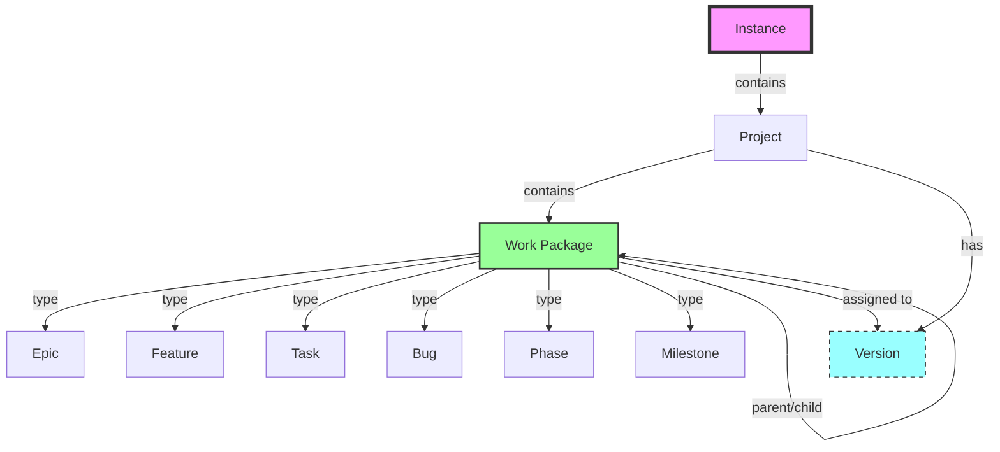
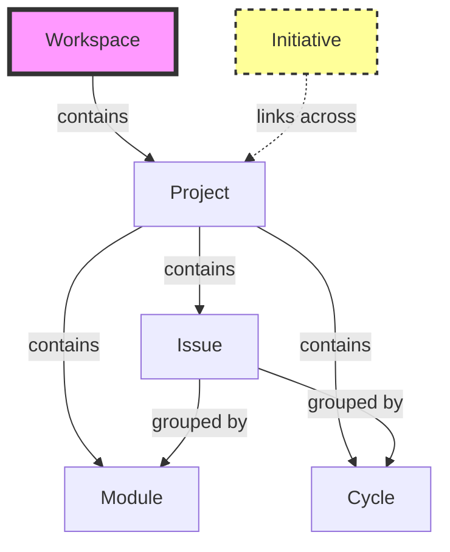
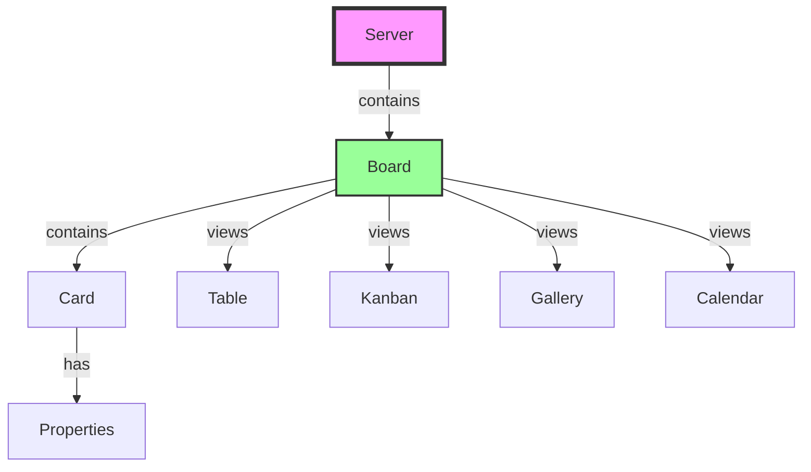
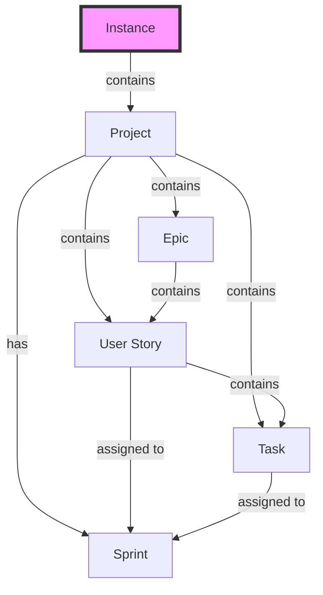
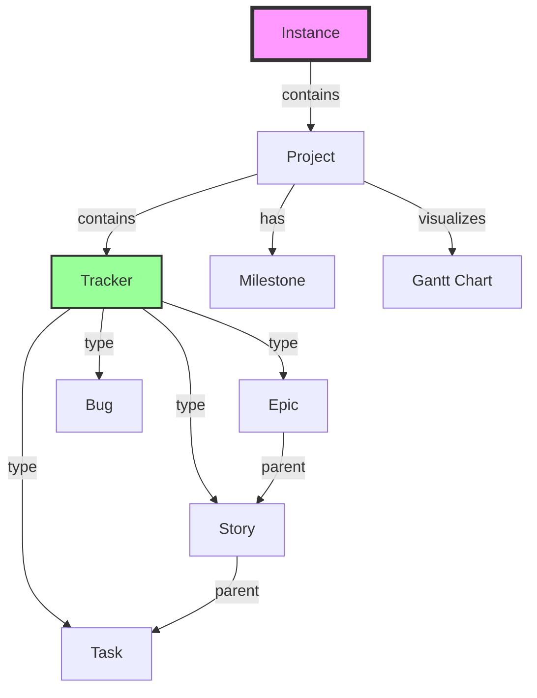
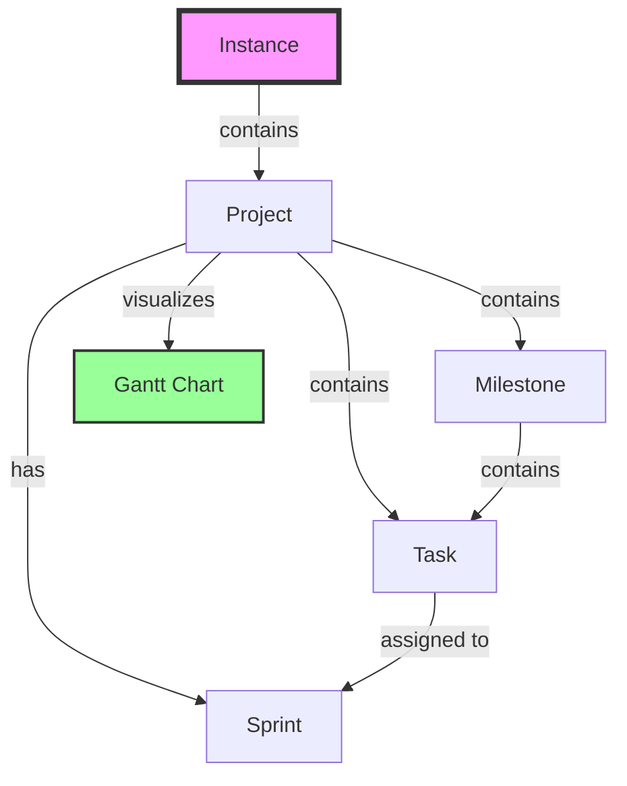

# v0.3.0 - PM Tool Evaluation

**Status:** 🔬 IN PROGRESS (2026-02-23)  
**Priority:** HIGH (blocks agent orchestration)

---

## Tool Hierarchies

### OpenProject

**Structure:** Instance → Project → Work Package (types: Epic, Feature, Task, Bug, Phase, Milestone)

**Hierarchy:** Fully flexible parent/child relationships. Work packages can have any type as parent or child. No enforced hierarchy (e.g., Epic doesn't have to be above Feature).

**Version:** Cross-cutting grouping (assigns work packages to releases), not part of hierarchy.

**Source:** [OpenProject docs - Work package types](https://www.openproject.org/docs/system-admin-guide/manage-work-packages/work-package-types/), [Work package relations](https://www.openproject.org/docs/user-guide/work-packages/work-package-relations-hierarchies/)

**Status:** ✅ Production ready

---

### Plane

**Structure:** Workspace → Project → Module/Cycle → Issue  
**Status:** ❌ Eliminated (API broken)

---

### Focalboard

**Structure:** Server → Board → Card (Notion-like)  
**Status:** ❌ Eliminated (standalone version has NO API)

---

### Taiga

**Structure:** Instance → Project → Epic → User Story → Task  
**Status:** ⏳ Not tested

---

### Tuleap

**Structure:** Instance → Project → Tracker (Epic/Story/Task/Bug)  
**Features:** Full ALM (Application Lifecycle Management), Agile + Waterfall, Portfolio management  
**Status:** ⏳ Testing now (port 9002)

---

### Leantime

**Structure:** Instance → Project → Milestone → Task  
**Status:** ⏳ Not tested

---

## Comparison Table

| Feature | OpenProject | Plane | Focalboard | Taiga | Tuleap | Leantime |
|---------|-------------|-------|------------|-------|--------|----------|
| **API** | ✅ REST v3 + BCF | ✅ REST | ✅ REST | ✅ REST | ✅ REST | ✅ REST |
| **ARM64 Support** | ✅ Native | ✅ Native | ✅ Native | ✅ Native | ❌ AMD64 only | ✅ Native |
| **Epic Hierarchy** | ✅ Work Package parent/child | ❌ Flat issues | ❌ Flat cards | ✅ Epic→Story→Task | ✅ Tracker hierarchy | ✅ Milestone→Task |
| **Self-hosted** | ✅ Docker | ✅ Docker | ✅ Docker | ✅ Docker | ✅ Docker | ✅ Docker |
| **Port** | 8082 | 8085 | 8010 | 9000 | ❌ Broken | 9001 |
| **Status** | ⏳ Testing | ❌ Eliminated | ⏳ Testing | ⏳ Testing | ❌ Incompatible | ⏳ Testing |
| **Gantt Charts** | ✅ Yes | ❌ No | ❌ No | ✅ Yes | ✅ Yes | ✅ Yes |
| **Agent-Friendly** | ❓ | ❌ API broken | ❓ | ❓ | ❌ Can't run | ❓ |

---

**Related:**
- [v0.2.0 Company Skeleton](../ROADMAP.md#v020)
- [v0.21.0 Business Model](v0.21.0-business-model-commons.md)
- [Grant Advisor Workflow](grant-advisor-workflow.md) — API-driven grant proposals
