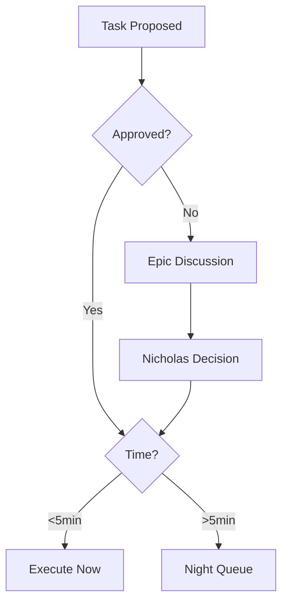

# v0.30.0 - Execution Decision Protocol

**Status:** 💡 PROPOSED (2026-02-26)  
**Priority:** HIGH (Reduces decision overhead)

---

## 🎯 Problem

**Too much decision-making overhead = metabolic waste.**

**Current state:**
- Every task requires explicit approval
- No clear boundary: execute now vs later vs discuss
- No time budgets (work expands to fill available time)
- No distinction: tactical (do it) vs strategic (plan it)

**Result:** Nicholas spends cognitive energy on "should I do this now?" instead of actual work.

---

## 🧠 Decision Tree

### Level 1: Approved vs Needs Discussion

**Approved = clear action, known method, safe to execute**
- Examples: Download model, update config, run script, commit changes
- Criteria: No ambiguity, reversible, low stakes

**Needs Discussion = unclear goal, multiple approaches, high stakes**
- Examples: Architecture decisions, epic planning, new systems
- Criteria: Requires Nicholas input, irreversible, or expensive mistakes

**Action:**
- Approved → Level 2 (time-based routing)
- Needs Discussion → Create epic (document options, propose solutions)

---

### Level 2: Time-Based Routing (Approved Tasks Only)

#### A) <5min → Execute Immediately

**Criteria:**
- Task completes in <5min
- Already approved (clear action)
- Low risk (reversible, safe)

**Examples:**
- Config changes (pmset, git commit, file edits)
- Quick downloads (<500MB)
- Script runs (<5min execution)

**Action:** Execute without confirmation, report after.

---

#### B) >5min → Night Shift Queue

**Criteria:**
- Task takes >5min (long downloads, batch processing, heavy compute)
- Already approved (clear action)
- Can run unattended (no user input needed)

**Examples:**
- Model downloads (5-50GB)
- Batch processing (OCR 500 PDFs)
- Benchmark runs (test all models)
- Data migrations

**Action:** Add to night queue, execute 2AM-6AM, report in morning.

---

### Level 3: Epic Creation (Needs Discussion)

**When:**
- Multiple valid approaches (need to choose)
- High stakes (expensive to undo)
- Unclear requirements (need clarification)

**Action:**
- Create epic note (`v0.X.0-topic.md`)
- Document options (research, pros/cons)
- Propose recommendation
- Wait for Nicholas approval

---

## 🌙 Night Shift Protocol

**Goal:** Batch long-running tasks overnight (2AM-6AM)

**Queue structure:**
```jsonl
{"task": "download Qwen Coder 32B", "command": "huggingface-cli ...", "timeout": 7200, "priority": 1}
{"task": "benchmark 72B model", "command": "python benchmark.py", "timeout": 3600, "priority": 2}
```

**Execution:**
- Trigger: 2AM (cron or HA automation)
- Run sequentially (priority order)
- Timeout enforcement (kill if exceeds)
- Logging (success/fail/duration)

**Morning report (6AM Telegram):**
```
🌙 Night shift complete (4h 23m):
✅ Qwen Coder 32B downloaded (2h 15m)
✅ Benchmark 72B (1h 45m)
❌ OCR batch failed: disk full (line 342)
```

**Add to queue:**
```bash
night-queue add "download model X" "huggingface-cli download ..." --timeout 7200
night-queue add "process PDFs" "python ocr.py --batch 500" --timeout 3600
```

**View queue:**
```bash
night-queue list
```

---

## 📋 Contract Diagram

**What:** Visual agreement of work scope (epics + tasks + time budget)

**Purpose:**
- Clear boundaries (what's in scope, what's not)
- Time budgets (how much work per day/week)
- Approval gates (when Nicholas decides vs Kin executes)

**Format:** Mermaid diagram (like epic roadmap)

**Example:**


**Living document:** Updated as protocols evolve

---

## 🏢 Scope: Global vs Squad/Agent

### Option 1: Global Protocol (All Agents)

**Pros:**
- Simple (one rule for everyone)
- Consistent (no confusion)
- Low maintenance

**Cons:**
- May not fit all contexts (UX research ≠ code deployment)

---

### Option 2: Per-Squad Protocol

**Pros:**
- Context-aware (code agents = different rules than design agents)
- Flexible (each squad optimizes own workflow)

**Cons:**
- More complexity (which protocol applies?)
- Maintenance overhead (update N protocols)

---

### Option 3: Hybrid (Global + Squad Overrides)

**Default:** Global protocol (Levels 1-3 above)

**Squad overrides:**
- **Development Squad:** Auto-deploy to staging (<5min), production = epic
- **Design Squad:** Mockups = execute now, brand changes = epic
- **Operations Squad:** Config changes = execute now, infrastructure = epic

**Recommendation:** Start global, add squad overrides as needed

---

## ⏱️ Time Budgets

**3h nonlinear studio work per day = sustainable pace**

**Breakdown:**
- **1h strategic** (epic planning, architecture, decisions)
- **1h tactical** (execution, implementation, testing)
- **1h learning** (research, reading, skill-building)

**Tracking:**
- Time logs (start/end timestamps)
- Weekly review (actual vs budget)
- Adjust if needed (burnout = reduce, capacity = increase)

**Enforcement:**
- Hard stop at 3h (finish task tomorrow)
- OR: Flexible (some days 1h, some days 5h, avg 3h/day)

**Question for Nicholas:** Hard budget or flexible average?

---

## 🛠️ Implementation

### Phase 1: Decision Tree (Immediate)
- [ ] Document decision tree (this epic)
- [ ] Add to AGENTS.md (execution protocol)
- [ ] Test with real tasks (observe where ambiguity exists)

### Phase 2: Night Shift Queue (Next)
- [ ] Create `~/.night-queue.jsonl`
- [ ] Script: `night-queue` CLI (add, list, run)
- [ ] Cron: 2AM trigger
- [ ] Telegram: 6AM morning report
- [ ] Test: Queue 1-2 tasks, verify execution

### Phase 3: Contract Diagram (Later)
- [ ] Create initial diagram (decision tree + time budgets)
- [ ] Review with Nicholas (adjust as needed)
- [ ] Update epic roadmaps with contract boundaries
- [ ] Periodic review (monthly? quarterly?)

### Phase 4: Time Tracking (Optional)
- [ ] Log work sessions (start/end timestamps)
- [ ] Weekly summary (time spent per category)
- [ ] Dashboard (visualize budgets vs actual)

---

## 🎯 Success Criteria

- ✅ Decision overhead reduced (Kin knows when to execute vs ask)
- ✅ Night shift working (long tasks run overnight, reports in morning)
- ✅ Time budgets respected (sustainable pace, no burnout)
- ✅ Contract diagram clear (visual agreement of work scope)
- ✅ Nicholas spends less time on "should we do this?" decisions

---

## 🔗 Related Epics

- **v0.25.0 Local LLM** - Night shift runs agent jobs
- **v0.21.0 Business Model** - Time budgets for studio work
- **v0.2.0 Company Skeleton** - Agent orchestration (which agent decides what)

---

## 📝 Open Questions

1. **Time budget:** Hard stop at 3h or flexible average?
2. **Squad overrides:** Global protocol first, or define squad rules now?
3. **Night shift:** 2AM-6AM OK? Or different window?
4. **Approval gates:** Always ask for >5min tasks, or auto-queue trusted ones?
5. **Contract diagram:** Where to store? (epic note, AGENTS.md, separate file?)

---

**Next:** Discuss with Nicholas → finalize protocol → implement Phase 1 (decision tree)
