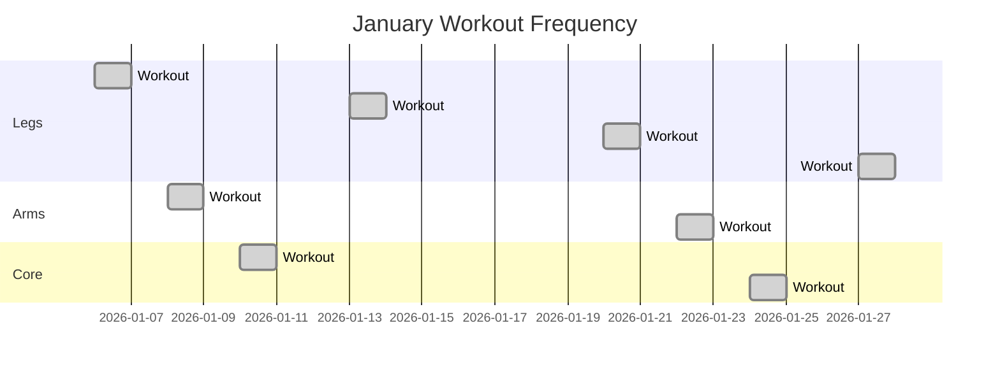
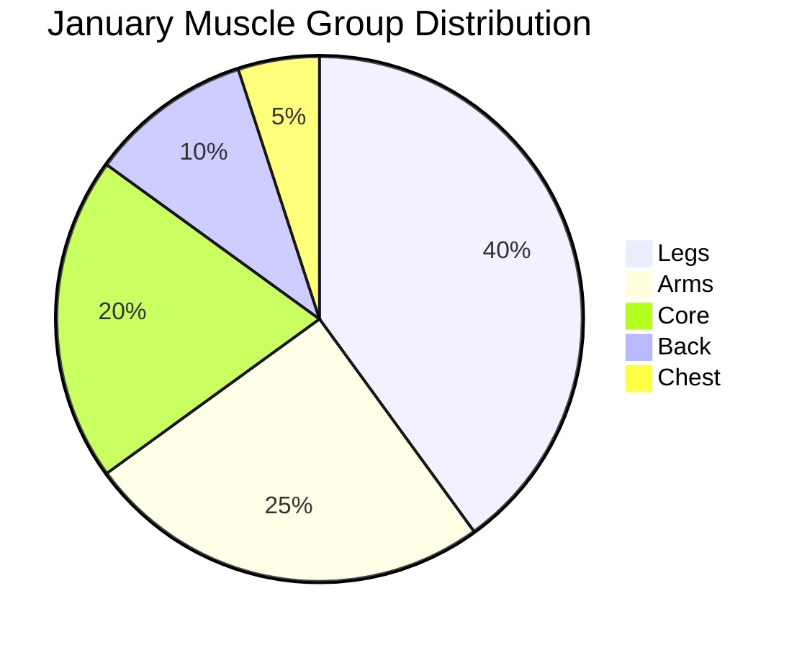

# Epic Notes

> Version, name, status → see `epic.yaml`

---

# v0.6.0 - Fitness Tracker (Gymera + Airtable + Voice)

**Effort:** 3-4 days (Airtable integration + voice UI)


## Problem

**Current state:**
- ✅ Gymera exercise machine (gymera.net)
- ✅ Starting to catalog exercises in Airtable
- ❌ No smart workout planning
- ❌ No tracking/history
- ❌ Manual data entry (friction = won't do it)

**User needs:**
- 🎯 AI-suggested workouts ("today: legs, 6 exercises")
- 🗣️ Voice-guided setup ("configure machine to position X")
- 📊 Automatic tracking (log sets/reps as you go)
- 📈 Progress visualization (Mermaid graphs, weekly summaries)
- ⚠️ Smart suggestions (areas not trained, balance)
- ✨ Voice-first (HA Voice integration = hands-free while exercising!)


## Solution

**Airtable-backed fitness coach via OpenClaw + HA Voice:**

### **Airtable Schema (2 tables):**

#### **Table 1: Exercises**
```
Columns:
- Name (text): "Leg Press"
- Muscle Group (select): Legs, Arms, Core, Back, Chest
- Gymera Position (number): 3
- Gymera Settings (text): "Seat: 5, Backrest: 3, Weight: 20kg"
- Instructions (long text): "Sit with back flat, feet shoulder-width..."
- Difficulty (select): Beginner, Intermediate, Advanced
- Equipment (select): Gymera, Dumbbells, Bodyweight
- Video URL (url): Optional demo link
```

#### **Table 2: Workout Tracker**
```
Columns:
- Date (date): 2026-01-30
- Exercise (linked record): → Exercises table
- Sets (number): 3
- Reps (number): 12
- Weight (number): 20
- Duration (number): 15 (minutes)
- Notes (long text): "Felt good, increased weight"
- Muscle Group (rollup): From Exercise
```


## User Flow (Voice-First, HA Voice)

### **Scenario 1: Plan Workout**

**Location:** Home gym, standing in front of Gymera

**You:** "Hey assistant, I want to work out"

**HA Voice:** 🔊 "Great! What muscle group today? Legs, arms, core, back, or chest?"

**You:** "Legs, 6 exercises"

**HA Voice:** 🔊 "Got it. Pulling 6 leg exercises from your library... Here's your workout:
1. Leg Press
2. Squats
3. Leg Extension
4. Hamstring Curl
5. Calf Raise
6. Lunges

Ready to start?"

**You:** "Yes"


### **Scenario 2: Guided Exercise (Hands-Free!)**

**HA Voice:** 🔊 "Exercise 1: Leg Press. Configure the Gymera:
- Position: 3
- Seat: 5
- Backrest: 3
- Weight: Start with 20 kilograms

Let me know when you're ready."

**You:** *(configuring machine)*

**You:** "Ready"

**HA Voice:** 🔊 "Instructions: Sit with your back flat against the backrest. Place feet shoulder-width apart on the platform. Push through your heels, extend legs fully, then slowly return. Do 3 sets of 12 reps. Say 'done' after each set."

**You:** *(does set 1)*

**You:** "Done"

**HA Voice:** 🔊 "Set 1 complete. Rest 60 seconds. 2 more sets to go."

**You:** *(rests, does set 2)*

**You:** "Done"

**HA Voice:** 🔊 "Set 2 complete. Rest 60 seconds. Last set!"

**You:** *(does set 3)*

**You:** "Done"

**HA Voice:** 🔊 "Leg Press complete! 3 sets of 12 reps logged. Next: Squats. Configure Gymera to position 1..."


### **Scenario 3: Mid-Workout Adjustments**

**You:** *(struggling with weight)*

**You:** "Hey assistant, this is too heavy"

**HA Voice:** 🔊 "No problem. Reduce weight to 15 kilograms. Your last workout was 18kg, so this is appropriate. Continue when ready."

**You:** "Skip this exercise"

**HA Voice:** 🔊 "Skipping squats. Moving to Leg Extension. Configure Gymera to position 5..."


### **Scenario 4: Post-Workout Summary**

**You:** *(finished, sweaty)*

**You:** "Hey assistant, I'm done"

**HA Voice:** 🔊 "Awesome work! You completed 5 out of 6 exercises in 42 minutes:
- Leg Press: 3 sets, 12 reps, 20kg
- Squats: Skipped
- Leg Extension: 3 sets, 10 reps, 15kg
- Hamstring Curl: 3 sets, 12 reps, 12kg
- Calf Raise: 3 sets, 15 reps, bodyweight

Workout logged. Great job!"


### **Scenario 5: Add New Exercise (Voice)**

**You:** *(gym, just tried new exercise)*

**You:** "Hey assistant, add new exercise"

**HA Voice:** 🔊 "Sure! What's the exercise name?"

**You:** "Romanian Deadlift"

**HA Voice:** 🔊 "Got it. Which muscle group?"

**You:** "Legs and back"

**HA Voice:** 🔊 "Gymera position?"

**You:** "Position 7"

**HA Voice:** 🔊 "Settings?"

**You:** "Seat at 2, no backrest, weight 25kg"

**HA Voice:** 🔊 "Perfect. Romanian Deadlift added to your exercise library. Want to add instructions?"

**You:** "Not now"

**HA Voice:** 🔊 "Saved! You can add details later."


### **Scenario 6: Progress Check**

**You:** *(evening, relaxing)*

**You:** "Hey assistant, how was my workout week?"

**HA Voice:** 🔊 "This week you worked out 4 times. Here's your breakdown:
- Monday: Legs (6 exercises, 45 min)
- Wednesday: Arms (5 exercises, 38 min)
- Friday: Core (4 exercises, 30 min)
- Sunday: Legs (6 exercises, 42 min)

Total: 155 minutes. You haven't trained back or chest this week. Want to schedule upper body for tomorrow?"

**You:** "Yes"

**HA Voice:** 🔊 "Great! I'll suggest a chest and back workout tomorrow. Reminder set for 9 AM."


### **Scenario 7: Visual Progress (Web/iMessage)**

**You:** *(at desk, web chat)*  
"Show my January workout graph"

**Me:** *generates Mermaid chart*



Or muscle group heatmap:




## Tasks

### Phase 1: Airtable Setup (Day 1, 2-3 hours)

- [ ] Create Airtable base "Fitness"
- [ ] Table 1: Exercises (schema above)
- [ ] Table 2: Workout Tracker (schema above)
- [ ] Populate initial exercises (Gymera catalog)
- [ ] Get Airtable API key
- [ ] Test API access (read/write)

**Deliverable:** Airtable base with 10+ exercises, trackable via API.


### Phase 2: Airtable Skill (Day 1-2, 3-4 hours)

**Goal:** OpenClaw can read/write Airtable fitness data.

- [ ] Create `airtable` skill (or extend existing)
- [ ] Function: `list_exercises(muscle_group, limit)`
- [ ] Function: `get_exercise(name)` → details, settings
- [ ] Function: `log_workout(exercise, sets, reps, weight, notes)`
- [ ] Function: `add_exercise(data)` → create new exercise
- [ ] Function: `get_workout_history(start_date, end_date)`
- [ ] Test via CLI: `airtable list-exercises --muscle-group=Legs`

**Alternative: Jira MCP for New Exercises**
- [ ] Evaluate Jira MCP integration (if available)
- [ ] Use case: Natural way to add new exercises ("I found a new exercise: [description]")
- [ ] Jira ticket → parsed into Airtable Exercise schema
- [ ] Benefit: Structured input via familiar ticketing flow
- [ ] Note: Only if Jira MCP is robust; otherwise stick to direct Airtable

**Deliverable:** OpenClaw can CRUD fitness data in Airtable.


### Phase 3: Workout Voice Flow (Day 2-3, 4-5 hours)

**Goal:** Voice-guided workout session (HA Voice).

**Conversation patterns:**

#### **Start Workout:**
```
User: "I want to work out [muscle group], [N] exercises"
OpenClaw: 
  1. Query Airtable (muscle group filter)
  2. Select N exercises (variety, difficulty)
  3. Read list verbally
  4. Ask: "Ready to start?"
```

#### **Guide Exercise:**
```
OpenClaw:
  1. Read exercise name
  2. Read Gymera settings (position, seat, weight)
  3. Read instructions (concise, voice-friendly)
  4. Wait for "ready"
  5. Coach through sets ("Set 1 of 3, go!")
  6. Track completion ("Done" → log set)
  7. Rest timer ("Rest 60 seconds")
  8. Move to next exercise
```

#### **Log & Summarize:**
```
User: "I'm done"
OpenClaw:
  1. Summarize workout (exercises, sets, reps, time)
  2. Log to Airtable Tracker
  3. Encourage ("Great job!")
```

**Deliverable:** Full voice-guided workout loop.


### Phase 4: Progress & Insights (Day 3-4, 3-4 hours)

**Analytics queries:**

- [ ] "How was my workout week?" → Summary stats
- [ ] "Show my progress on leg press" → Weight/reps over time
- [ ] "What haven't I trained?" → Missing muscle groups
- [ ] "Suggest tomorrow's workout" → Balance algorithm
- [ ] "Compare this month to last month" → Frequency, volume

**Visualizations (web/iMessage):**

- [ ] Mermaid Gantt (workout calendar)
- [ ] Mermaid Pie (muscle group distribution)
- [ ] Mermaid Bar (exercise volume trends)
- [ ] Table (exercise PRs - personal records)

**Deliverable:** Voice queries + visual progress reports.


### Phase 5: HA Voice Integration (Day 4, 2 hours)

**After v0.5.0 HA Voice is working:**

- [ ] Test workout flow via HA Voice
- [ ] Optimize for gym environment (louder TTS, clear prompts)
- [ ] Hands-free logging ("Done" voice trigger)
- [ ] Place HA Voice device in gym area
- [ ] Validate latency (acceptable mid-set?)

**Deliverable:** Fully hands-free workout sessions.


## Airtable Schema (Detailed)

### **Exercises Table**

| Field | Type | Example | Purpose |
|-------|------|---------|---------|
| Name | Text | "Leg Press" | Exercise identifier |
| Muscle Group | Single Select | Legs, Arms, Core, Back, Chest, Full Body | Filtering |
| Gymera Position | Number | 3 | Machine setup |
| Gymera Settings | Long Text | "Seat: 5, Backrest: 3, Weight: 20kg" | Voice instructions |
| Instructions | Long Text | "Sit with back flat..." | Coaching |
| Difficulty | Single Select | Beginner, Intermediate, Advanced | Progression |
| Equipment | Single Select | Gymera, Dumbbells, Bodyweight, Bands | Availability |
| Video URL | URL | https://... | Optional demo |
| Tags | Multiple Select | Compound, Isolation, Cardio | Advanced filtering |
| Created | Created Time | Auto | Audit |


### **Workout Tracker Table**

| Field | Type | Example | Purpose |
|-------|------|---------|---------|
| Date | Date | 2026-01-30 | When |
| Exercise | Linked Record | → Leg Press | What |
| Sets | Number | 3 | Volume |
| Reps | Number | 12 | Volume |
| Weight | Number | 20 | Intensity |
| Duration | Number | 15 | Time (min) |
| Notes | Long Text | "Felt strong, increased weight" | Context |
| Muscle Group | Rollup | (from Exercise) | Analytics |
| Difficulty | Rollup | (from Exercise) | Analytics |
| Completed | Checkbox | ✓ | Status |
| Created | Created Time | Auto | Audit |


## Voice UI Design (Hands-Free Considerations)

### **Prompts (clear, concise):**
- ✅ "Leg Press. Position 3. Seat 5. Weight 20 kilograms."
- ❌ "The next exercise in your workout routine is the Leg Press, which is performed on the Gymera machine. You'll need to configure the machine to position number 3..." (too long!)

### **Commands (natural):**
- "Ready" → Start exercise
- "Done" → Log set
- "Skip" → Next exercise
- "Repeat" → Say instructions again
- "Too heavy" / "Too light" → Adjust weight
- "Stop" → End workout

### **Feedback (motivating):**
- "Set 1 complete! 2 more to go."
- "Halfway there!"
- "Last set, push through!"
- "Awesome work! Workout logged."


## Smart Features (Future)

### **Progressive Overload:**
- Track weight/reps over time
- Suggest +2.5kg when last 3 workouts hit target reps
- "Last time you did 20kg. Try 22.5kg today?"

### **Rest Day Detection:**
- "You worked legs Monday and Wednesday. Rest day recommended."

### **Balance Warnings:**
- "You've trained legs 4 times, arms 0 times this month. Consider upper body."

### **Plateau Detection:**
- "Leg press weight hasn't increased in 4 weeks. Try drop sets or higher reps?"

### **Voice Journaling:**
- "How did that feel?" → Log subjective difficulty
- "Any pain?" → Flag for review


## Success Criteria

- ✅ Can start workout via voice ("work out legs, 6 exercises")
- ✅ Gymera setup instructions clear and correct
- ✅ Logs sets/reps automatically as I say "done"
- ✅ Post-workout summary accurate
- ✅ Can add new exercises via voice
- ✅ Weekly progress query shows muscle group balance
- ✅ Mermaid graphs visualize trends
- ✅ Hands-free (no phone touching during workout)


## Dependencies

- **v0.5.0** (HA Voice integration) - core voice UI
- Airtable account + API key
- Gymera machine (you have!)
- HA Voice device placed in gym area


## Blockers

**Questions for you:**

1. **Airtable base exists?** (nonlinear workspace? need link/API key)
2. **Current exercises cataloged?** (how many? can I see schema?)
3. **Gymera positions documented?** (machine manual? position numbers?)
4. **Gym location?** (where to place HA Voice device?)
5. **Start simple or full featured?** (MVP = guide 1 exercise, or full workout flow?)


## Why This Epic Is PERFECT

**ADHD-friendly:**
- ✅ Voice = no manual logging (friction removed!)
- ✅ Guided = no decision fatigue mid-workout
- ✅ Tracking = visible progress (dopamine!)

**Health benefits:**
- ✅ Consistency (easier to do = do it more)
- ✅ Balance (AI catches muscle group gaps)
- ✅ Safety (proper form instructions)

**HA Voice killer app:**
- ✅ Hands-free when you NEED it (sweaty, holding weights)
- ✅ Real-time feedback (not just smart home control)
- ✅ Daily use case (builds HA Voice habit)


*This is a GREAT epic. Let's build it!* 💪

**Next:** You answer blocker questions, I start Phase 1 (Airtable setup).
