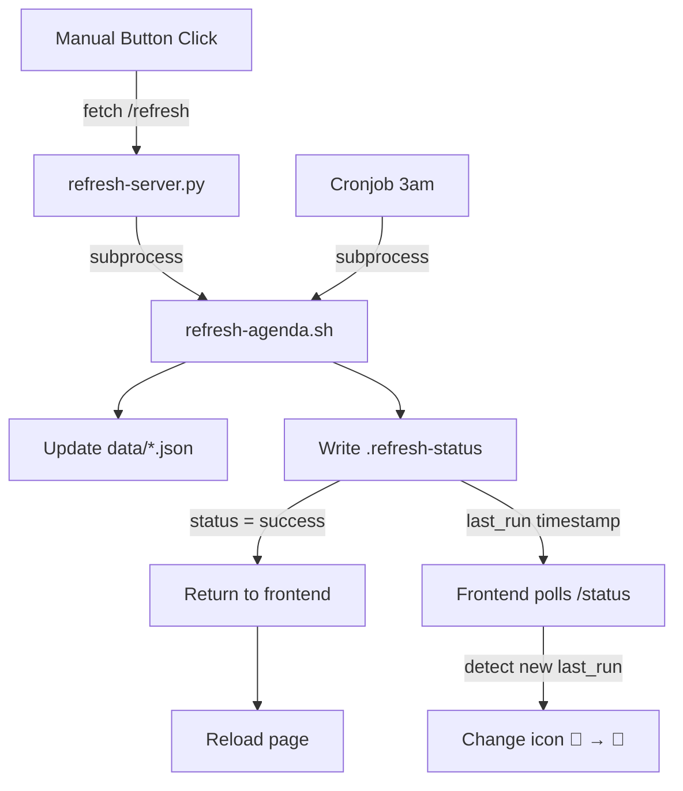

# Epic: Agenda Refresh Architecture

**Status:** 🏗️ ACTIVE  
**Created:** 2026-02-13

## Problem

Agenda app has two refresh mechanisms:
1. **Button** (manual) → calls `refresh-server.py` → runs `refresh-agenda.sh` → **doesn't reload page** (bug?)
2. **Cronjob** (automated) → runs `refresh-agenda.sh` directly → no page interaction

**Issues:**
- Button doesn't reload page after refresh
- Two separate trigger points (not DRY)
- No visual indicator when cronjob refreshes (user doesn't know data is stale)

## Solution

**Centralize refresh engine:**
- Both button + cronjob use same `refresh-agenda.sh`
- Shared status file (`.refresh-status`) for coordination

**Divergent behaviors:**
- **Button:** Refresh → reload page
- **Cronjob:** Refresh → change 🔄 icon to 🌟 (indicate new data without disrupting user)

## Architecture



## Tasks

- [ ] **Fix button reload:** After `/refresh` success, call `location.reload()`
- [ ] **Cronjob indicator:** Poll `/status` every 30s, detect `last_run` change → update icon to 🌟
- [ ] **Manual indicator reset:** When user clicks button, reset icon to 🔄
- [ ] **Test button refresh:** Click → data refreshes → page reloads
- [ ] **Test cronjob indicator:** Trigger cronjob → icon changes to 🌟 without reload
- [ ] **Document:** Add comments in agenda.html explaining polling logic

## Implementation Notes

**Frontend changes (agenda.html):**
```javascript
// Button click handler
async function reloadTasks() {
    const btn = document.getElementById('reloadTasksBtn');
    btn.disabled = true;
    btn.textContent = '⏳';
    
    try {
        const response = await fetch('http://localhost:8766/refresh');
        const data = await response.json();
        
        if (data.status === 'success') {
            // NEW: Reload page after successful refresh
            location.reload();
        } else {
            throw new Error(data.error);
        }
    } catch (error) {
        console.error('Refresh failed:', error);
        btn.textContent = '❌';
        setTimeout(() => {
            btn.textContent = '🔄';
            btn.disabled = false;
        }, 3000);
    }
}

// Poll for cronjob updates
let lastKnownRun = null;
async function checkRefreshStatus() {
    const response = await fetch('http://localhost:8766/status');
    const data = await response.json();
    const btn = document.getElementById('reloadTasksBtn');
    
    // Initialize on first poll
    if (lastKnownRun === null) {
        lastKnownRun = data.last_run;
        return;
    }
    
    // Detect cronjob refresh (last_run changed)
    if (data.last_run && data.last_run > lastKnownRun) {
        btn.textContent = '🌟'; // Indicate new data
        lastKnownRun = data.last_run;
    }
    
    // Running indicator
    if (data.running && !btn.disabled) {
        btn.textContent = '⏳';
    }
}

// Poll every 30s
setInterval(checkRefreshStatus, 30000);
checkRefreshStatus(); // Initial check
```

**Backend (refresh-server.py):**
- No changes needed (already writes `.refresh-status`)

**Cronjob:**
- No changes needed (already runs `refresh-agenda.sh`)

## Success Criteria

- ✅ Click button → data refreshes → page reloads
- ✅ Cronjob runs → icon changes to 🌟 (no page reload)
- ✅ Click button → icon resets to 🔄 (clears stale indicator)
- ✅ Both use same `refresh-agenda.sh` (centralized)

## Future Enhancements

- **WebSocket:** Real-time push instead of polling
- **Service Worker:** Background refresh, notify user when new data available
- **Multiple icons:** Different states (🔄 idle, ⏳ running, 🌟 new data, ❌ error)

---

**Epic note:** This is a self-contained improvement (no dependencies on other epics)
