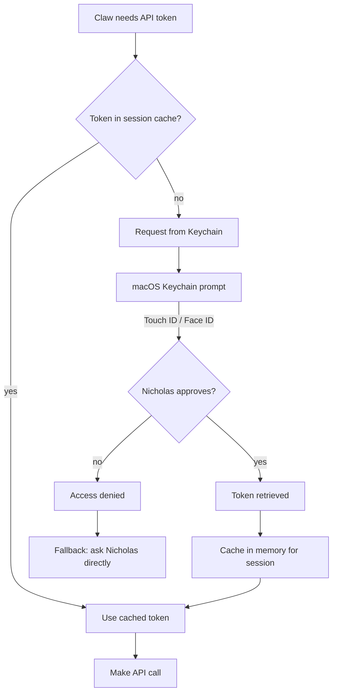

# Epic: Security - Biometric Token Vault

**Status:** 📋 BACKLOG  
**Created:** 2026-02-13  
**Project:** life

---

## Problem

**Current state:** Tokens stored in plaintext `.env`
- ✅ Works for automation (cron, heartbeat, API calls)
- ❌ Security risk if machine compromised
- ❌ No audit trail (who accessed what token when)
- ❌ No revocation (if token leaked, must regenerate)

**ClawHub warning valid:** Plaintext .env is risky.

**Nicholas's constraint:** Automation MUST work without asking permission every time.

---

## Solution: Biometric Token Vault

**Concept:**
- Tokens stored in encrypted vault (macOS Keychain or similar)
- **First access per session:** Requires Touch ID / Face ID (Nicholas present)
- **Subsequent accesses:** Token cached in memory (session-only)
- **Automation friendly:** Once unlocked, cron/heartbeat work unattended

**User experience:**
1. Claw needs Jira token (first time today)
2. macOS prompt: "OpenClaw wants to access Jira token" → Touch ID
3. Nicholas approves (muscle memory, takes 1 second)
4. Token cached for rest of session
5. Next API call → uses cached token (no prompt)

**Nicholas happy:** Biometric = legitimate gate, muscle memory
**Claw happy:** Automation still works
**Security happy:** No plaintext tokens, audit trail

---

## Architecture



---

## Implementation Options

### Option A: macOS Keychain (native)

**Pros:**
- Built-in biometric integration
- System-level encryption
- Audit logs in Console.app
- Works offline

**Cons:**
- macOS only (not portable to server)
- CLI requires security command (verbose)

**Storage:**
```bash
# Store token (prompts for password/Touch ID)
security add-generic-password \
  -a "$USER" \
  -s "WILEY_JIRA_TOKEN" \
  -w "token_value" \
  -T "/usr/bin/security" \
  -T "/usr/bin/python3"  # Allow Python access
```

**Retrieval:**
```bash
# First access → Touch ID prompt
# Subsequent → cached until reboot/timeout
security find-generic-password \
  -a "$USER" \
  -s "WILEY_JIRA_TOKEN" \
  -w
```

**Python wrapper:**
```python
import subprocess
import os

_token_cache = {}

def get_token(service_name):
    # Check session cache
    if service_name in _token_cache:
        return _token_cache[service_name]
    
    # Request from Keychain (may prompt Touch ID)
    result = subprocess.run(
        ['security', 'find-generic-password', 
         '-a', os.getenv('USER'),
         '-s', service_name,
         '-w'],
        capture_output=True,
        text=True
    )
    
    if result.returncode == 0:
        token = result.stdout.strip()
        _token_cache[service_name] = token  # Cache for session
        return token
    else:
        raise Exception(f"Failed to get token: {result.stderr}")

# Usage
jira_token = get_token('WILEY_JIRA_TOKEN')
```

### Option B: 1Password CLI (if Nicholas uses it)

**Pros:**
- Cross-platform (macOS, server, etc.)
- Biometric unlock
- Sync across devices

**Cons:**
- Requires 1Password subscription
- External dependency

### Option C: Pass + GPG + Touch ID

**Pros:**
- Open source
- Git-backed (versioned tokens)
- GPG can use Touch ID via gpg-agent

**Cons:**
- More complex setup
- Requires Yubikey or similar for best Touch ID integration

---

## Migration Plan

**Phase 1: Wrapper library**
- Create `~/Documents/life/scripts/secure_tokens.py`
- Wrapper that tries Keychain first, falls back to .env
- Gradual migration (both work during transition)

**Phase 2: Move critical tokens**
- Jira, Figma, GitHub → Keychain
- Less sensitive (NAS password) → can stay in .env

**Phase 3: Deprecate .env**
- Once all tokens migrated
- Keep .env for non-secret config (URLs, account IDs)

**Phase 4: Audit & test**
- Verify cron jobs work after first Touch ID unlock
- Test session cache timeout
- Confirm automation still unattended

---

## Tasks

- [ ] **Research:** Test macOS Keychain Touch ID behavior
  - Does it prompt once per session or per access?
  - Can we cache in Python process memory?
  - What happens with cron jobs (no user session)?

- [ ] **Prototype:** secure_tokens.py wrapper
  - get_token(service_name) function
  - Session cache
  - Fallback to .env

- [ ] **Test:** Migrate one token (Jira)
  - Store in Keychain
  - Update agenda refresh script
  - Verify Touch ID prompt on first access
  - Confirm subsequent accesses cached

- [ ] **Document:** Update token-management skill
  - Keychain storage instructions
  - Biometric workflow
  - Migration guide
  - Keep .env as fallback option (with warnings)

- [ ] **Automate:** Touch ID unlock on session start
  - "bom dia" triggers unlock prompt
  - Caches all needed tokens upfront
  - Rest of day = unattended

- [ ] **Edge case:** Cron jobs without user session
  - Option 1: Keep critical automation tokens in .env (accept risk)
  - Option 2: LaunchAgent with KeepAlive (maintains session)
  - Option 3: SSH key-based auth instead of tokens where possible

---

## Success Criteria

**Security:**
- ✅ No plaintext tokens in .env (or only non-critical ones)
- ✅ Biometric gate for first access per session
- ✅ Audit trail in macOS logs

**Usability:**
- ✅ Nicholas approves once per day (muscle memory)
- ✅ Automation works unattended after unlock
- ✅ No broken cron jobs

**Compatibility:**
- ✅ Works with current scripts (minimal code changes)
- ✅ Gradual migration (old .env works during transition)
- ✅ Portable (can adapt for future server deployment)

---

## Open Questions

1. **Cron jobs without user session:** How to handle 3am automated tasks?
   - Possible answer: Keep SOME tokens in .env (least sensitive)
   - Or: Run cron jobs in user LaunchAgent (has keychain access)

2. **Server migration:** When Claw moves to always-on server?
   - Keychain won't work (no Touch ID on headless server)
   - May need different solution (encrypted .env with key in Keychain?)

3. **Token rotation:** How to update tokens in Keychain?
   - Manual: `security delete-generic-password` + `add-generic-password`
   - Or: Script that prompts for new token, stores automatically

---

## References

- macOS Keychain: https://developer.apple.com/documentation/security/keychain_services
- security CLI: `man security`
- Python keyring library: https://pypi.org/project/keyring/
- 1Password CLI: https://developer.1password.com/docs/cli

---

**Epic note:** This is Nicholas's idea (biometric gate = acceptable friction). Solve plaintext .env risk without breaking automation.
