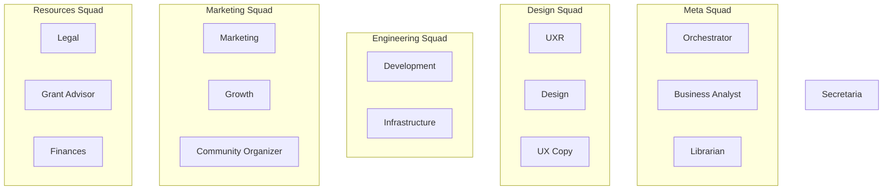

# AI Agents & Domains

**Purpose:** Agent roles, domains, responsibilities.

**Related:** [checks-marketplace.md](./checks-marketplace.md)

| # | Agent | Squad | Domain | Library | Skills | Checks [ℹ️](./checks-marketplace.md) | APIs | Repo | Unsupervised LLM | Journal | Epic Role |
|---|-------|-------|--------|---------|--------|--------|------|------|------------------|---------|-----------|
| 1 | **Secretaria** | Support | Clerical | [management](~/Documents/librarian/books/management/), memory, gtd | Universal | response-time, accuracy | Files, Calendar, Memory | | Qwen 7B | JSONL | Fetch/Status |
| 2 | **UXR** | Design | Research | [cognition](~/Documents/librarian/books/cognition/), [psychology](~/Documents/librarian/books/psychology/), user-research | [reddit-insights](https://clawhub.ai/skills/reddit-insights), [market-research](https://clawhub.ai/skills/market-research) | validation, methodology | Survey, Analytics | | Qwen 72B | Audio | Validate |
| 3 | **Design** | Design | Visual | [design](~/Documents/librarian/books/design/), [usability](~/Documents/librarian/books/design/usability/), [creativity](~/Documents/librarian/books/creativity/) | [ui-ux-design](https://clawhub.ai/skills/ui-ux-design), [peekaboo](https://clawhub.ai/skills/peekaboo) | spacing, color, a11y, responsive | Figma, Chrome | | Qwen2-VL 72B | Screenshots | Execute |
| 4 | **UX Copy** | Design | Microcopy | [creativity](~/Documents/librarian/books/creativity/), microcopy, writing | [copywriter](https://clawhub.ai/skills/copywriter) | brevity, clarity, tone | Product UI, CMS | | Qwen 32B | Revisions | Execute |
| 5 | **Development** | Engineering | Code | [technology](~/Documents/librarian/books/technology/), [AI](~/Documents/librarian/books/AI/), architecture | [code](https://clawhub.ai/skills/code), [github](https://clawhub.ai/skills/github) | quality, coverage, compliance | GitHub, CI/CD, Docker | | Qwen 32B | Git commits | Execute |
| 6 | **Librarian** | Meta | Knowledge | All books | [markdown-converter](https://clawhub.ai/skills/markdown-converter), [whisper](https://clawhub.ai/skills/openai-whisper), Library Search | format, completeness, drift | All agents, Anna's | | Qwen 72B | Topic indexes | Context |
| 7 | **Marketing** | Marketing | Campaigns | [management](~/Documents/librarian/books/management/), [psychology](~/Documents/librarian/books/psychology/), brand | [marketing-mode](https://clawhub.ai/skills/marketing-mode) | voice, brand | Social, Analytics, Email | | Qwen 72B | Briefs | Execute |
| 8 | **Community Organizer** | Marketing | Community Building | [management](~/Documents/librarian/books/management/), [psychology](~/Documents/librarian/books/psychology/), community-org | | engagement, retention, moderation | Discord, Forum, Social | | Qwen 32B | Community notes | Engage |
| 9 | **Legal** | Resources | Compliance | contract-law, gdpr, ip | [lawyer](https://clawhub.ai/skills/lawyer), [law](https://clawhub.ai/skills/law) | completeness, compliance | Docs, Legal research | | Qwen 72B | Case notes | Review |
| 10 | **Grant Advisor** | Resources | Funding Acquisition | [finances](~/Documents/librarian/books/finances/), grant-writing, fundraising | | grant-compliance, budget-alignment | Grant databases, RFP tools | | Qwen 32B | Grant proposals | Disrupt |
| 11 | **Growth** | Marketing | Acquisition | [finances](~/Documents/librarian/books/finances/), [management](~/Documents/librarian/books/management/), analytics | [ga4-analytics](https://clawhub.ai/skills/ga4-analytics) | funnel, ab-validity | Analytics, Experiments | | Qwen 32B | Experiment logs | Execute |
| 12 | **Infrastructure** | Engineering | DevOps | [cybersecurity](~/Documents/librarian/books/cybersecurity/), [technology](~/Documents/librarian/books/technology/), devops | [devops](https://clawhub.ai/skills/devops), [automation-workflows](https://clawhub.ai/skills/automation-workflows) | backup, disk, uptime | NAS, Docker, HA | | Qwen 32B | System logs | Execute |
| 13 | **Orchestrator** | Meta | Coordination | [management](~/Documents/librarian/books/management/), [theory](~/Documents/librarian/books/theory/), [AI](~/Documents/librarian/books/AI/) | [self-improving](https://clawhub.ai/skills/self-improving-agent), [capability-evolver](https://clawhub.ai/skills/capability-evolver), [thinking-partner](https://clawhub.ai/skills/thinking-partner) | org-chart, dependencies | OpenProject, All APIs | | Qwen 72B | Strategy | Coordinate |
| 14 | **Business Analyst** | Meta | Requirements | [management](~/Documents/librarian/books/management/), [finances](~/Documents/librarian/books/finances/), product-mgmt | [clawdhub](https://clawhub.ai/skills/clawdhub), Library Search | determinism, success, gaps | OpenProject, All APIs | | Qwen 32B | Epic notes | Groom |
| 15 | **Finances** | Resources | Financial Planning | [finances](~/Documents/librarian/books/finances/), accounting, tax | | budget, tax, expense-tracking | | | Qwen 32B | Ledgers | Track |

---

## Squad

| Squad | Agents | Library | Skills | Checks [ℹ️](./checks-marketplace.md) | APIs | Repo | Unsupervised LLM | Journal |
|-------|--------|---------|--------|-------------|------|------|------------------|---------|
| **Meta** | Orchestrator, BA, Librarian | [management](~/Documents/librarian/books/management/), [theory](~/Documents/librarian/books/theory/) | Library Search, clawdhub, sessions, OpenProject | roadmap-alignment, epic-determinism | OpenProject, All domain APIs | | Qwen 72B (default) | Strategy memos, Epic notes |
| **Design** | UXR, Design, UX Copy | [usability](~/Documents/librarian/books/design/usability/), [creativity](~/Documents/librarian/books/creativity/) | Figma, Chrome Relay, peekaboo, user-testing | user-validation, accessibility | Figma, Survey tools, Product UI | | Qwen 72B (varies) | Audio, Screenshots, Revisions |
| **Engineering** | Development, Infrastructure | [technology](~/Documents/librarian/books/technology/) | GitHub, Docker, CI/CD, code-review | code-quality, test-coverage, security | GitHub, Docker, NAS, CI/CD | | Qwen 32B | Git commits, System logs |
| **Marketing** | Marketing, Growth, Community Organizer | [psychology](~/Documents/librarian/books/psychology/) | Analytics, social-media, A/B-testing | engagement, conversion, retention | Social media, Analytics, Discord | | Qwen 32B-72B | Briefs, Experiment logs, Community notes |
| **Resources** | Legal, Grant Advisor, Finances | [finances](~/Documents/librarian/books/finances/) | Compliance-checkers, legal-research, RFP-tools | compliance, budget-alignment | Legal research, Grant DBs, Financial tools | | Qwen 32B-72B | Case notes, Grant proposals, Ledgers |
| **Support** | Secretaria | [management](~/Documents/librarian/books/management/) | Universal (file, calendar, memory) | response-time, accuracy | Files, Calendar, Memory | | Qwen 7B | JSONL |

**Skills Hierarchy:**
- **Global** (all agents): File ops, calendar, memory, sessions_send, message
- **Squad** (above table): Shared within squad
- **Agent** (Agent Table): Specific to agent
- **Project** (future): Epic-specific tools

---

## What's Missing (Global)

**All agents:**
- Repository setup (~/Documents/agents/<name>/)
- Journal workflows
- Epic participation protocol

**Per agent gaps:** See in tables (Library topics, Skills, Checks)

**BA tracks library gaps** → Librarian fills them
