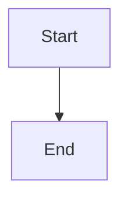
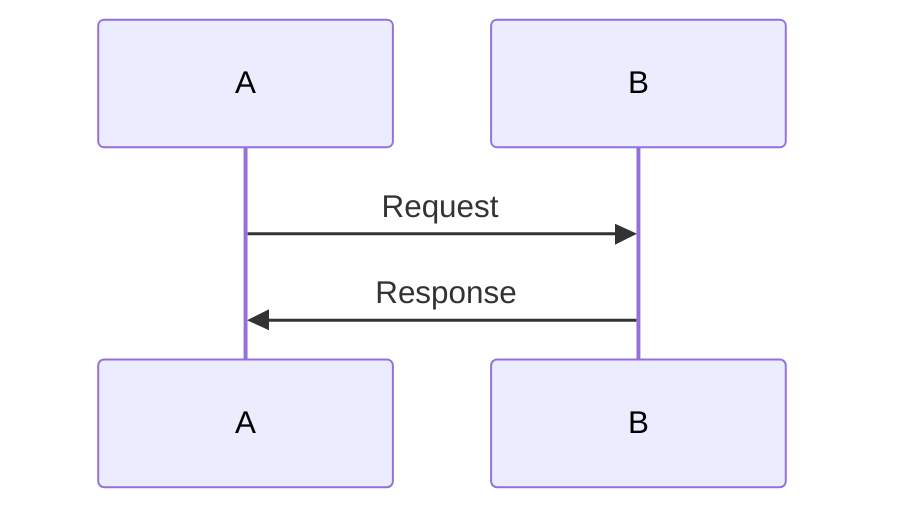

# Template Epic Contract

**Replace this entire file when creating a new epic.**

---

## 📋 Setup Tasks (Complete in order)

- [ ] Define goal (one sentence - what does this epic achieve?)
- [ ] Choose contract type (diagram | wireframe | sequence | other)
- [ ] Define framework (if wireframe: shadcn/ui, tailwind, etc.)
- [ ] Define tier (infrastructure | product | research)
- [ ] List deliverables (what gets built/shipped)
- [ ] Identify dependencies (what's needed before starting)
- [ ] Update index.yml with all metadata
- [ ] Delete this checklist section
- [ ] Delete unused contract type sections below

---

## Goal

**What this epic achieves** (one sentence).

Example: Build wireframe for Backstage 2.0 UI using shadcn components.

---

## Contract Type: [diagram | wireframe | sequence | other]

### For Diagram Contracts:

### For Wireframe Contracts:

**Framework:** [e.g., shadcn/ui]

**Pages/Views:**
1. [Page name]
2. [Page name]

**Components:**
- [Component name] - [Description]
- [Component name] - [Description]

### For Sequence Contracts:

---

## Deliverables

**What gets built/shipped:**
- [ ] Item 1
- [ ] Item 2
- [ ] Item 3

---

## Dependencies

**Requires (before this epic can start):**
- [ ] Epic vX.Y.Z (name)

**Blocks (other epics waiting on this):**
- Epic vX.Y.Z (name)

---

## Notes

**Decisions, trade-offs, open questions.**

### 1️⃣ [Question Title]
**Question:** ...
**Context:** ...
**Options:** A, B, C
**Needed:** Decision / Permission / Help

---

**Owner:** [agent-name]  
**Status:** [proposed | approved | active | review | published]
