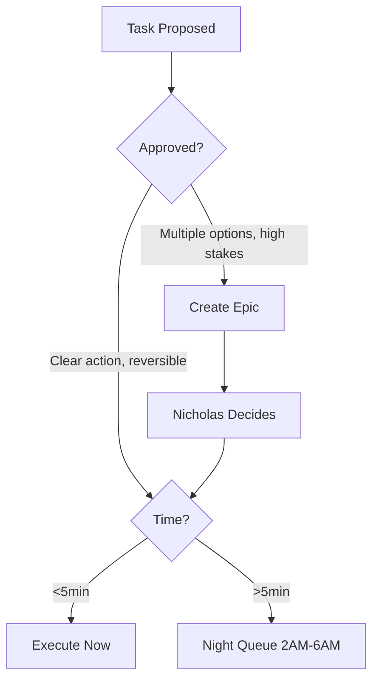

# v0.30.0 - Execution Decision Protocol

## Decision Tree

**Approved = clear action, known method, safe to execute**

**Needs Discussion = unclear goal, multiple approaches, high stakes**

**Night Queue:** Long tasks (downloads, batch jobs) run 2AM-6AM, report 6AM Telegram

**Time Budget:** 3h studio/day (flexible average, not hard stop)
