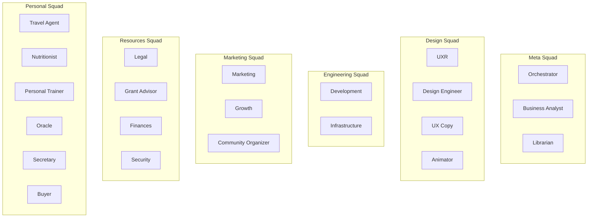

# AI Agents & Domains

**Purpose:** Agent roles, domains, responsibilities.

**Related:** [checks-marketplace.md](./checks-marketplace.md)

---

## Squad Organization

---

## Agents by Squad

<table>
<thead>
<tr style="vertical-align: top;">
<th>Squad</th>
<th>Slug</th>
<th>Agents</th>
<th>Library</th>
<th>Skills</th>
<th>Checks <a href="./checks-marketplace.md">ℹ️</a></th>
<th>APIs</th>
</tr>
</thead>
<tbody>
<tr style="vertical-align: top;">
<td><strong>Meta</strong></td>
<td>✅ meta</td>
<td>Orchestrator, Business Analyst, Librarian</td>
<td><a href="~/Documents/librarian/books/management/">management</a>, <a href="~/Documents/librarian/books/theory/">theory</a></td>
<td>Library Search, clawdhub, sessions, OpenProject</td>
<td>roadmap-alignment, epic-determinism</td>
<td>OpenProject, All domain APIs</td>
</tr>
<tr style="vertical-align: top;">
<td><strong>Design</strong></td>
<td>✅ design</td>
<td>UXR, Design Engineer, UX Copy, Animator</td>
<td><a href="~/Documents/librarian/books/design/usability/">usability</a>, <a href="~/Documents/librarian/books/creativity/">creativity</a>, <a href="~/Documents/librarian/books/design/">design</a></td>
<td>Figma, Chrome Relay, peekaboo, user-testing, DaVinci Resolve</td>
<td>user-validation, accessibility, timing, easing</td>
<td>Figma, Survey tools, Product UI, After Effects</td>
</tr>
<tr style="vertical-align: top;">
<td><strong>Engineering</strong></td>
<td>✅ engineering</td>
<td>Development, Infrastructure</td>
<td><a href="~/Documents/librarian/books/technology/">technology</a></td>
<td>GitHub, Docker, CI/CD, code-review</td>
<td>code-quality, test-coverage, security</td>
<td>GitHub, Docker, NAS, CI/CD</td>
</tr>
<tr style="vertical-align: top;">
<td><strong>Marketing</strong></td>
<td>✅ marketing</td>
<td>Marketing, Growth, Community Organizer</td>
<td><a href="~/Documents/librarian/books/psychology/">psychology</a></td>
<td>Analytics, social-media, A/B-testing</td>
<td>engagement, conversion, retention</td>
<td>Social media, Analytics, Discord</td>
</tr>
<tr style="vertical-align: top;">
<td><strong>Resources</strong></td>
<td>✅ resources</td>
<td>Legal, Grant Advisor, Finances, Security</td>
<td><a href="~/Documents/librarian/books/finances/">finances</a>, <a href="~/Documents/librarian/books/cybersecurity/">cybersecurity</a></td>
<td>Compliance-checkers, legal-research, RFP-tools, Z3-verification</td>
<td>compliance, budget-alignment, policy-enforcement, attack-path</td>
<td>Legal research, Grant DBs, Financial tools, AWS security</td>
</tr>
<tr style="vertical-align: top;">
<td><strong>Personal</strong></td>
<td>✅ personal</td>
<td>Secretary, Buyer, Travel Agent, Nutritionist, Personal Trainer, Oracle</td>
<td><a href="~/Documents/librarian/books/health/">health</a>, <a href="~/Documents/librarian/books/fitness/">fitness</a>, <a href="~/Documents/librarian/books/travel/">travel</a>, <a href="~/Documents/librarian/books/magick/">magick</a></td>
<td>Travel planning, meal planning, workout logging, i-ching</td>
<td>safety, macro-balance, form, progression</td>
<td>Maps, Nutrition DBs, Gymera, Booking APIs</td>
</tr>
</tbody>
</table>

**Skills Hierarchy:**
- **Global** (all agents): File ops, calendar, memory, sessions_send, message
- **Squad** (above table): Shared within squad
- **Agent** (below table): Specific to agent
- **Project** (future): Epic-specific tools

---

## Individual Agents

| Agent | Slug | Squad | Domain | Library | Skills | Checks [ℹ️](./checks-marketplace.md) | APIs | Matrix Room |
|-------|------|-------|--------|---------|--------|--------|------|-------------|
| **Orchestrator** | ✅ orchestrator | Meta | Coordination | [management](~/Documents/librarian/books/management/), [theory](~/Documents/librarian/books/theory/), [AI](~/Documents/librarian/books/AI/) | [self-improving](https://clawhub.ai/skills/self-improving-agent), [capability-evolver](https://clawhub.ai/skills/capability-evolver), [thinking-partner](https://clawhub.ai/skills/thinking-partner) | org-chart, dependencies | OpenProject, All APIs | |
| **Business Analyst** | ✅ business-analyst | Meta | Requirements | [management](~/Documents/librarian/books/management/), [finances](~/Documents/librarian/books/finances/), product-mgmt | [clawdhub](https://clawhub.ai/skills/clawdhub), Library Search | determinism, success, gaps | OpenProject, All APIs | Business Analyst (!WVzcJmuqaClmBRmyYm:studio.adal-rigel.ts.net) |
| **Librarian** | ✅ librarian | Meta | Knowledge | All books | [markdown-converter](https://clawhub.ai/skills/markdown-converter), [whisper](https://clawhub.ai/skills/openai-whisper), Library Search | format, completeness, drift | All agents, Anna's | |
| **UXR** | ✅ uxr | Design | Research | [cognition](~/Documents/librarian/books/cognition/), [psychology](~/Documents/librarian/books/psychology/), user-research | [reddit-insights](https://clawhub.ai/skills/reddit-insights), [market-research](https://clawhub.ai/skills/market-research) | validation, methodology | Survey, Analytics | |
| **Design Engineer** | ✅ design-engineer | Design | Visual | [design](~/Documents/librarian/books/design/), [usability](~/Documents/librarian/books/design/usability/), [creativity](~/Documents/librarian/books/creativity/) | [ui-ux-design](https://clawhub.ai/skills/ui-ux-design), [peekaboo](https://clawhub.ai/skills/peekaboo) | spacing, color, a11y, responsive | Figma, Chrome | Design Engineer (!lJDOTCEsWeStTsoOwF:studio.adal-rigel.ts.net) |
| **UX Copy** | ✅ ux-copy | Design | Microcopy | [creativity](~/Documents/librarian/books/creativity/), microcopy, writing | [copywriter](https://clawhub.ai/skills/copywriter) | brevity, clarity, tone | Product UI, CMS |
| **Animator** | ✅ animator | Design | Animation & Motion | [design](~/Documents/librarian/books/design/), animation, motion-design | | timing, easing, fps | DaVinci Resolve, After Effects |
| **Development** | ✅ development | Engineering | Code | [technology](~/Documents/librarian/books/technology/), [AI](~/Documents/librarian/books/AI/), architecture | [code](https://clawhub.ai/skills/code), [github](https://clawhub.ai/skills/github) | quality, coverage, compliance | GitHub, CI/CD, Docker |
| **Infrastructure** | ✅ infrastructure | Engineering | DevOps | [cybersecurity](~/Documents/librarian/books/cybersecurity/), [technology](~/Documents/librarian/books/technology/), devops | [devops](https://clawhub.ai/skills/devops), [automation-workflows](https://clawhub.ai/skills/automation-workflows) | backup, disk, uptime | NAS, Docker, HA |
| **Marketing** | ✅ marketing | Marketing | Campaigns | [management](~/Documents/librarian/books/management/), [psychology](~/Documents/librarian/books/psychology/), brand | [marketing-mode](https://clawhub.ai/skills/marketing-mode) | voice, brand | Social, Analytics, Email |
| **Growth** | ✅ growth | Marketing | Acquisition | [finances](~/Documents/librarian/books/finances/), [management](~/Documents/librarian/books/management/), analytics | [ga4-analytics](https://clawhub.ai/skills/ga4-analytics) | funnel, ab-validity | Analytics, Experiments |
| **Community Organizer** | ✅ community-organizer | Marketing | Community Building | [management](~/Documents/librarian/books/management/), [psychology](~/Documents/librarian/books/psychology/), community-org | | engagement, retention, moderation | Discord, Forum, Social |
| **Legal** | ✅ legal | Resources | Compliance | contract-law, gdpr, ip | [lawyer](https://clawhub.ai/skills/lawyer), [law](https://clawhub.ai/skills/law) | completeness, compliance | Docs, Legal research |
| **Grant Advisor** | ✅ grant-advisor | Resources | Funding Acquisition | [finances](~/Documents/librarian/books/finances/), grant-writing, fundraising | | grant-compliance, budget-alignment | Grant databases, RFP tools |
| **Security** | ✅ security | Resources | Security & Compliance | [cybersecurity](~/Documents/librarian/books/cybersecurity/), ai-safety, compliance | | policy-enforcement, attack-path, vulnerability | AWS, Cloud security, Z3 verification |
| **Secretary** | ✅ secretary | Personal | Clerical | [management](~/Documents/librarian/books/management/), memory, gtd | Universal | response-time, accuracy | Files, Calendar, Memory |
| **Buyer** | ✅ buyer | Personal | Shopping | Product research, price comparison, deal hunting | | | Shopping APIs, Price trackers |
| **Travel Agent** | ✅ travel-agent | Personal | Travel Planning | [travel](~/Documents/librarian/books/travel/), logistics, geography | [travel-planner](https://clawhub.ai/skills/travel-planner) | itinerary, budget, safety | Maps, Booking APIs, Travel advisories |
| **Nutritionist** | ✅ nutritionist | Personal | Nutrition | [health](~/Documents/librarian/books/health/), [nutrition](~/Documents/librarian/books/nutrition/), diet | [meal-planner](https://clawhub.ai/skills/meal-planner) | macro-balance, dietary-restrictions | Nutrition DBs, Recipe APIs |
| **Personal Trainer** | ✅ personal-trainer | Personal | Fitness | [fitness](~/Documents/librarian/books/fitness/), [health](~/Documents/librarian/books/health/), exercise | [gymera](https://clawhub.ai/skills/gymera), [workout-logger](https://clawhub.ai/skills/workout-logger) | form, progression, rest | Gymera, Fitness trackers |
| **Oracle** | ✅ oracle | Personal | Divination | [magick](~/Documents/librarian/books/magick/), i-ching, tarot, chaos-magick | [i-ching](~/.openclaw/workspace/skills/i-ching/) | | |

---

## What's Missing (Global)

**All agents:**
- Repository setup (~/Documents/agents/<name>/)
- Journal workflows
- Epic participation protocol

**Per agent gaps:** See in tables (Library topics, Skills, Checks)

**BA tracks library gaps** → Librarian fills them
