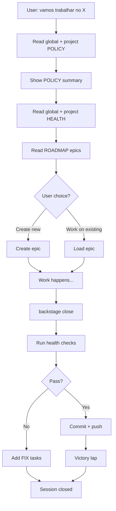

# Backstage - Project Management Framework

AI-powered project management for developers. Epic-based roadmaps, POLICY enforcement, health checks.

## Triggers

**Start work session:**
- "vamos trabalhar no [projeto]"
- "work on [projeto]"
- "backstage start"
- "começar [projeto]"

**Create epic:**
- "criar epic [nome]"
- "new epic [nome]"

**End session:**
- "boa noite"
- "acabei"
- "backstage close"

**Health check:**
- "roda health check"
- "backstage health"

---

## Commands

### Start Work Session
```bash
backstage.sh start [project-path]
```

**What it does:**
1. Read `backstage/global/POLICY.md` (if exists - universal rules)
2. Read `backstage/POLICY.md` (project-specific - WINS)
3. Show POLICY summary
4. Read `backstage/global/HEALTH.md` (if exists)
5. Read `backstage/HEALTH.md` (project checks)
6. Read `backstage/ROADMAP.md` (list epics)
7. Ask: create new epic or work on existing?

### Create Epic
```bash
backstage.sh epic create "epic-name"
```

**What it does:**
1. Read ROADMAP to find next version
2. Create `epic-notes/vX.Y.Z-epic-name.md`
3. Add epic to ROADMAP
4. (If POLICY requires) Create branch `epic/vX.Y.Z-epic-name`

### Health Check
```bash
backstage.sh health
```

**What it does:**
1. Run `backstage/global/HEALTH.md` checks (if exists)
2. Run `backstage/HEALTH.md` checks (project-specific)
3. Report pass/fail

### Close Session
```bash
backstage.sh close
```

**What it does:**
1. Run health checks
2. If fail: add 🔧 FIX tasks to ROADMAP
3. If pass: commit + push
4. Victory lap (brief summary)
5. Body check (optional)

---

## Flow Diagram



---

## Project Structure

**Required:**
```
project/
  backstage/
    ROADMAP.md      ← Required
```

**Optional:**
```
project/
  backstage/
    POLICY.md       ← Project workflow rules
    HEALTH.md       ← Project health checks
    CHANGELOG.md    ← Completed work
    epic-notes/     ← Epic specs
    global/         ← Universal framework files
      POLICY.md
      HEALTH.md
```

---

## Polycentric Governance

**Backstage uses overlapping jurisdictions - check BOTH levels:**

1. **Global defaults** (`backstage/global/`) - Universal rules
2. **Project overrides** (`backstage/`) - Project-specific (WINS)

**Example:**
- `backstage/global/POLICY.md` says: "Always create branches"
- `backstage/POLICY.md` says: "Work directly on main"
- **Result:** Project rule wins, work on main

---

## Status

**Current:** v0.3.0 (OpenClaw Skill)  
**Repository:** https://github.com/nonlinear/backstage

---

**Author:** nonlinear
