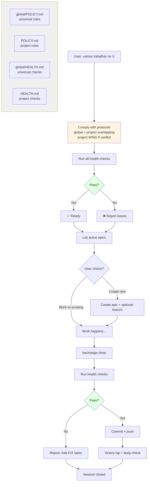

# Backstage - Project Management Framework

AI-powered project management for developers. Epic-based roadmaps, POLICY enforcement, health checks.

## Triggers

**Start work session:**
- "vamos trabalhar no [projeto]"
- "work on [projeto]"
- "backstage start"
- "começar [projeto]"

**Create epic:**
- "criar epic [nome]"
- "new epic [nome]"

**End session:**
- "boa noite"
- "acabei"
- "backstage close"

**Health check:**
- "roda health check"
- "backstage health"

---

## Commands

### Start Work Session
```bash
backstage.sh start [project-path]
```

**What it does:**
1. Comply with `global/POLICY.md` (universal rules)
2. Comply with `POLICY.md` (project-specific - WINS if conflict)
3. Run `global/HEALTH.md` checks
4. Run `HEALTH.md` checks (project-specific - WINS if conflict)
5. Report: ✅ ready / ❌ issues found
6. List active epics from ROADMAP
7. Ask: create new epic or work on existing?

### Create Epic
```bash
backstage.sh epic create "epic-name"
```

**What it does:**
1. Read ROADMAP to find next version
2. Create `epic-notes/vX.Y.Z-epic-name.md`
3. Add epic to ROADMAP
4. (If POLICY requires) Create branch `epic/vX.Y.Z-epic-name`

### Health Check
```bash
backstage.sh health
```

**What it does:**
1. Run `global/HEALTH.md` checks
2. Run `HEALTH.md` checks (project-specific - WINS if conflict)
3. Report: ✅ all passed / ❌ X failed

### Close Session
```bash
backstage.sh close
```

**What it does:**
1. Run health checks
2. If fail: add 🔧 FIX tasks to ROADMAP
3. If pass: commit + push
4. Victory lap (brief summary)
5. Body check (optional)

---

## Flow Diagram



**Protocol execution order:**
1. Read `global/POLICY` + `POLICY` simultaneously
2. Apply combined rules (project wins if conflict)
3. Read `global/HEALTH` + `HEALTH` simultaneously  
4. Run all checks (project wins if conflict)
5. Report result: ✅ ready / ❌ issues

---

## Project Structure

**Required:**
```
project/
  backstage/
    ROADMAP.md      ← Required
```

**Optional:**
```
project/
  backstage/
    POLICY.md       ← Project workflow rules
    HEALTH.md       ← Project health checks
    CHANGELOG.md    ← Completed work
    epic-notes/     ← Epic specs
    global/         ← Universal framework files
      POLICY.md
      HEALTH.md
```

---

## Polycentric Governance

Backstage reads protocols from TWO levels simultaneously:

1. **`global/`** - Universal framework rules
2. **`project/`** - Project-specific rules

**Conflict resolution:** Project wins.

**Example:**
- `global/POLICY`: "Always create branches"  
- `POLICY`: "Work directly on main"  
- **Result:** Work on main (project wins)

---

## Status

**Current:** v0.3.0 (OpenClaw Skill)  
**Repository:** https://github.com/nonlinear/backstage

---

**Author:** nonlinear
