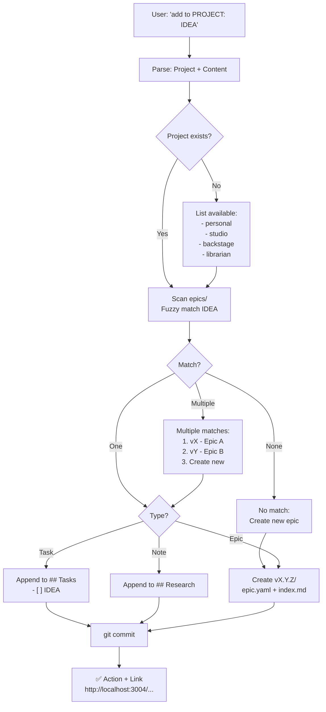

# Add to Project Skill

**Purpose:** Park ideas immediately in Backstage (never orphaned, always visible).

**Philosophy:** Ideas → parked first → create epic only if needed.

---

## Triggers

- `add to personal: arr suite automation`
- `studio note: compare OPA vs Temporal`
- `add task to librarian: fix search ranking`

---

## Workflow Diagram



---

## Type Detection

**Epic signals:**
- Multi-component ("arr suite", "meshtastic network")
- New system/area
- No action verb

**Task signals:**
- Action verb: "fix", "add", "configure", "test", "update"
- Specific, bounded action

**Note signals:**
- "research", "compare", "investigate", "learn"
- Questions

**Default:** Task (most common).

---

## Epic Matching

**Fuzzy match on:**
1. Epic name (epic.yaml)
2. Epic goal (epic.yaml)
3. Keywords in index.md

**Multiple matches → Ask user to choose.**

**No match → Create new epic.**

---

## Epic Creation

**Location:** `~/Backstage/projects/PROJECT/epics/vX.Y.Z/`

**Files created:**

### epic.yaml
```yaml
---
name: "Epic Name"
goal: "Brief description from user input"
status: backlog
type: "minor"
created: 2026-MM-DD
started: null
completed: null
tasks:
  - text: "Initial task from user input"
    checked: false
---
```

**CRITICAL:** Tasks use `text:` + `checked:` format (NOT simple strings, NOT emoji prefixes).

### index.md
```markdown
# Epic Name

## Context
[Auto-generated from goal]

## Tasks
- [ ] Initial task from user input

## Research

## Done
```

**Rules:**
- NO version in title (just `# Epic Name`)
- NO redundant metadata (status/goal already in yaml)
- Sections: Context → Tasks → Research → Done

---

## Version Numbering

**Next version = max(existing versions) + 0.1.0**

**Example:**
- Existing: v2.3.0, v2.4.0
- Next: v2.5.0

**Project-specific counters** (studio v2.3.0 ≠ personal v2.3.0).

---

## Report Format

### Parked Task
```
✅ Parked in v2.3.0 - Epic Name
http://localhost:3004/projects/PROJECT#v2.3.0
```

### Created Epic
```
✅ Created v2.5.0 - Epic Name
http://localhost:3004/projects/PROJECT#v2.5.0
```

**Always include Backstage link** (user can click to verify).

---

## Backstage URL Structure

**Format:** `{backstage_base}/projects/{project}#{version}`

**Localhost:**
```
http://localhost:3004/projects/{project}#{version}
```

**Tailscale:**
```
https://studio.adal-rigel.ts.net:3004/projects/{project}#{version}
```

**Examples:**
- Personal epic v1.2.0: `http://localhost:3004/projects/personal#v1.2.0`
- Studio epic v2.7.0: `https://studio.adal-rigel.ts.net:3004/projects/studio#v2.7.0`
- Librarian epic v0.15.0: `http://localhost:3004/projects/librarian#v0.15.0`

**Critical:** Version uses `#` anchor (NOT `/epics/vX.Y.Z` path).

---

## Disambiguation Examples

### Unknown project
```
❓ Which project?
  - personal
  - studio
  - backstage
  - librarian
```

### Multiple matches
```
❓ "search" matches multiple epics:
  1. v2.1.0 - Search UI
  2. v2.5.0 - Performance
  3. Create new epic
```

### Ambiguous type
```
❓ Is "arr suite" a new epic or task for existing epic?
```

---

## Critical Rules

1. **Park in Backstage ONLY** (never epic-notes/)
2. **Always git commit** after changes
3. **Always report with link** (user verifies visually)
4. **Create epic if no match** (don't leave orphaned)
5. **Tasks in BOTH** (epic.yaml for UI, index.md for humans)

---

## Task Syntax Reference

**epic.yaml (CORRECT):**
```yaml
tasks:
  - text: "Task description"
    checked: false
```

**epic.yaml (WRONG):**
```yaml
# ❌ Simple strings
tasks: ["Task description"]

# ❌ Emoji prefixes  
tasks: ["✅ Task"]
```

**index.md (CORRECT):**
```markdown
## Tasks
- [ ] Task description
- [x] Completed task
```

---

## CRITICAL: Epic YAML Format (Learned 2026-03-15)

**Backstage UI ONLY reads simple format. Notes = waste.**

**CORRECT (appears in UI):**
```yaml
---
name: "Epic Name"
goal: "Brief one-line description"
status: done
type: "minor"
created: 2026-03-15
started: 2026-03-15
completed: 2026-03-15
tasks:
  - text: "Task description"
    checked: true
---
```

**WRONG (breaks UI, epic invisible):**
```yaml
---
version: v2.7.0
name: "Epic Name"
status: done
summary: |
  Long paragraph...
context:
  - Multiple sections...
decisions:
  - date: 2026-03-15
    decision: "..."
    rationale: |
      Pages of text...
tasks:
  - id: T1
    text: "..."
    status: done
    notes: |
      More paragraphs...
technical_notes:
  key: |
    Even more text...
---
```

**Why it breaks:**
- Backstage parser expects minimal keys
- Extra fields = ignored or malformed
- Large YAML = slow parsing, UI times out
- Technical notes belong in `notes.md`, NOT `epic.yaml`

**Structure:**
```
epics/vX.Y.Z/
  epic.yaml          ← Simple (name, goal, status, tasks)
  index.md           ← Human-readable narrative
  notes.md           ← Technical details, decisions, references
  other-docs.md      ← Supporting materials
```

**Rule:** epic.yaml = metadata ONLY. Everything else = separate .md files.

**Parity lesson (v2.7.0):**
- Created 18KB epic.yaml with decisions/notes/references
- Epic invisible in Backstage UI
- Simplified to 851 bytes → appeared instantly
- Moved notes to `notes.md` → works perfectly

**Remember:** UI expects structure, not novel. Keep epic.yaml lean.

---

**Created:** 2026-03-12  
**Updated:** 2026-03-15 (epic format parity)  
**Location:** `~/.openclaw/workspace/skills/add-to-project/SKILL.md`
