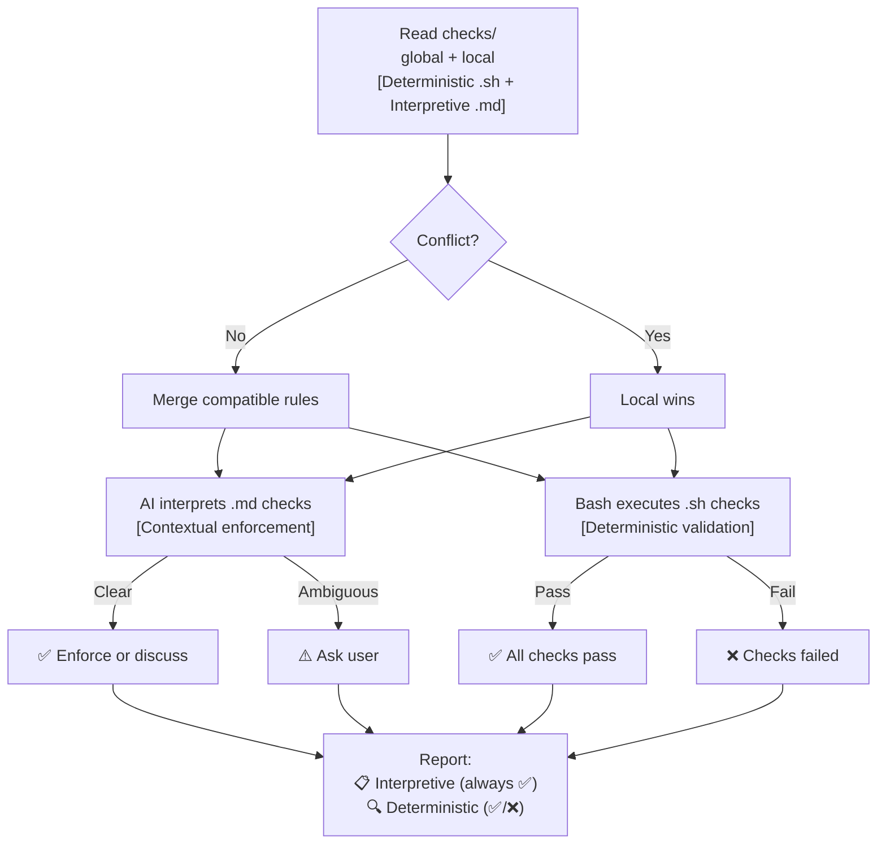
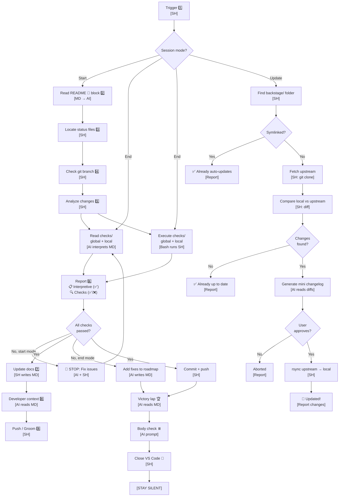
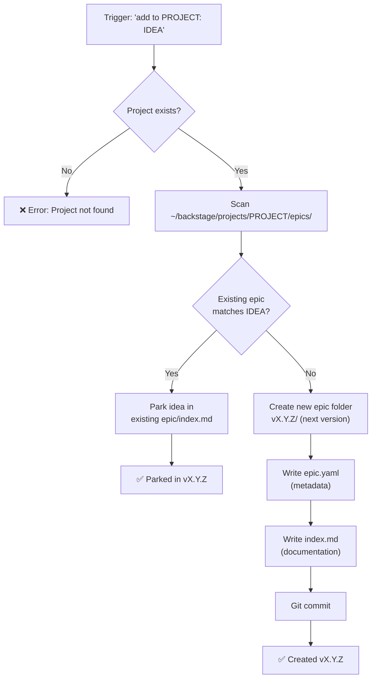

# Backstage Skill

**Nickname:** `backstage:`

**Objective:** Universal project status management for AI-assisted development. Ensures documentation matches reality before every commit.

---

## ⚠️ Security Notice

**This is an admin tool with elevated privileges:**

- **Executes checks from global path** (`$HOME/Documents/backstage/checks/`)
- **Pulls remote code** from GitHub (https://github.com/nonlinear/backstage)
- **Modifies project files** (README, ROADMAP, CHANGELOG with mermaid diagrams)
- **Rsyncs updates** when using `update backstage` trigger

**Intended for:**
- Personal use (you control the upstream repo)
- Trusted teams (shared backstage protocol repo)

**Not recommended for:**
- Untrusted third-party projects
- Public/open-source projects with unknown contributors

**Mitigations in place:**
- User confirmation before applying updates
- Git history (all changes committed, revertable)
- Symlink detection (admin mode auto-updates)

**Use at your own risk.** Review `update-backstage.sh` and `checks.sh` before running.

---

## Usage

**When Nicholas says "bom dia PROJECT" or "good morning PROJECT":**

1. **Validate project exists** in `~/Backstage/projects/PROJECT/`
2. **Run `backstage.sh PROJECT`** (checks + epic summary)
3. **Open Chrome** at `http://localhost:3004/projects/PROJECT`
4. **Report:** Active epics, status summary

**Example:**
```
User: bom dia studio
Kin: 
  1. Runs backstage.sh studio
  2. Opens Chrome http://localhost:3004/projects/studio
  3. Reports: "Studio context loaded. Active epics: v0.2.0, v0.25.0"
```

---

## 🔴 Why This Skill Exists (Anti-Drift)

**Backstage-skill = ANTI-DRIFT:**
- ✅ Force context awareness (project/epic)
- ✅ Health checks prevent chaos
- ✅ Architecture-first workflow
- ✅ Roadmap visibility = no surprises

**WITHOUT IT:**  
Work happens outside backstage → drift → broken trust → triple metabolic cost

**WITH IT:**  
"good morning X" → automatic context load → work inside boundaries → paridade maintained

---

**The Metabolic Cost Problem:**

Without backstage, delegation costs **triple**:
1. The work itself
2. Explicating methodology (ethics, preferences, protocols)
3. Defining WHERE that learning gets stored (VISION? SOUL? SKILL? memory?)

This is **exhausting** for the human.

**Investment is worth it ONLY IF plateau is reached:**
- Human teaches ONCE → AI internalizes
- Each session: READ context files → act according to ethics
- Each session: LESS explanation needed
- Plateau = Human delegates, AI executes without supervision

**This skill enforces stabilization.**  
Force context awareness (project/epic/design architecture) to prevent drift.  
**3x work becomes 1x work.**

---

## Policies & Checks Enforcement

**Backstage-skill enforces ALL rules in checks/ (deterministic + interpretive, global + local).**

### Enforcement Model


```mermaid
flowchart TD
    READ_CHK["Read checks/<br/>global + local<br/>[Deterministic .sh + Interpretive .md]"]
    
    CONFLICT{Conflict?}
    MERGE[Merge compatible rules]
    LOCAL[Local wins]
    
    AI["AI interprets .md checks<br/>[Contextual enforcement]"]
    SH["Bash executes .sh checks<br/>[Deterministic validation]"]
    
    AI_ACT[✅ Enforce or discuss]
    AI_AMBIG[⚠️ Ask user]
    
    SH_OK[✅ All checks pass]
    SH_FAIL[❌ Checks failed]
    
    REPORT["Report:<br/>📋 Interpretive (always ✅)<br/>🔍 Deterministic (✅/❌)"]
    
    READ_CHK --> CONFLICT
    CONFLICT -->|No| MERGE
    CONFLICT -->|Yes| LOCAL
    MERGE --> AI
    MERGE --> SH
    LOCAL --> AI
    LOCAL --> SH
    
    AI -->|Clear| AI_ACT
    AI -->|Ambiguous| AI_AMBIG
    
    SH -->|Pass| SH_OK
    SH -->|Fail| SH_FAIL
    
    AI_ACT --> REPORT
    AI_AMBIG --> REPORT
    SH_OK --> REPORT
    SH_FAIL --> REPORT
```

**Two enforcement domains:**

1. **Checks (Interpretive)**
   - `checks/*.md (global)` = Universal workflow rules
   - `projects/PROJECT/checks.yaml (project-specific)` = Project-specific overrides
   - **Enforced by:** AI (reads markdown, interprets context, acts)
   - **Always pass:** AI reads, understands, will act accordingly

2. **Checks (Deterministic)**
   - `checks/*.sh` = Universal validation tests
   - `projects/PROJECT/checks.yaml` = Project-specific tests
   - **Enforced by:** Bash (executes shell scripts, exit codes)
   - **Pass or fail:** ✅ (exit 0) or ❌ (exit non-zero)

**Polycentric governance:**
- Global + local rules coexist
- Local wins on conflict
- AI merges when compatible

**Report format:**

```
📋 Interpretive checks:
  ✅ checks/branch-workflow.md (read)
  ✅ checks/commit-style.md (read)
  ✅ projects/PROJECT/ (see checks.yaml)dogfooding.md (read)

🔍 Checks (deterministic):
  ✅ checks/navigation-block-readme.sh
  ✅ checks/semver-changelog.sh
  ❌ projects/PROJECT/ (see checks.yaml)pre-merge-tasks.sh (incomplete tasks)
```

**Self-contained:** All prompts in SKILL.md (no external prompt files needed).

---

## Mermaid Diagram Generation (Interpretive)

**Purpose:** Automatically generate + propagate ROADMAP diagram to all backstage files.

**Workflow:**

1. **Parse ROADMAP.md** (deterministic - SH):
   ```bash
   parse-roadmap.sh backstage/ROADMAP.md
   # Output: version|status_emoji|name
   ```

2. **Read checks/ diagram rules** (interpretive - AI):
   - `checks/navigation-block.md` defines default format (linear graph, all epics, sequential)
   - `projects/PROJECT/checks.yaml (project-specific)` can override (gantt, flowchart, or `diagram: none`)
   - Local wins on conflict

3. **Generate mermaid** (interpretive - AI):
   - Apply checks/ rules to parsed data
   - Create mermaid syntax matching specification
   - Example (default):
     ```mermaid
     graph LR
         A[🏗️ v0.1.0 Active Epic] --> B[📋 v0.2.0 Backlog Epic]
     ```

4. **Propagate to all files** (deterministic - SH):
   - Insert after `> 🤖` marker
   - README.md, ROADMAP.md, CHANGELOG.md
   - Remove old diagrams (anti-drift)

**AI Prompt (when running backstage-start/end):**

> Read checks/navigation-block.md and projects/PROJECT/checks.yaml (project-specific) for diagram rules.
> Run `parse-roadmap.sh` to extract epics.
> Generate mermaid diagram following checks/ rules (prefer local over global).
> Insert diagram after navigation block (`> 🤖`) in all backstage files.
> If local checks say `diagram: none`, skip generation.

**Tools:**
- `parse-roadmap.sh` - Extract version|status|name from ROADMAP.md
- `checks/` - Diagram format rules (type, include/exclude logic, status mapping)

---

## Polycentric Governance (How It Works)

```mermaid
flowchart TD
    GLOBAL_POL[checks/*.md (global)<br/>Universal rules]
    LOCAL_POL[projects/PROJECT/checks.yaml (project-specific)<br/>Project-specific overrides]
    
    GLOBAL_CHK[checks/*.sh<br/>Universal tests]
    LOCAL_CHK[projects/PROJECT/checks.yaml<br/>Project-specific tests]
    
    AI[AI reads checks/]
    BASH[Bash executes checks/]
    CONFLICT{Conflict?}
    
    GLOBAL_POL --> AI
    LOCAL_POL --> AI
    GLOBAL_CHK --> BASH
    LOCAL_CHK --> BASH
    
    AI --> CONFLICT
    CONFLICT -->|Yes| LOCAL_POL
    CONFLICT -->|No| MERGE[Merge rules]
    
    MERGE --> ACTION[Execute workflow]
    LOCAL_POL --> ACTION
    BASH --> ACTION
```

**This skill enforces polycentric governance:**
- Reads ALL `checks/**/*.md` files (global + local)
- Executes ALL `checks/**/*.sh` files (global + local)
- Merges checks when compatible
- Prefers local checks on conflict
- Reports deterministic check results (pass/fail)

**Triggered by:** "good morning", "good night", "backstage start/end", "update backstage"

---

## Workflow Diagram


```mermaid
flowchart TD
    START["Trigger 1️⃣<br/>[SH]"]
    MODE{"Session mode?"}
    
    %% Common enforcement module
    READ_POL["Read checks/<br/>global + local<br/>[AI interprets MD]"]
    EXEC_CHK["Execute checks/<br/>global + local<br/>[Bash runs SH]"]
    
    REPORT["Report 6️⃣<br/>📋 Interpretive (✅)<br/>🔍 Checks (✅/❌)"]
    CHECKS_GATE{"All checks<br/>passed?"}
    
    %% Start Branch
    START_BRANCH["Read README 🤖 block 2️⃣<br/>[MD → AI]"]
    START_FILES["Locate status files 3️⃣<br/>[SH]"]
    START_GIT["Check git branch 4️⃣<br/>[SH]"]
    START_WORK["Analyze changes 5️⃣<br/>[SH]"]
    START_FIX["🛑 STOP: Fix issues<br/>[AI + SH]"]
    START_UPDATE["Update docs 7️⃣<br/>[SH writes MD]"]
    START_REPORT["Developer context 8️⃣<br/>[AI reads MD]"]
    START_PUSH["Push / Groom 9️⃣<br/>[SH]"]
    
    %% End Branch
    END_FIXES["Add fixes to roadmap<br/>[AI writes MD]"]
    END_PUSH["Commit + push<br/>[SH]"]
    END_VICTORY["Victory lap 🏆<br/>[AI reads MD]"]
    END_BODY["Body check ⏸️<br/>[AI prompt]"]
    END_CLOSE["Close VS Code 🌙<br/>[SH]"]
    END_SILENT["[STAY SILENT]"]
    
    %% Update Backstage Branch
    UPDATE_DETECT["Find backstage/ folder<br/>[SH]"]
    UPDATE_CHECK_SYM{"Symlinked?"}
    UPDATE_SKIP["✅ Already auto-updates<br/>[Report]"]
    UPDATE_FETCH["Fetch upstream<br/>[SH: git clone]"]
    UPDATE_DIFF["Compare local vs upstream<br/>[SH: diff]"]
    UPDATE_UPTODATE{"Changes<br/>found?"}
    UPDATE_UPTODATE_SKIP["✅ Already up to date<br/>[Report]"]
    UPDATE_CHANGELOG["Generate mini changelog<br/>[AI reads diffs]"]
    UPDATE_PROMPT{"User<br/>approves?"}
    UPDATE_ABORT["Aborted<br/>[Report]"]
    UPDATE_APPLY["rsync upstream → local<br/>[SH]"]
    UPDATE_REPORT["🎉 Updated!<br/>[Report changes]"]
    
    %% Flow
    START --> MODE
    
    MODE -->|Start| START_BRANCH
    START_BRANCH --> START_FILES
    START_FILES --> START_GIT
    START_GIT --> START_WORK
    START_WORK --> READ_POL
    START_WORK --> EXEC_CHK
    
    READ_POL --> REPORT
    EXEC_CHK --> REPORT
    REPORT --> CHECKS_GATE
    
    CHECKS_GATE -->|No, start mode| START_FIX
    START_FIX --> READ_POL
    CHECKS_GATE -->|Yes| START_UPDATE
    START_UPDATE --> START_REPORT
    START_REPORT --> START_PUSH
    
    MODE -->|End| READ_POL
    MODE -->|End| EXEC_CHK
    CHECKS_GATE -->|No, end mode| END_FIXES
    CHECKS_GATE -->|Yes| END_PUSH
    END_FIXES --> END_VICTORY
    END_PUSH --> END_VICTORY
    END_VICTORY --> END_BODY
    END_BODY --> END_CLOSE
    END_CLOSE --> END_SILENT
    
    MODE -->|Update| UPDATE_DETECT
    UPDATE_DETECT --> UPDATE_CHECK_SYM
    UPDATE_CHECK_SYM -->|Yes| UPDATE_SKIP
    UPDATE_CHECK_SYM -->|No| UPDATE_FETCH
    UPDATE_FETCH --> UPDATE_DIFF
    UPDATE_DIFF --> UPDATE_UPTODATE
    UPDATE_UPTODATE -->|No| UPDATE_UPTODATE_SKIP
    UPDATE_UPTODATE -->|Yes| UPDATE_CHANGELOG
    UPDATE_CHANGELOG --> UPDATE_PROMPT
    UPDATE_PROMPT -->|No| UPDATE_ABORT
    UPDATE_PROMPT -->|Yes| UPDATE_APPLY
    UPDATE_APPLY --> UPDATE_REPORT
```

**Domain labels:**
- **[MD]** - Markdown file (checks/*.md, ROADMAP.md) = Human/AI prompts
- **[SH]** - Shell script (checks/*.sh, backstage-start.sh) = Machine executables
- **[AI reads MD]** - AI parses markdown, understands rules/prompts
- **[AI writes MD]** - AI generates markdown content
- **[SH writes MD]** - Script modifies markdown files (checkboxes, navigation blocks)
- **[Bash runs SH]** - Bash executes shell scripts (deterministic validation)
- **[AI interprets MD]** - AI reads checks/, acts contextually

**Critical separation:**
- **checks/ = prompts** - AI reads, interprets, acts
- **checks/ = executors** - Bash runs commands, returns exit codes
- **AI intermediates** - Reads checks/, executes checks/, integrates report

**Notes:**

**1️⃣ Trigger:** "backstage start", "vamos trabalhar no X", "whatsup" (start mode) OR "backstage end", "boa noite", "wrap up" (end mode)
- **Code:** `backstage-start.sh` OR `backstage-end.sh`

**2️⃣ Read README 🤖 block:** Find navigation block between `> 🤖` markers. Extract all status file paths (ROADMAP, CHANGELOG, checks/, checks/). This is ONLY source of truth for file locations.
- **Code:** `backstage-start.sh::read_navigation_block()`

**3️⃣ Locate status files:** Use paths from 🤖 block. If missing, STOP and ask user where to create them. Check BOTH global (`backstage/checks/`, `backstage/checks/`) and local (`backstage/projects/PROJECT/ (see checks.yaml)`, `backstage/projects/PROJECT/ (see checks.yaml)`) for polycentric governance.
- **Code:** `backstage-start.sh::locate_status_files()`

**4️⃣ Check git branch:** Run `git branch --show-current`. Determine work context.
- **Code:** `backstage-start.sh::check_branch()`

**5️⃣ Analyze changes:** 
```bash
git diff --name-status
git diff --stat
LAST_VERSION=$(grep -m1 "^## v" CHANGELOG.md | cut -d' ' -f2)
git log --oneline "${LAST_VERSION}..HEAD"
```
Categorize: patch/minor/major. Compare with ROADMAP. Match reality to plans.
- **Code:** `backstage-start.sh::analyze_changes()`

**6️⃣ Report - Policies + Checks:**

**Report format:**
```
📋 Interpretive checks:
  ✅ checks/branch-workflow.md (read)
  ✅ checks/commit-style.md (read)
  ✅ projects/PROJECT/ (see checks.yaml)dogfooding.md (read)

🔍 Checks (deterministic):
  ✅ checks/navigation-block-readme.sh
  ✅ checks/semver-changelog.sh
  ❌ projects/PROJECT/ (see checks.yaml)pre-merge-tasks.sh (incomplete tasks)
```

**Policies always ✅:** AI reads, interprets, will act accordingly

**Checks can fail ❌:** Exit code determines status

**Mode behavior:**
- **Start mode:** Hard fail (block commit if checks fail)
- **End mode:** Soft fail (warn, add to ROADMAP)

- **Code:** `backstage-start.sh::report_enforcement()`

**7️⃣ Update docs:** If checks pass, auto-update ROADMAP (mark checkboxes) and CHANGELOG (add new entries at TOP, append-only). Bump version. Add navigation menu to all status files.
- **Code:** `backstage-start.sh::update_docs()`

**8️⃣ Developer context:** Generate outcome-based summary (5 possible states: 🛑 Failed, ⚠️ Mismatch, 🧑 Grooming, ✅ Progress, 🎉 Complete). Show: When, What, Why, Status, Next.
- **Code:** `backstage-start.sh::show_developer_context()`

**9️⃣ Push / Groom:** If checks passed, commit with appropriate message (progress/release). If grooming mode, just update ROADMAP priorities.
- **Code:** `backstage-start.sh::prompt_push()`

**Victory lap 🏆:** Brief reminder of achievements (3 main items max + stats). Keep it short.
- **Code:** `backstage-end.sh::victory_lap()`

**Body check ⏸️:** Ask: Hungry? Thirsty? Tired? Need to stretch? What does body NEED right now?
- **Code:** `backstage-end.sh::body_check()`

**Close VS Code 🌙:** Run countdown + `osascript -e 'quit app "Visual Studio Code"'`. CRITICAL: Agent must NOT send ANY message after this or VS Code will prompt "unsaved changes".
- **Code:** `backstage-end.sh::close_vscode()`

**[STAY SILENT]:** No reply after closing VS Code (prevents unsaved prompt).

**🔄 Update Backstage:** "update backstage" trigger
- **Find backstage folder:** Search CWD for `*/backstage/` directory
- **Check if symlinked:** If `checks/` is symlink → already auto-updates (skip)
- **Fetch upstream:** Clone https://github.com/nonlinear/backstage (temp dir)
- **Compare:** Diff local `checks/` vs upstream
- **Generate changelog:** Show NEW, CHANGED, REMOVED files (with descriptions)
- **Prompt user:** "Apply updates? (y/n)"
- **Apply if yes:** `rsync --delete upstream → local`
- **Report:** What changed, how many files
- **Code:** `update-backstage.sh`

---

## When to Use

**Trigger patterns:**

**"Bom dia" / "Good morning" + PROJECT:**
- `bom dia personal` / `good morning personal`
- `bom dia librarian` / `good morning librarian`
- **Action:** Load project context + run health checks
- **Output:** Current epic, roadmap status, branch info, gaps

**"Add to PROJECT" / "PROJECT note:":**
- `add to personal: arr suite automation`
- `librarian note: add semantic search to UI`
- `personal: meshtastic mesh network research`
- **Action:** Create epic or park idea in existing epic
- **Output:** Epic created/updated in `~/backstage/projects/PROJECT/epics/vX.Y.Z/`

**"Update backstage":**
- **Action:** Compare local `*/backstage/checks/` against official repo
- **Detect changes:** What's NEW or CHANGED in upstream
- **Show delta:** Mini changelog (1 paragraph: what you GAIN if updated)
- **Confirm:** User approves update
- **Execute:** Pull latest `checks/` files from upstream
- **Output:** Updated files list, what changed

**Start mode:**
- "backstage start"
- "whatsup"
- "vamos trabalhar no X"
- "what's the status"
- Before every commit (especially after long breaks)

**End mode:**
- "backstage end"
- "boa noite"
- "wrap up"
- "pause work"
- End of work session, when tired, or context-switch

---

## "Add to PROJECT" / "PROJECT note:" Workflow

**Trigger:** `add to PROJECT: IDEA` OR `PROJECT note: IDEA` OR `PROJECT: IDEA`

**Purpose:** Quick epic creation or idea parking without manual file creation.

### Structure

**Epics are FOLDERS:**
```
~/backstage/projects/PROJECT/epics/vX.Y.Z/
├── epic.yaml          # Metadata (version, name, goal, status, tasks)
└── index.md           # Documentation (context, research, notes)
```

**Example:**
```
~/backstage/projects/personal/epics/v2.3.0/
├── epic.yaml
└── index.md
```

### Workflow Diagram


```mermaid
flowchart TD
    TRIGGER["Trigger: 'add to PROJECT: IDEA'"]
    CHECK_PROJ{"Project exists?"}
    ERR_PROJ["❌ Error: Project not found"]
    
    SCAN_EPICS["Scan ~/backstage/projects/PROJECT/epics/"]
    MATCH{"Existing epic<br/>matches IDEA?"}
    
    PARK["Park idea in<br/>existing epic/index.md"]
    PARK_REPORT["✅ Parked in vX.Y.Z"]
    
    CREATE["Create new epic folder<br/>vX.Y.Z/ (next version)"]
    CREATE_YAML["Write epic.yaml<br/>(metadata)"]
    CREATE_INDEX["Write index.md<br/>(documentation)"]
    CREATE_COMMIT["Git commit"]
    CREATE_REPORT["✅ Created vX.Y.Z"]
    
    TRIGGER --> CHECK_PROJ
    CHECK_PROJ -->|No| ERR_PROJ
    CHECK_PROJ -->|Yes| SCAN_EPICS
    
    SCAN_EPICS --> MATCH
    MATCH -->|Yes| PARK
    MATCH -->|No| CREATE
    
    PARK --> PARK_REPORT
    
    CREATE --> CREATE_YAML
    CREATE_YAML --> CREATE_INDEX
    CREATE_INDEX --> CREATE_COMMIT
    CREATE_COMMIT --> CREATE_REPORT
```

### Steps

**1. Parse trigger:**
```
Input: "add to personal: arr suite automation"
→ PROJECT = personal
→ IDEA = arr suite automation
```

**2. Check project exists:**
```bash
ls ~/backstage/projects/personal/
# If not found → Error: "Project 'personal' not found"
```

**3. Scan existing epics:**
```bash
ls ~/backstage/projects/personal/epics/
# Output: v0.10.0, v0.11.5, ... v2.2.0
```

**4. Match IDEA to existing epic (fuzzy):**
- Read each `epic.yaml` (name, goal fields)
- Search `index.md` for keyword matches
- If match → park idea there
- If no match → create new epic

**5a. Park in existing epic:**
```markdown
# v2.1.0 - Home Automation

## Tasks
- [ ] Existing task 1
- [ ] Existing task 2
- [ ] NEW: arr suite automation (added 2026-03-11)
```

**5b. Create new epic:**

**Find next version:**
```bash
# Get latest version
ls ~/backstage/projects/personal/epics/ | grep -E "^v[0-9]" | sort -V | tail -1
# Output: v2.2.0
# Next: v2.3.0
```

**Create folder:**
```bash
mkdir ~/backstage/projects/personal/epics/v2.3.0
```

**Write epic.yaml:**
```yaml
---
version: v2.3.0
name: "Arr Suite Media Automation"
goal: "Automate media download using arr suite"
status: backlog
type: "minor"
created: 2026-03-11
started: null
completed: null
tasks: []
---
```

**Write index.md:**
```markdown
# v2.3.0 - Arr Suite Media Automation

**Goal:** Automate media download and organization.

## Context

(Brief description)

## Tasks

- [ ] Research arr suite components
- [ ] Configure Sonarr/Radarr
- [ ] Test workflow

## Research

_(To be filled)_

## Done

_(Empty)_
```

**Commit:**
```bash
cd ~/backstage
git add projects/personal/epics/v2.3.0/
git commit -m "Add v2.3.0 - Arr Suite Media Automation epic (personal)"
```

**6. Report:**
```
✅ Created v2.3.0 - Arr Suite Media Automation
Location: ~/backstage/projects/personal/epics/v2.3.0/
View: http://localhost:3004/projects/personal/epics/v2.3.0
```

### Epic Metadata (epic.yaml)

**Required fields:**
- `version` - Semantic version (v2.3.0)
- `name` - Short title
- `goal` - One-line objective
- `status` - `backlog`, `active`, `done`, `cancelled`
- `type` - `minor`, `major`, `patch`
- `created` - YYYY-MM-DD
- `started` - YYYY-MM-DD or null
- `completed` - YYYY-MM-DD or null
- `tasks` - Array (empty by default, managed in index.md)

**Optional fields:**
- `dependencies` - Array of epic versions (e.g., `[v2.1.0]`)
- `tags` - Array of keywords

### Epic Documentation (index.md)

**Standard sections:**
- `## Context` - Background, motivation, why this epic
- `## Tasks` - Checklist (syncs with epic.yaml)
- `## Research` - Notes, links, findings
- `## Done` - Completed work summary

**Optional sections:**
- `## Architecture` - Design diagrams
- `## Resources` - External links, docs
- `## Decisions` - ADRs (architecture decision records)

### Edge Cases

**1. Ambiguous match:**
```
IDEA: "search optimization"
Matches: v2.1.0 (Search UI), v2.5.0 (Performance)

→ Ask: "Multiple epics match. Park in:
  1. v2.1.0 - Search UI
  2. v2.5.0 - Performance Optimization
  3. Create new epic"
```

**2. No project specified:**
```
Input: "arr suite automation" (no "add to X")

→ Ask: "Which project?
  - personal
  - librarian
  - studio"
```

**3. Epic vs task ambiguity:**
```
IDEA: "fix typo in README"
→ Too small for epic, ask:
  "This seems like a task. Park in existing epic or create?"
```

**4. Version numbering:**
- **Major (v3.0.0)** - Breaking changes, architecture shifts
- **Minor (v2.1.0)** - New features, epics
- **Patch (v2.0.1)** - Bugfixes, minor improvements

**Default for new epics:** Minor (vX.Y.0)

### Philosophy

**Problem:** Ideas get lost in chat/notes → never materialize

**Solution:** 
- Immediate epic creation on trigger
- Visible in Backstage UI at http://localhost:3004
- Grooming-ready (appears in project view)

**Rule:** Every idea → epic or parked (nothing orphaned)

---

## "Update Backstage" Workflow

**Trigger:** `update backstage` (from any project using backstage protocol)

**Purpose:** Sync local `checks/` with latest from upstream repo, show what's new.

### How It Works

1. **Detect project backstage folder:**
   ```bash
   # Search up from CWD for backstage/ folder
   find . -type d -name "backstage" | grep -E "backstage$"
   # Or read README 🤖 block for backstage location
   ```

2. **Confirm upstream source:**
   ```bash
   # Check if checks/ is symlink (admin mode)
   if [ -L "backstage/checks/global" ]; then
     echo "✅ Symlinked to upstream (auto-updates)"
     exit 0
   fi
   
   # Otherwise, assume official repo
   UPSTREAM="https://github.com/nonlinear/backstage"
   echo "Upstream: $UPSTREAM"
   echo "Confirm this is correct? (y/n)"
   ```

3. **Fetch latest from upstream:**
   ```bash
   # Clone or pull latest
   TMP_DIR=$(mktemp -d)
   git clone --depth 1 "$UPSTREAM" "$TMP_DIR/backstage"
   ```

4. **Compare local vs upstream:**
   ```bash
   # Diff local checks/ vs upstream
   diff -qr backstage/checks/ "$TMP_DIR/backstage/backstage/checks/"
   ```

5. **Generate mini changelog:**
   ```
   📦 Backstage Updates Available:
   
   NEW files (3):
   - skill-publish-warning.sh (warns before merging unpublished skills)
   - rebase-cadence.md (suggests rebase if branch >7 days old)
   - epic-notes-orphan-detection.md (detects orphan epic notes)
   
   CHANGED files (2):
   - merge-to-main.md (added Step 0: skill publish check)
   - epic-branch.sh (improved detection logic)
   
   WHAT YOU GAIN:
   Better skill publishing workflow, orphan detection, rebase reminders.
   ```

6. **Prompt user:**
   ```
   Apply these updates? (y/n)
   ```

7. **Update if confirmed:**
   ```bash
   # Copy upstream checks/ to local
   rsync -av --delete "$TMP_DIR/backstage/backstage/checks/" backstage/checks/
   
   # Cleanup
   rm -rf "$TMP_DIR"
   
   echo "✅ Updated checks/ from upstream"
   ```

8. **Report:**
   ```
   🎉 Backstage updated!
   
   Files changed: 5
   - Added: skill-publish-warning.sh, rebase-cadence.md, epic-notes-orphan-detection.md
   - Modified: merge-to-main.md, epic-branch.sh
   
   Next: Run 'backstage start' to test new checks.
   ```

### Edge Cases

**Symlinked (admin mode):**
- If `checks/` is symlink → already auto-updates
- Just report: "✅ Already symlinked to upstream (no action needed)"

**No changes:**
- If local == upstream → report: "✅ Already up to date"

**Conflicts:**
- If user modified global checks locally → warn, ask to resolve
- Suggest: copy to `projects/PROJECT/ (see checks.yaml)` (overrides) before updating

**No internet:**
- If git clone fails → report: "❌ Can't reach upstream (offline?)"

---

## Key Principles

1. **README's 🤖 block = Single source of truth** for file locations
2. **Status files = AI prompts** (checks/ = tests, checks/ = rules, ROADMAP = backlog, CHANGELOG = history)
3. **Polycentric governance** (global + local rules, local wins on conflict)
4. **Checks must pass** before commit (non-negotiable for start mode, soft fail for end mode)
5. **CHANGELOG is append-only** (never edit old entries, add NEW entry for corrections)
6. **5 possible outcomes** (Failed, Mismatch, Grooming, Progress, Complete)
7. **Documentation auto-syncs** with reality (mark checkboxes, bump versions, move epics)
8. **Body check at end** (mental health + momentum preservation)
9. **Silent after VS Code close** (prevent unsaved prompt)
10. **Works on ANY project** (no hardcoded paths, reads README first)

---

## The 5 States (Start Mode)

| State               | When         | Action            | Can Push? |
|---------------------|--------------|-------------------|-----------|
| 🛑 Failed Checks    | Tests fail   | Fix issues        | ❌ NO     |
| ⚠️ Docs Mismatch    | Code ≠ docs  | Auto-update docs  | ✅ YES    |
| 🧑 Grooming         | No changes   | Plan next work    | N/A       |
| ✅ In Progress      | Partial work | Update checkboxes | ✅ YES    |
| 🎉 Version Complete | All done!    | Move to CHANGELOG | ✅ YES 🎉 |

---

## Check Policy

**From checks/:**

- **Epic branches:** Soft fail (warn but allow)
- **Main branch:** Hard fail (block merge)
- **Wrap-up (end mode):** Soft fail (list fixes, don't push)

---

## The 3-Level System

**Level 1: Personal** (not tracked)
- Your books, notes, local config
- Not part of any project

**Level 2: Project-Specific** (e.g., Librarian MCP)
- Generic tool others can use
- Has status files (ROADMAP, CHANGELOG, checks/, checks/)
- Example flagship project for Level 3

**Level 3: Meta-Workflow** (this skill)
- Works for ANY project
- No hardcoded paths
- Reads README to find everything
- Can be copied anywhere

---

## Reference Prompts

**Original prompts (for future refinement):**
- `backstage-start.prompt.md` - Full start workflow specification
- `backstage-close.prompt.md` - Full end workflow specification

**Location:** `/Users/nfrota/Documents/nonlinear/.github/prompts/`

**Note:** This SKILL.md is a DRAFT distillation of those prompts. Future refinements will improve diagram, add emoji notes, clarify steps. The original prompts contain ALL details.

---

## TODO / Future Refinements

- [ ] **Update .sh scripts** to read checks/ and checks/ folders
- [ ] **Add emoji notes** (like design-discrepancy 1️⃣-8️⃣ format)
- [ ] **Simplify diagram** (consolidated enforcement, removed "separate" step)
- [ ] **Add code execution points** (where scripts run, if any)
- [ ] **Create templates** (for new projects without status files)
- [ ] **Document edge cases** (no git, no README, corrupted files)
- [ ] **Add examples** (successful runs, failed runs, grooming sessions)
- [ ] **Test on multiple projects** (validate universal workflow)
- [ ] **Consider splitting** (start vs end as separate skills?)

---

**Created:** 2026-02-12
**Updated:** 2026-02-18 (v1.0.0 - modular checks/checks)
**Status:** Documentation updated, scripts pending
**Location:** `~/Documents/backstage/skills/backstage/SKILL.md`
