# Billable Hours - Automated Billing Workflow

**Status:** Design phase

**Purpose:** Automate billing from Jira issues → Figma history → Tempo timelog.

**Trigger:** Monthly cron (25th, weekday, 3AM) - future automation

**Current:** Manual execution (testing phase)

---

## 🚨 Naming Convention (CRITICAL)

**Rules confirmed with coworkers (2026-03-10):**

1. **Milestone ↔ Epic naming:**
   - Wiley JPD Milestone: "IEEE OA funding preview (Phase 2: Hybrid)"
   - Wiley Global Epic: **"[UX] IEEE OA funding preview (Phase 2: Hybrid)"**
   - Rule: Epic = Milestone name + `[UX]` prefix (EXACT match required)

2. **Billing filter:**
   - Milestone **without** UATP link (`customfield_22822 = null`) = **NOT billable**
   - Milestone **with** UATP link = billable (e.g., AUTP-667)

**What happens when naming doesn't match:**
- JQL search fails → milestone not found
- Task marked as "não billable" (removed from timelog)
- **Coworkers must fix:** Epic name should match milestone name + `[UX]`

**Example (UXPMS-55):**
- Task: UXPMS-55 "update flow with just the approved one"
- Epic: UXPMS-34 "[UX] IEEE OA funding preview (Phase 2: Hybrid)"
- Milestone: SUB-698 "IEEE OA funding preview (Phase 2: Hybrid)"
- UATP link: AUTP-667 ✅ (billable)

---

## Workflow Diagram

```mermaid
%%{init: {'theme':'base','themeVariables':{'clusterBkg':'transparent','clusterBorder':'transparent'}}}%%
flowchart TD
    subgraph PHASE1["PHASE 1: Discovery (populate timelog)"]
        API["0️⃣ Check APIs<br/>(Wiley Global, Wiley JPD, Tempo)"]
        
        READ_TABLE["1️⃣ Read IEEE_timelog.md<br/>Find rows with empty Timetracking<br/>(top = newest, stop at first filled)"]
        
        LOOP_START["2️⃣ For each row<br/>(process until first filled Timetracking)"]
        
        GET_TASK["3️⃣ Get task from Wiley Global<br/>GET /issue/{key}"]
        
        EPIC["4️⃣ Get parent epic<br/>fields.parent.key<br/>fields.parent.fields.summary"]
        
        EPIC_NAME["5️⃣ Extract epic name<br/>Remove '[UX] ' prefix<br/>Example: '[UX] New Submission Question: AI Disclosure'<br/>→ 'New Submission Question: AI Disclosure'"]
        
        MILESTONE["6️⃣ Search Wiley JPD Milestone<br/>POST /rest/api/3/search/jql<br/>JQL: type=Milestone AND summary~'AI Disclosure'<br/>Result: SUB-3841"]
        
        CHECK_TAG{"7️⃣ Check Timetracking field<br/>customfield_22822<br/>(Timetracking AUTP Link)"}
        
        REMOVE_ROW["❌ REMOVE row<br/>(não billable)"]
        
        UPDATE_ROW["✅ UPDATE Timetracking column<br/>Fill with customfield_22822 value"]
        
        LOOP_CHECK{"More empty rows?"}
        
        NOTIFY["8️⃣ Notify Nicholas<br/>(updated X rows, removed Y)<br/>STOP"]
    end
    
    subgraph PHASE2["PHASE 2: Billing (publish to Tempo)"]
        READ["🔄 Read IEEE_timelog.md"]
        PARSE["Find rows: Status = Pending"]
        CHECK_HOURS{"Has Hours?"}
        
        NAG["Enche o saco<br/>(missing hours)"]
        
        GET_ISSUE_ID["Get Issue ID<br/>GET atypon.atlassian.net/issue/AUTP-646<br/>Extract: fields.id"]
        
        TEMPO["Log to Tempo API<br/>POST api.tempo.io/4/worklogs<br/>issueId: 365181 (numeric)<br/>timeSpentSeconds: hours * 3600<br/>authorAccountId: from .env"]
        
        UPDATE["Update Status<br/>Pending → [TEMPO_LINK]"]
    end
    
    API --> READ_TABLE
    READ_TABLE --> LOOP_START
    LOOP_START --> GET_TASK
    GET_TASK --> EPIC
    EPIC --> EPIC_NAME
    EPIC_NAME --> MILESTONE
    MILESTONE --> CHECK_TAG
    
    CHECK_TAG -->|null| REMOVE_ROW
    CHECK_TAG -->|not null| UPDATE_ROW
    
    REMOVE_ROW --> LOOP_CHECK
    UPDATE_ROW --> LOOP_CHECK
    
    LOOP_CHECK -->|Yes| LOOP_START
    LOOP_CHECK -->|No| NOTIFY
    
    NOTIFY -.->|Nicholas fills hours| READ
    
    READ --> PARSE
    PARSE --> CHECK_HOURS
    
    CHECK_HOURS -->|Não| NAG
    CHECK_HOURS -->|Sim| GET_ISSUE_ID
    
    GET_ISSUE_ID --> TEMPO
    TEMPO --> UPDATE
```

## billable-hours contract diagram 



**Notes on diagram:**

**UPDATE pass (CRITICAL):**
- ✅ **Read rows top-down** (newest first)
- ✅ **Stop at first filled Timetracking** (trust outros checks já processaram)
- ✅ **For each empty Timetracking:** Jump Wiley Global → Epic → Milestone → customfield_22822
- ✅ **If null:** REMOVE row (não billable)
- ✅ **If not null:** UPDATE Timetracking column with value
- ⚠️ **Loop until first filled** (checkpoint = já processado antes)

**Critical discovery (2026-02-28):**
- ✅ **No linked work items** between Wiley Global epic and Wiley JPD milestone
- ✅ **Must search by name** - Remove `[UX]` prefix from epic summary, search Wiley JPD milestones
- ✅ **Filter key: customfield_22822** (Timetracking AUTP Link) - if null, skip (not billable)
- ✅ **API endpoints:**
  - Wiley Global: `/rest/api/3/issue/{key}` (Basic Auth: email:token)
  - Wiley JPD: `POST /rest/api/3/search/jql` (new endpoint, old one deprecated)
  - Tempo: `POST /4/worklogs`
- ✅ **Figma link field:** customfield_20773 (Wireframes Link)
- ✅ **Example tested:** UXPMS-258 → UXPMS-233 → SUB-3841 → customfield_22822 = null

**Testing table:** `~/Documents/personal/wiley/IEEE_timelog.md` (Discovery section)

---

## 0️⃣ Check APIs

**Goal:** Verify all API credentials work before processing

**APIs needed:**
- Jira (Wiley Global) - `WILEY_JIRA_TOKEN`
- Jira (Wiley JPD) - Same token, different domain
- Tempo - `TEMPO_API_TOKEN`
- Figma - `FIGMA_TOKEN`

**Test script:**
```python
import requests
import os

def check_apis():
    results = {}
    
    # 1. Check Wiley Global Jira
    url = "https://wiley-global.atlassian.net/rest/api/3/myself"
    auth = (os.getenv('WILEY_JIRA_EMAIL'), os.getenv('WILEY_JIRA_TOKEN'))
    try:
        r = requests.get(url, auth=auth, timeout=5)
        results['wiley_global'] = '✅' if r.status_code == 200 else f'❌ ({r.status_code})'
    except Exception as e:
        results['wiley_global'] = f'❌ ({e})'
    
    # 2. Check Wiley JPD Jira
    url = "https://wiley.atlassian.net/rest/api/3/myself"
    try:
        r = requests.get(url, auth=auth, timeout=5)
        results['wiley_jpd'] = '✅' if r.status_code == 200 else f'❌ ({r.status_code})'
    except Exception as e:
        results['wiley_jpd'] = f'❌ ({e})'
    
    # 3. Check Tempo API
    tempo_url = "https://api.tempo.io/4/worklogs"
    tempo_headers = {"Authorization": f"Bearer {os.getenv('TEMPO_API_TOKEN')}"}
    try:
        r = requests.get(tempo_url, headers=tempo_headers, timeout=5)
        results['tempo'] = '✅' if r.status_code in [200, 400] else f'❌ ({r.status_code})'
    except Exception as e:
        results['tempo'] = f'❌ ({e})'
    
    # 4. Check Figma API
    figma_url = "https://api.figma.com/v1/me"
    figma_headers = {"X-Figma-Token": os.getenv('FIGMA_TOKEN')}
    try:
        r = requests.get(figma_url, headers=figma_headers, timeout=5)
        results['figma'] = '✅' if r.status_code == 200 else f'❌ ({r.status_code})'
    except Exception as e:
        results['figma'] = f'❌ ({e})'
    
    return results

# Run check
results = check_apis()
print(f"Wiley Global: {results['wiley_global']}")
print(f"Wiley JPD: {results['wiley_jpd']}")
print(f"Tempo: {results['tempo']}")
print(f"Figma: {results['figma']}")

if all('✅' in v for v in results.values()):
    print("\n✅ All APIs ready")
else:
    print("\n❌ Fix credentials before proceeding")
```

---

## 1️⃣ Read Rows with Empty Timetracking

**Goal:** Find rows that need Timetracking filled (top-down, stop at first filled)

**Contract location:** `~/Documents/personal/wiley/IEEE_timelog.md`

**Implementation:**
```python
import re

def get_rows_to_process(timelog_path):
    with open(timelog_path, 'r') as f:
        lines = f.readlines()
    
    # Find Discovery table
    in_discovery = False
    rows_to_process = []
    
    for i, line in enumerate(lines):
        if '## 🔍 Discovery:' in line:
            in_discovery = True
            continue
        
        if in_discovery and line.startswith('| Feb') or line.startswith('| Jan'):
            # Parse row
            # Format: | Feb 28, 2026 | [UXPMS-258](...) | null | | Pending |
            parts = [p.strip() for p in line.split('|')]
            
            if len(parts) >= 6:
                date_str = parts[1]
                jira_link = parts[2]
                timetracking = parts[3]
                
                # Extract task key
                match = re.search(r'\[([A-Z]+-\d+)\]', jira_link)
                if match:
                    task_key = match.group(1)
                    
                    # Check if Timetracking empty
                    if not timetracking or timetracking == 'null':
                        rows_to_process.append({
                            'line_index': i,
                            'task_key': task_key,
                            'date': date_str
                        })
                    else:
                        # First filled Timetracking = STOP
                        print(f"Stopping at {task_key} (Timetracking already filled)")
                        break
        
        if in_discovery and line.startswith('---'):
            break
    
    return rows_to_process

# Test
timelog_path = os.path.expanduser("~/Documents/personal/wiley/IEEE_timelog.md")
rows = get_rows_to_process(timelog_path)

print(f"Found {len(rows)} rows to process:")
for row in rows[:5]:
    print(f"  Line {row['line_index']}: {row['task_key']} ({row['date']})")
```

---

## 2️⃣ Loop: For Each Row

**Goal:** Process each empty Timetracking row

**Implementation:** Loop wrapper around steps 3-7

---

## 3️⃣ Get Task from Wiley Global

**Goal:** Fetch task details (includes parent epic)

**API endpoint:** `GET https://wiley-global.atlassian.net/rest/api/3/issue/{key}`

**Implementation:**
```python
import requests
import os

def get_task_details(task_key):
    url = f"https://wiley-global.atlassian.net/rest/api/3/issue/{task_key}"
    auth = (os.getenv('WILEY_JIRA_EMAIL'), os.getenv('WILEY_JIRA_TOKEN'))
    
    params = {
        'fields': 'key,summary,parent'
    }
    
    response = requests.get(url, auth=auth, params=params)
    
    if response.status_code == 200:
        return response.json()
    else:
        print(f"❌ Failed to get {task_key}: {response.status_code}")
        return None

# Test
task = get_task_details('UXPMS-258')
if task:
    print(f"{task['key']}: {task['fields']['summary']}")
    print(f"Parent: {task['fields']['parent']['key']}")
```

---

## 4️⃣ Get Parent Epic

**Goal:** Extract epic key + summary from task

**API response:**
```json
{
  "key": "UXPMS-258",
  "fields": {
    "summary": "design",
    "parent": {
      "key": "UXPMS-233",
      "fields": {
        "summary": "[UX] New Submission Question: AI Disclosure"
      }
    }
  }
}
```

**Implementation:**
```python
def get_epic_info(task):
    parent = task['fields'].get('parent')
    if not parent:
        return None
    
    return {
        'key': parent['key'],
        'summary': parent['fields']['summary']
    }

# Test
for task in tasks:
    epic = get_epic_info(task)
    if epic:
        print(f"{task['key']} → {epic['key']}: {epic['summary']}")
```

---

## 5️⃣ Extract Epic Name (Remove [UX])

**Goal:** Clean epic name to match Wiley JPD milestone

**Implementation:**
```python
import re

def clean_epic_name(epic_summary):
    # Remove [UX] prefix (case-insensitive, optional spaces)
    cleaned = re.sub(r'^\[UX\]\s*', '', epic_summary, flags=re.IGNORECASE)
    return cleaned.strip()

# Test
epic_summary = "[UX] New Submission Question: AI Disclosure"
milestone_name = clean_epic_name(epic_summary)
print(f"Epic: {epic_summary}")
print(f"Milestone search: {milestone_name}")
# → "New Submission Question: AI Disclosure"
```

---

## 6️⃣ Search Wiley JPD Milestone

**Goal:** Find milestone by name in Wiley JPD

**API endpoint:** `POST https://wiley.atlassian.net/rest/api/3/search/jql`

**JQL query:**
```
type=Milestone AND summary~"New Submission Question: AI Disclosure"
```

**Implementation:**
```python
def find_milestone(epic_name):
    url = "https://wiley.atlassian.net/rest/api/3/search/jql"
    auth = (os.getenv('WILEY_JIRA_EMAIL'), os.getenv('WILEY_JIRA_TOKEN'))
    headers = {"Content-Type": "application/json"}
    
    # Escape quotes in epic name
    epic_name_escaped = epic_name.replace('"', '\\"')
    
    payload = {
        "jql": f'type=Milestone AND summary~"{epic_name_escaped}"',
        "fields": ["key", "summary", "customfield_22822", "customfield_20773"],
        "maxResults": 10
    }
    
    response = requests.post(url, auth=auth, headers=headers, json=payload)
    
    if response.status_code == 200:
        issues = response.json().get('issues', [])
        if issues:
            return issues[0]  # Return first match
        else:
            print(f"⚠️  No milestone found for: {epic_name}")
            return None
    else:
        print(f"❌ Wiley JPD API error: {response.status_code}")
        print(response.text)
        return None

# Test
milestone = find_milestone("New Submission Question: AI Disclosure")
if milestone:
    print(f"Found: {milestone['key']} - {milestone['fields']['summary']}")
```

---

## 7️⃣ Check Timetracking Field

**Goal:** Filter billable tasks (customfield_22822 not null)

**Implementation:**
```python
def is_billable(milestone):
    if not milestone:
        return False
    
    timetracking_link = milestone['fields'].get('customfield_22822')
    return timetracking_link is not None and timetracking_link != ''

# Test
if is_billable(milestone):
    autp_link = milestone['fields']['customfield_22822']
    print(f"✅ Billable: {autp_link}")
else:
    print(f"❌ Not billable (customfield_22822 is null)")
```

---

---

## ❌ REMOVE Row (Not Billable)

**Goal:** Delete row from Discovery table (customfield_22822 = null)

**Implementation:**
```python
def remove_row_from_timelog(timelog_path, line_index):
    with open(timelog_path, 'r') as f:
        lines = f.readlines()
    
    # Remove line
    del lines[line_index]
    
    # Write back
    with open(timelog_path, 'w') as f:
        f.writelines(lines)
    
    print(f"✅ Removed row at line {line_index}")

# Test
# remove_row_from_timelog(timelog_path, row['line_index'])
```

---

## ✅ UPDATE Timetracking Column

**Goal:** Fill Timetracking with customfield_22822 value

**Implementation:**
```python
def update_timetracking(timelog_path, line_index, timetracking_value):
    with open(timelog_path, 'r') as f:
        lines = f.readlines()
    
    line = lines[line_index]
    parts = [p.strip() for p in line.split('|')]
    
    # Update Timetracking column (index 3)
    parts[3] = f' {timetracking_value} '
    
    # Rebuild line
    updated_line = '|'.join(parts) + '\n'
    lines[line_index] = updated_line
    
    # Write back
    with open(timelog_path, 'w') as f:
        f.writelines(lines)
    
    print(f"✅ Updated line {line_index} with Timetracking: {timetracking_value}")

# Test
# update_timetracking(timelog_path, row['line_index'], "AUTP-646")
```

---

## 8️⃣ Notify Nicholas

**Goal:** Send summary (updated X, removed Y)

**Implementation:**
```python
def notify_update_complete(updated_count, removed_count):
    message = f"""
🔔 Timetracking Update Complete

✅ Updated: {updated_count} rows (billable)
❌ Removed: {removed_count} rows (não billable)

Next: Fill Hours + run Phase 2 (Tempo billing)
"""
    print(message)
    # TODO: Send to Telegram if configured

notify_update_complete(5, 2)
```

---

## PHASE 2: Billing (Tempo)

**Goal:** Read pending entries, log to Tempo, update status

**Implementation:** (See existing sections 2️⃣-4️⃣ above)

---

## Testing Plan (Devagar)

**Step 1: Test UXPMS-258 flow** ✅
- [x] Get task → epic → milestone → timetracking
- [x] Verify customfield_22822 detection
- [x] Document in IEEE_timelog.md

**Step 2: Test Figma API**
- [ ] Extract file key from URL
- [ ] Get version history
- [ ] Filter dates by month

**Step 3: Generate test rows**
- [ ] Create 1-2 test entries
- [ ] Append to timelog
- [ ] Nicholas fills hours

**Step 4: Test Tempo API (dry-run)**
- [ ] Log 1 test worklog
- [ ] Verify in Tempo UI
- [ ] Update timelog status

**Step 5: Full month run**
- [ ] Process all Feb Done tasks
- [ ] Filter billable only
- [ ] Generate complete table

**Step 6: Automate (cron)**
- [ ] Schedule: 3AM, 25th, weekdays
- [ ] Notification: Telegram

---

## Open Questions

1. **AUTP issue format:** Is customfield_22822 always a plain AUTP-XXX or can it be a URL?
2. **Figma version filtering:** Filter by date range? (only Feb edits?)
3. **Multiple milestones:** What if search returns >1 milestone for same epic name?
4. **No milestone match:** Skip task or alert Nicholas?
5. **Tempo worklog:** Which Jira system? (Atypon AUTP or Wiley Global?)

---

## 🎉 WORKING END-TO-END (2026-02-28 23:35 EST)

**Status:** ✅ **PHASE 2 VALIDATED** - Tempo publishing works!

### Critical Discovery: Tempo API Workflow

**Problem:** Tempo API requires `issueId` (numeric), not `issueKey` (string)

**Solution (2-step):**

**Step 1: Get Issue ID from Atypon Jira**
```python
# Use atypon.atlassian.net (NOT jira.prod.atypon.com - that returns 404)
url = f"https://atypon.atlassian.net/rest/api/3/issue/{issue_key}"
auth = (WILEY_EMAIL, WILEY_TOKEN)  # Same Wiley credentials work!

r = requests.get(url, auth=auth)
issue_id = r.json()['id']  # e.g., 365181 for AUTP-646
```

**Step 2: Create Worklog via Tempo API**
```python
headers = {
    "Authorization": f"Bearer {TEMPO_TOKEN}",
    "Content-Type": "application/json"
}

payload = {
    "issueId": 365181,  # Numeric ID from Step 1
    "timeSpentSeconds": 10800,  # 3h = 10800s
    "startDate": "2026-02-03",  # YYYY-MM-DD
    "startTime": "09:00:00",
    "description": "IEEE work - Feb 03 (automated entry)",
    "authorAccountId": "5f6a182958ea7b00706d352a"  # From .env
}

r = requests.post("https://api.tempo.io/4/worklogs", 
                  headers=headers, json=payload)

worklog_id = r.json()['tempoWorklogId']
```

### Test Results (2026-02-28)

**First test:** Feb 03, 2026 | AUTP-646 | 3h
- ✅ Worklog ID: 3078061
- ✅ Status: Pending → Published

**Batch publish:** 13 Feb rows (all with hours filled)
- ✅ Worklogs: 3078062-3078074
- ✅ All Pending → Published
- ✅ 100% success rate

**Total published:** 14 worklogs (1 test + 13 batch)

### Key Learnings

1. **Auth is split:**
   - Atypon Jira API: Basic Auth (Wiley email:token)
   - Tempo API: Bearer token (separate TEMPO_API_TOKEN_NEW)

2. **Two Atypon domains:**
   - ❌ `jira.prod.atypon.com` - Web UI only (API returns 404)
   - ✅ `atypon.atlassian.net` - REST API works

3. **Account ID required:**
   - Get from Wiley Jira: `GET /rest/api/3/myself` → `accountId`
   - Same account works across both Jira systems

4. **Status tracking prevents duplicates:**
   - Pending + Hours filled → publish
   - After publish → change to Published
   - Next run skips Published rows (idempotent)

### Documentation Created

- ✅ `~/Documents/personal/connections/tempo.md` - Complete Tempo API workflow
- ✅ Updated SKILL.md diagram (added "Get Issue ID" step)
- ✅ All code tested and validated

### Open Questions (Answered)

1. ~~AUTP issue format~~ → Always `AUTP-XXX` (from customfield_22822)
2. ~~Tempo worklog~~ → Atypon Jira (atypon.atlassian.net)
3. ~~Multiple milestones~~ → Take first result (ordered by created DESC)

### Next Steps

**PHASE 1 (Discovery):** Not yet implemented
- Query Done tasks from Wiley Global
- Filter by customfield_22822 (non-null)
- Extract Figma links (optional)
- Populate IEEE_timelog.md

**PHASE 2 (Billing):** ✅ **COMPLETE AND WORKING**
- Read IEEE_timelog.md
- Find Pending + Hours filled
- Get issue ID from Atypon Jira
- Publish to Tempo API
- Update status to Published

**Automation:** Future (cron on 25th, 3AM, weekdays)

---

**Created:** 2026-02-27  
**Updated:** 2026-02-28 23:35 EST  
**Status:** ✅ **PHASE 2 WORKING** (PHASE 1 pending)  
**Next:** Review on 2026-03-07 (próxima sexta)
