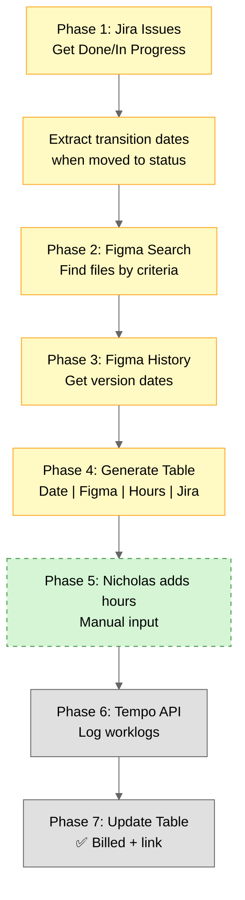

# Billable Hours - Automated Billing Workflow Contract

**Status:**  Design phase

**Goal:** Automate billing from Jira issues → Figma history → Tempo timelog.

---



---

## 1️⃣ Phase 1: Jira Conditions (Need Nicholas Input)

**Questions:**
1. **Projects:** UXPMS? AUTP? RPM? All?
2. **Statuses:** Done only? Done + In Progress?
3. **Time range:** Last 30 days? Month-to-date? Custom?
4. **Labels/components:** IEEE? REX? All?

**Needed:** Nicholas decision before implementation

---

## 2️⃣ Phase 2: Figma Conditions (Need Nicholas Input)

**Questions:**
1. **Team ID:** Which Figma team?
2. **Projects:** Which Figma projects?
3. **File patterns:** IEEE-*? REX-*? Specific files?
4. **Match Jira how:** Naming convention? Manual mapping?

**Needed:** Nicholas decision before implementation

---

## Phase 3: Figma History (Implementation Detail)

**API:** `/files/{file_key}/versions`

**Extract:** Version dates → work days

**Note:** Figma versions = all changes (may include minor edits, need filtering?)

---

## Phase 4: Generate Table (Format Approved)

**Output:**

| Date       | Figma File                | Activity           | Hours | Jira Issue | Status |
|------------|---------------------------|--------------------|-------|------------|--------|
| 2026-02-10 | IEEE-Gold-OA              | Version 1.2.3      | ?     | AUTP-646   | ⏳     |

**Markdown format → Nicholas edits hours column**

---

## Phase 5: Manual Hours (Nicholas Input)

**Outside system boundary** (dashed border in diagram)

**Workflow:**
1. Script generates table with `?`
2. Nicholas replaces `?` with actual hours
3. Script reads updated table

**Format validation:** Date, hours (float), issue key

---

## Phase 6: Tempo API (Implementation Detail)

**Endpoint:** `POST /worklogs`

**Payload:**
```json
{
  "issueKey": "AUTP-646",
  "timeSpentSeconds": 7200,
  "startDate": "2026-02-10",
  "startTime": "09:00:00",
  "description": "Figma: IEEE-Gold-OA (Version 1.2.3)"
}
```

**Note:** Need to test dry-run mode first

---

## 3️⃣ Phase 7: Update Table (Link Format?)

**Question:** What link format for Tempo worklog?

**Options:**
- Tempo worklog ID (if available)
- Jira issue link (fallback)
- No link (just ✅)

**Needed:** Nicholas preference

---

## Testing Plan

**Step 1:** Define conditions (1️⃣ 2️⃣ above)

**Step 2:** Test Jira API (get issues + dates)

**Step 3:** Test Figma API (search + history)

**Step 4:** Generate table (dry-run)

**Step 5:** Test Tempo API (1 worklog, delete after)

**Step 6:** Full run (real billing)

**Step 7:** Automate (3AM, 25th, weekday)

---

## Future: Automation

**Cron:** Monthly (25th, weekday, 3AM)

**Notification:** Telegram (table → Nicholas fills → script processes)

---

**Created:** 2026-02-27  
**Next:** Answer 1️⃣ 2️⃣ 3️⃣ to proceed
