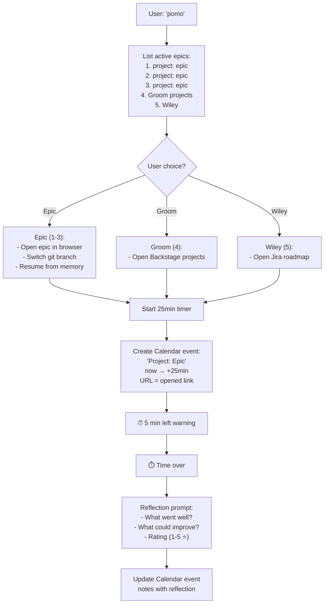

# Pomodoro Skill

**Purpose:** Focus sessions with automatic calendar blocking and post-work reflection.

**Philosophy:** Time-boxed work + immediate reflection = better awareness of productivity patterns.

**Configuration:**
- **Duration:** `{{ config.duration_minutes }}` minutes (default: 25)
- **Warning:** `{{ config.warning_minutes }}` minutes before end (default: 5)

---

## Workflow



---

## Epic Selection (Options 1-3)

**When user picks epic:**

1. **Open in browser:**
   ```bash
   open http://localhost:3004/projects/PROJECT#vX.Y.Z
   ```

2. **Switch git branch (if applicable):**
   ```bash
   cd ~/Backstage  # or project repo
   git checkout epic/PROJECT-vX.Y.Z  # if branch exists
   ```

3. **Resume from memory:**
   - Search `memory/*.md` for epic mentions
   - Last session: "3 days ago" / "yesterday" / "3 weeks ago"
   - Summarize (2 paragraphs):
     - What was done last time
     - Where we stopped
     - Current objective

**Example output:**
```
📂 Opened: Research Exchange v0.1.0
🌿 Branch: epic/research-exchange-v0.1.0

📝 Last worked: 3 days ago (2026-03-09)

We were implementing the agent detail page in MUI. Finished the basic
layout with tabs for metadata, tasks, and files. Hit a blocker with
Next.js routing not matching our expected pattern.

Next: Debug the routing issue and add Playwright visual tests before
claiming the page works. Don't edit UI blindly.
```

---

## Groom Projects (Option 4)

**Opens Backstage projects overview:**
```bash
open http://localhost:3004/projects
```

---

## Wiley Work (Option 5)

**Opens Jira roadmap (filtered to Nicholas):**
```bash
open "https://wiley-global.atlassian.net/jira/plans/2095/scenarios/2095/calendar?filter=assignee%20%3D%205f6a182958ea7b00706d352a"
```

---

## Timer & Calendar

### Start Timer (25 minutes)

```bash
# Background timer process
(sleep 1200 && echo "⏰ 5 min left") &
(sleep 1500 && echo "⏱️ Time over! Reflection time.") &
TIMER_PID=$!
```

### Create Calendar Event

**Using `gws` (Google Workspace CLI):**

```bash
# Get current time in ISO 8601 format (RFC3339)
START_TIME=$(date -u +"%Y-%m-%dT%H:%M:%S%z" | sed 's/\([0-9][0-9]\)$/:\1/')
END_TIME=$(date -u -v+25M +"%Y-%m-%dT%H:%M:%S%z" | sed 's/\([0-9][0-9]\)$/:\1/')

# Build Backstage URL (PROJECT and VERSION from epic selection)
BACKSTAGE_URL="http://localhost:3004/projects/$PROJECT#$VERSION"

# Create event (gws v0.13.2+ syntax)
gws calendar +insert \
  --summary "🍅 $PROJECT: $EPIC_NAME" \
  --start "$START_TIME" \
  --end "$END_TIME" \
  --description "Pomodoro session\n\n$BACKSTAGE_URL" \
  --format json > /tmp/pomo-event.json

# Capture event ID for later update
EVENT_ID=$(jq -r '.id' /tmp/pomo-event.json)
```

**Critical timezone fix:**
- Use `date -u` (UTC) to avoid DST confusion
- Format: `2026-03-12T20:24:00-05:00` (RFC3339)
- gws CLI v0.13.2+ uses `+insert` helper (NOT `events insert`)
- Flags: `--summary`, `--start`, `--end`, `--description` (NOT `--params` JSON)

---

## Reflection (After 25 min)

**Prompt user:**

```
⏱️ Pomodoro complete! Quick reflection:

1. What went well? (1-2 sentences)
2. What could improve? (1-2 sentences)
3. Rating: ⭐⭐⭐⭐⭐ (1-5 stars)
```

**Example response:**
```
1. Fixed the routing issue by reading Next.js docs. Playwright installed.
2. Took too long debugging - should have checked docs sooner.
3. ⭐⭐⭐⭐ (4 stars)
```

**Update Calendar event notes:**

```bash
# Update event description with reflection (gws v0.13.2+)
# Note: gws +insert doesn't have +patch helper, use raw API
gws calendar events patch \
  --params '{
    "calendarId": "primary",
    "eventId": "'"$EVENT_ID"'",
    "description": "Pomodoro session\n\n✅ What went well:\nFixed routing by reading docs. Playwright installed.\n\n⚠️ What could improve:\nTook too long debugging - check docs sooner.\n\n⭐ Rating: 4/5"
  }'
```

**Alternative (if patch fails, use update):**
```bash
gws calendar events update \
  --params '{
    "calendarId": "primary",
    "eventId": "'"$EVENT_ID"'",
    "description": "Pomodoro session\n\n[reflection text]"
  }'
```

---

## Implementation Notes

### Active Epics List

**Find active epics:**
```bash
find ~/Backstage/projects/*/epics/*/epic.yaml \
  -exec grep -l 'status: active' {} \; \
  | while read f; do
      PROJECT=$(echo $f | cut -d'/' -f6)
      VERSION=$(echo $f | cut -d'/' -f8)
      NAME=$(grep 'name:' $f | sed 's/name: "\(.*\)"/\1/')
      echo "**$PROJECT:** [$NAME](http://localhost:3004/projects/$PROJECT#$VERSION)"
    done
```

### Git Branch Detection

**Check if epic branch exists:**
```bash
cd ~/Backstage
git branch -a | grep -q "epic/PROJECT-vX.Y.Z"
if [ $? -eq 0 ]; then
  git checkout epic/PROJECT-vX.Y.Z
else
  echo "No dedicated branch (working on main)"
fi
```

### Memory Search

**Find last work on epic:**
```bash
grep -r "vX.Y.Z\|Epic Name" ~/.openclaw/workspace/memory/*.md \
  | tail -1 \
  | awk -F':' '{print $1}' \
  | xargs basename \
  | sed 's/\.md//'  # Extracts date (2026-03-09)
```

**Calculate "X days ago":**
```bash
LAST_DATE=2026-03-09
TODAY=$(date +%Y-%m-%d)
DAYS_AGO=$(( ($(date -j -f "%Y-%m-%d" "$TODAY" +%s) - $(date -j -f "%Y-%m-%d" "$LAST_DATE" +%s)) / 86400 ))
echo "$DAYS_AGO days ago"
```

---

## Google Workspace CLI Setup

**Install:**
```bash
npm install -g @googleworkspace/cli
```

**Authenticate:**
```bash
gws auth setup   # First time (Google Cloud project)
gws auth login   # Subsequent sessions
```

**Test Calendar access:**
```bash
gws calendar events list --params '{"calendarId": "primary", "maxResults": 5}'
```

---

## Example Session

**User:** `pomo`

**System:**
```
📋 Active work:

1. **research-exchange:** [Agent Detail Page](http://localhost:3004/projects/research-exchange#v0.1.0)
2. **personal:** [Finances](http://localhost:3004/projects/personal#v2.4.0)
3. **studio:** [Local LLM](http://localhost:3004/projects/studio#v0.25.0)
4. Groom projects
5. Wiley

Pick one (1-5):
```

**User:** `1`

**System:**
```
📂 Opened: Research Exchange v0.1.0
🌿 Branch: epic/research-exchange-v0.1.0

📝 Last worked: 3 days ago (2026-03-09)

We were implementing the agent detail page in MUI. Finished basic layout
with tabs. Hit blocker with Next.js routing.

Next: Debug routing, add Playwright tests. Don't edit UI blindly.

⏱️ Starting 25-minute Pomodoro...
📅 Calendar event created.
```

**[20 minutes later]**
```
⏰ 5 min left
```

**[25 minutes later]**
```
⏱️ Pomodoro complete! Quick reflection:

1. What went well?
```

**User:** `Fixed routing by reading Next.js docs. Installed Playwright.`

**System:** `2. What could improve?`

**User:** `Took too long debugging - should have checked docs sooner.`

**System:** `3. Rating (1-5 ⭐):`

**User:** `4`

**System:**
```
✅ Reflection saved to Calendar event!

📊 Session summary:
- Duration: 25 minutes
- Epic: Research Exchange v0.1.0
- Rating: ⭐⭐⭐⭐ (4/5)
```

---

## Critical Rules

1. **Timer runs in background** (don't block CLI)
2. **Calendar event created IMMEDIATELY** (not after timer ends)
3. **5-min warning via notification** (audible/visual alert)
4. **Reflection MUST update Calendar** (not just terminal output)
5. **Epic resume from memory** (search memory/*.md for context)

---

**Created:** 2026-03-12  
**Location:** `~/.openclaw/workspace/skills/pomodoro/SKILL.md`
